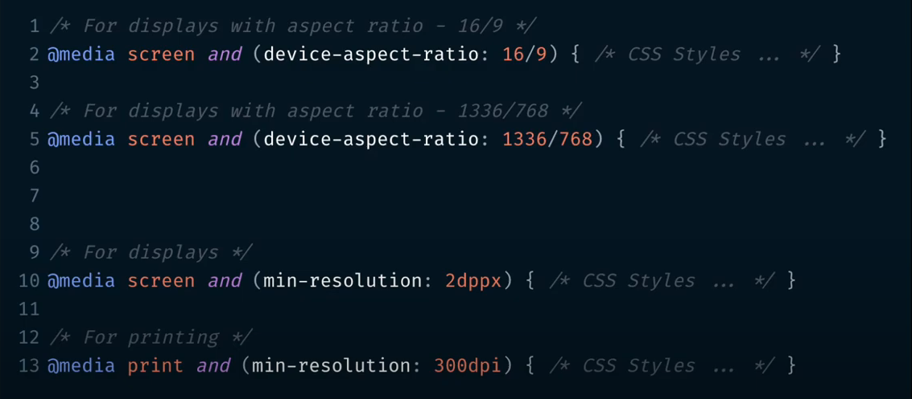

<!-- 
   https://github.com/andreysssr/examples

   webdev
-->

# CSS 3

1 Базовый синтаксис и применение стилей (Base Syntax & CSS Applying)  
2 Простые селекторы (Simple Selectors)  
3 Составные селекторы (Composite Selectors)  
4 Псевдоэлементы и псевдоклассы (Pseudo-elements & Pseudo-classes)  
5 Каскадность и наследование (Cascading & Inheritance)  
6 Блочная модель и отступы (Box Model, Padding & Margin)  
7 Позиционирование и размеры (Positioning & Sizing)  
8 Единицы, переполнение и уровни элементов (Units, Overflow & z-index)  
9 Плавающие элементы и очистка потока (Floating Elements & Clearfix)  
10 Шрифты и текст (CSS Font & Text styles)  
11 Границы и тени (Borders & Shadows)  
12 Скругление углов, списки и цвета (Border Radius, Lists & Colors)  
13 Отображение элементов и вендорные префиксы (Display vs. Visibility, Vendor Prefixes)  
14 Фон (Background)  
15 Градиенты (Gradients)  
16 Фильтры (Filters)  
17 Трансформации (Transform)  
18 Плавные переходы (Transition)  
19 Анимации (Animations)  
20 Таблицы и курсор (Tables & Cursor)  
21 Текстовые эффекты и многоколоночный текст (Text Effects & Multi Columns Text)  
22 Медиазапросы (Media queries)  
23 Стилизация плейсхолдера и скролла, CSS-спрайты (Placeholder, Scrollbar & Sprites)  

[https://web.dev/](https://web.dev/)

### Список уроков:
- [#1 Базовый синтаксис и применение стилей (Base Syntax & CSS Applying)](https://youtu.be/qxAnaoPI8cE)
- [#2 Простые селекторы (Simple Selectors)](https://youtu.be/vnmfn31G988)
- [#3 Составные селекторы (Composite Selectors)](https://youtu.be/fyI_K_Oya74)
- [#4 Псевдоэлементы и псевдоклассы (Pseudo-elements & Pseudo-classes)](https://youtu.be/C40ePbYJxmM)
- [#5 Каскадность и наследование (Cascading & Inheritance)](https://youtu.be/Y8UFzOoKkvQ)
- [#6 Блочная модель и отступы (Box Model, Padding & Margin)](https://youtu.be/1jvIi039-i4)
- [#7 Позиционирование и размеры (Positioning & Sizing)](https://youtu.be/iydD985acAc)
- [#8 Единицы, переполнение и уровни элементов (Units, Overflow & z-index)](https://youtu.be/pEdt0afL2-o)
- [#9 Плавающие элементы и очистка потока (Floating Elements & Clearfix)](https://youtu.be/1kZ9FTp2IiE)
- [#10 Шрифты и текст (CSS Font & Text styles)](https://youtu.be/TAB8pVUKiI4)
- [#11 Границы и тени (Borders & Shadows)](https://youtu.be/dAHu16pgBrg)
- [#12 Скругление углов, списки и цвета (Border Radius, Lists & Colors)](https://youtu.be/zaJh6CymejM)
- [#13 Отображение элементов и вендорные префиксы (Display vs. Visibility, Vendor Prefixes)](https://youtu.be/pyBjcMRLMoQ)
- [#14 Фон (Background)](https://youtu.be/5k-x7FUnDuE)
- [#15 Градиенты (Gradients)](https://youtu.be/8mzap9y6ECE)
- [#16 Фильтры (Filters)](https://youtu.be/k-qqZ7rcy-E)
- [#17 Трансформации (Transform)](https://youtu.be/vbdw3iHzkFo)
- [#18 Плавные переходы (Transition)](https://youtu.be/hwWIm6DSSoE)
- [#19 Анимации (Animations)](https://youtu.be/XG5JulRHSV8)
- [#20 Таблицы и курсор (Tables & Cursor)](https://youtu.be/Y5MwssNWetI)
- [#21 Текстовые эффекты и многоколоночный текст (Text Effects & Multi Columns Text)](https://youtu.be/6sc-gmz_MYQ)
- [#22 Медиазапросы (Media queries)](https://youtu.be/lv47xClJolw)
- [#23 Стилизация плейсхолдера и скролла, CSS-спрайты (Placeholder, Scrollbar & Sprites)](https://youtu.be/_eO1urQ71Lw)

--- 
#1 Базовый синтаксис и применение стилей (Base Syntax & CSS Applying)

4 варианта встраивание стилей в документ
- внутренние стили - описание стилей в блоке head
- внешний файл со стилями - подключение стилей в блоке head
- встроенные стили - описание стилей в теге
- подключение файла стилей в самом файле стилей

```html
<!DOCTYPE html>
<html lang="en">
  <head>
    <meta charset="utf-8" />
    <title>CSS/CSS3 Basics</title>
    <!-- Внутренние стили -->
    <style>
      /* Синтаксис одной строки */
      h1 { color: red; }
      /* Многострочный синтаксис */
      h1 {
        color: red;
      }
    </style>
    <!-- Внешний файл со стилями -->
    <link rel="stylesheet" href="css/styles.css" />
  </head>

  <body>
    <h1>Hello world!</h1>
    <h2>Hello world!</h2>
    <!-- Встроенные стили -->
    <h3 style="color: blue">Hello world!</h3>
    <h4>Hello world!</h4>
  </body>
</html>
```

```css
/* подключение файла стилей в файле стилей */
@import "main.css";

h2 {
  color: green;
}
```

--- 

#2 Простые селекторы (Simple Selectors) 

Селекторы делятся на:
- простые - состоят из одной синтаксической единицы
- составные - могут включать несколько единиц

```html
  <body>
    <h1 class="simple">Hello world!</h1>
    <p>Text paragraph1</p>
    <p class="fz20">Text paragraph2</p>
    <p class="fz20">Text paragraph3</p>
    <h2 class="heading1 fz20">Heading 1!</h2>
    <span class="heading2">Simple span element</span>
    <h3 id="heading">Hello world!</h3>
    <h3 id="heading2">Hello world!</h3>

    <q class="simple">Hello webDev!</q>
  </body>
```

```css
/* селектор относится ко всем тегам на странице */
* {
  color: red;
}

/* селектор по имени тега*/
p {
  color: green;
}

/* селектор по имени класса */
.heading1 {
  text-decoration: underline;
}

.heading2 {
  text-transform: uppercase;
}

p.fz20 {
  font-size: 20px;
}

#heading,  
#heading2 {
  font-size: 40px;
  border: 1px solid #000;
}

q {
  color: blue;
}

q.simple {
  color: aqua;
}

body q.simple {
  color: fuchsia;
}

/* id селектор */
#heading{
    font-size: 20px;
}
```
! лучше не осуществлять стилизацию по тегам (по нечайности можно добавить стили туда, где они не нужны)
! id на странице должен быть уникальным

>Основное правило:  
> - если нужно стилизировать элемент - используется селектор класса `class`,
> - если на элемент нужно добавить какую-то логику - то используется `id`

class - для стилизации
id - для логики

Специфичность селекторов


Пример расчёта весов специфичности селекторов


--- 
3 Составные селекторы (Composite Selectors)  

```css
h1,
h2,
span {
  color: red;
}

/* потомок (ближний, дальний) */
div p {
  color: green;
}

div p span {
  color: blue;
}

/* прямой потомок - без тегов между li и span */
ul li > span {
  font-weight: bold;
}

/* все следующие теги li за первым тегом li */
ul li + li {
  color: aqua;
}

/* все теги p после тега br */
br ~ p {
  font-size: 30px;
}

/* теги a - содержащие атрибут target */
a[target] {
  background-color: yellow;
}

/* теги a - содержащие атрибут target со значением "_blank" */
a[target="_blank"] {
  background-color: blue;
}

/* все теги a - у которых ссылка начинается с указанного значения */
a[href^="http://123"] {
  background-color: aqua;
}

/* все теги a - у которых ссылка заканчивается указанным значением */
a[href$=".jpg"] {
  background-color: teal;
}

/* все теги a - у которых ссылки содержат указанное значение */
a[href*="link"] {
  background-color: rebeccapurple;
}
```

--- 
4 Псевдоэлементы и псевдоклассы (Pseudo-elements & Pseudo-classes)  

>Все псевдоклассы и все псевдоэлементы разделяются двоеточием
>- псевдоклассы - `:`
>- псевдоэлементы - `::`

```css
a {
  color: black;
  text-decoration: none;
}

/* действует при наведении на элемент */
a:hover {
  color: red;
}

/* применим только к ссылкам - посещённые ресурсы с указанной ссылки */
a:visited {
  color: aqua;
}

/* применяется в момент щелчка кнопки мыши */
/* применятся не только для ссылок, но и для всех активных элементов на странице */
a:active {
  color: green;
}

/* добавляется на элемент если по странице мы передвигается с помощью кнопки [Tab] */
/* по умолчанию вокруг элемента появляется обводка */
a:focus {
  font-weight: bold;
}

/* стилизация первой буквы */
p::first-letter {
  font-size: 40px;
}

/* стилизация первой строки */
p::first-line {
  text-decoration: underline;
}

/* стилизация выделенной строки курсором */
/* изменить можно только фон и цвет текста, размер не будет меняться */
p::selection {
  background-color: yellow;
  color: red;
  font-size: 40px;
}

/* добавить в начало */
h1::before {
  content: "This is ";
  text-transform: uppercase;
}

/* добавить в конце */
h1::after {
  content: " channel";
  color: red;
}

/* первый элемент */
.list1 li:first-child {
  color: blue;
}

/* последний элемент */
.list1 li:last-child {
  color: green;
}

/* стилизация чётных элементов */
.list2 li:nth-child(even) {
  color: blue;
}

/* стилизация не чётных элементов */
.list2 li:nth-child(odd) {
  color: green;
}

/* если прописать номер - применяется к элементу с порядковым номером */
/* применяется к второму элементу  */
.list3 li:nth-child(2) {
  color: blue;
}

/* применяется к третьему элементу */
.list3 li:nth-child(3) {
  color: green;
}

/* применяется к каждому третьему элементу */
.list3 li:nth-child(3n) {
    text-transform: uppercase;
}

/* к каждому n-му элементу, плюс номер элемента с которого начнётся отсчёт */
/* применяется к каждому третьему элементу начиная с первого */
.list3 li:nth-child(3n + 1) {
  text-transform: uppercase;
}

/* применяется к каждому второму элементу начиная с третьего */
.list3 li:nth-child(2n + 3) {
    text-transform: uppercase;
}

.list3 li:nth-child(4n + 2) {
  border: 1px solid black;
}

/* стили для первого элемента (аналог :first-child ) */
.text span:first-of-type {
  color: red;
}

/* стили для последнего элемента (аналог :last-child) */
.text span:last-of-type {
  color: green;
}

/* стили для каждого второго элемента */
.text span:nth-of-type(2) {
  border: 1px solid black;
}

/* стили для тегов li которые не имеют класс .item */
.list4 li:not(.item) {
  border: 1px solid blue;
}
```
---
5 Каскадность и наследование (Cascading & Inheritance)  

Каскадность - набор правил для определения какие свойства должны быть добавлены 
для элемента, если в нём несколько конфликтующих свойств.

`!important` - перебивает все стили, имеет самый высокий вес.
Перебить `!important` можно только другим стилем со значением `!important`.

>Применение `!important;` в описании значений стилей `border: none !important;` относится к плохой практике. 
> В описании стилей желательно его не применять. 

Факторы влияющие на применение стилей:
- важность
- специфичность
- порядок в документе


Наследование - способность элементов потомков перенимать правила форматирования 
которые присвоены их предкам.

есть свойства которые наследуются  
- свойства определяющие вид текста

а также те которые не наследуются  
- рамки, границы, позиционирование

для применения стилей родителя к дочернему элементу есть правило
 `inherit` его можно применить практически к любому свойству

```css
body {
  color: red;
  border: 1px solid black;
  margin-bottom: 30px;
}

p {
  border: inherit;
  margin: inherit;
}
```

>`inherit` на практике практически не используется, из-за большой вложенности элементов 
> можно унаследовать что-то не то.

Есть браузерные дефолтные стили (стили по умолчанию). наример тег `<a href="#">Link</a>`
по умолчанию будет выделен синим цветом с подчеркиванием.  

В каждом браузере дефолтные стили разные. Создания кросбраузерной вёрстки стили разных браузеров
приводят к одному виду. Для этого исопльзуют 2 способа:  
- reset.css - сброс всех стилей
- normalize.css - дефолтные стили приводятся к одним правилам

[Normalize CSS or CSS Reset?](https://medium.com/@elad/normalize-css-or-css-reset-9d75175c5d1e)

[reset.css](https://gist.github.com/DavidWells/18e73022e723037a50d6)

---
6 Блочная модель и отступы (Box Model, Padding & Margin)  

Все теги делятся на 3 типа:
- блочные
- строчные
- строчно-блочные

```css
div {
 /* сокращённая запись для 4 сторон */
 margin: 10px; /* margin: 10px 10px 10px 10px; */
 
 /* полная запись */
 /* отступ: сверху справа снизу слева */
 margin: 10px 20px 30px 40px;
 
 margin: 10px 20px;  /* margin: 10px 20px 10px 20px; */
 margin-top: 10px;
 margin-right: 10px;
 margin-bottom: 10px;
 margin-left: 10px;
}
```

Для строчных элементов не работают `margin-top`, `margin-bottom`

У свойства `margin` - есть эффект "схлопывания".

Если рядом стоят элементы с `margin = 10px`, то расстояние между ними будет не 20px, 
а 10px - это и есть схлопывание `margin`

Если элементы с разными `margin` стоят рядом, то расстояние между ними будет равно большему
`margin`.

>Размер блока = размер контента + размер padding + размер border

Свойство `box-sizing: border-box` устанавливает для элемента заданную ширину и высоту 
не зависимо от размера `padding` и `border`.

Свойства значений box-sizing:
- `box-sizing: border-box;` - размер блока считается по краям `border`
- `box-sizing: content-box;` - размер блока считается по краям контента (используется по умолчанию)

---
CSS3 #7 Позиционирование и размеры (Positioning & Sizing)

Вид позиционирования элемента
- `position: static;` - по умолчанию
- `position: relative;` - относительное позиционирование
- `position: absolute;` - абсолютное позиционирование
- `position: fixed;` - фиксированное позиционирование 
- `position: sticky;` - уникальное позиционирование, которое создаёт липкий элемент.

Для задания позиций есть 4 свойства:
- `top: 10px;` 
- `right: 10px;` 
- `bottom: 10px;` 
- `left: 10px;` 

Описание позиционирований
- `position: relative;` - находится в основном потоке документа, сдвигается относительно текущего расположения, после сдвига освободившееся место не занимается
- `position: absolute;` - основной поток теряет связь с элементом, его место заполняется, 
Если элементу задаётся `position: absolute;` и нет ни одного элемента родителя с `position:` у которого было бы отличное от 
`static` - то данный элемент позиционируется от окна браузера.
- `position: fixed;` - аналог `absolute`, только позиция всегда отсчитывается от края окна браузера, ни какие типы позиционирования родителя не влияют.
- `position: sticky;` - практически не используется из-за его ограниченной браузерной поддержки.
скроллится в пределах родительского блока.

Размеры элемента:
- `width: 100px;` - фиксированная ширина элемента (не подстравиваются под контент)
- `height: 100px;` - фиксированная высота элемента (не подстравиваются под контент)
- `min-width: 100px;` - минимальная ширина элемента (способны трансформироваться)
- `max-width: 100px;` - максимальная ширина элемента (способны трансформироваться)
- `min-height: 100px;` - минимальная высота элемента (способны трансформироваться)
- `max-height: 100px;` - максимальная высота элемента (способны трансформироваться)

---
CSS3 #8 Единицы, переполнение и уровни элементов (Units, Overflow & z-index)

Единицы для задания размеров элементов

Существует 2 основных типа размеров:
- Абсолютные
- Относительные

| Абсолютные | Относительные |
|-------|--------|
| Pixels (px) | Percentages (%)    |
| Centimeters (cm) | Font-sizes (em & rem)    |
| Millimeters (mm) | Character-sizes (ex & ch)    |
| Inches (in) | Viewport Dimensions (vw & vh)    |
| Points (pt) | Viewport Max (vmax)    |
| Picas (pc) | Viewport Min (vmin)    |

- `Pixels (px)` - постоянная величина
- `Percentages (%)` - если размер родителя определён - берётся % от размера родителя, иначе
берётся для расчёта берётся дефолтное браузерное значение.
- `Font-sizes (em)` - от размера родителя, 2em - размер родителя умножается на 2, это (200%), 1.5em - размер родителя умножается на 1.5, (это 150%)
- `Font-sizes (rem)` - root (корень), от базовой величины браузера, не важно какие размеры заданы для родителя. 
- `Viewport Dimensions (vw & vh)` - `вьюпорт width` и `вьюпорт height`, вьюпорт - это видимая область экрана,
определяя эти величины - вы отталкиваетесь от размера документа

> Для значения `1rem` в браузере определено значение `16px`, единственный вариант переопределения размера для `rem` - это изменить размер для `html`

```css
/* переопределит значение rem */
html {
  font-size: 10px; 
}
```

>Для определения `font-size` можно использовать абсолютные и относительные величины
`px`, `em`, `rem`

>Для определения положения позиционирования, отступы - используются абсолютные величины `px`

```css
/* пример использования величин вьюпорта */
.overlay {
 background-color: rgba(0, 0, 0, 0.5);
 box-sizing: border-box;
 position: absolute;
 width: calc(100px + 200px + 1rem); /* функция переводит велечины в пиксели и подсчитывает */
 width: 100vw;
 height: 100vh;
}
```

Уровни элементов `z-index: 1;`

изначально элементы распологаются в основном потоке на одном уровне, чтобы
вытащить элемент выще других - ему нужно присвоить уровень на 1 выше текущего.

```css
/*  */
.overlay {
  background-color: rgba(0, 0, 0, 0.5);
  box-sizing: border-box;
  position: absolute;
  width: 100vw;
  height: 100vh;
  top: 0;
  left: 0;
  z-index: 1; /* перекроет остальные элементы и будет "сверху" на странице */
}
```
Если на странице уже используется `z-index: 10;` - то его можно перекрыть значением `z-index: 11;` 

Максимальное значение `z-index: 9999;` 
Так же это свойство может принимать отрицательные значения. В этом случае элемент будет рендерится под слоями.

Переполнение элемента - текст выходит за границы блока.
для скрытия текста в блоке испольуют свойство `overflow`

- `overflow: auto;` - в блоке появится полоса прокрутки - если текст не поместился, можно скролить элемент.
- `overflow: scroll;` - полоса прокрутки будет всегда, даже если текст поместился в блок.
- `overflow: hidden;` - текст обрезается, скролл не появляется.
- `overflow-x: auto;` - скролл по горизонтали
- `overflow-y: auto;` - скролл по вертикали

--- 
CSS3 #9 Плавающие элементы и очистка потока (Floating Elements & Clearfix)
https://www.youtube.com/watch?v=1kZ9FTp2IiE&list=PLNkWIWHIRwMHUawuIEpPI_tOG7Mfhs_sA&index=10

```css
.item {
  float: left;
  width: 150px;
}
```

Свойство `float` принимает ширину контента, поэтому для элементов с обтеканием принято
задавать размеры.

Свойство `float` вырывает элемент из нормального потока документа и формирует для него новый.
Это значит что другие элементы перестают его видеть.

--- 

CSS3 #10 Шрифты и текст (CSS Font & Text styles)

Безопасные шрифты CSS

```css
.style{
 font-family: Arial, "Helvetica Neue", Helvetica, sans-serif;
}
```

fonts.google.com
https://fonts.google.com/specimen/Roboto/about

```css
/* подлкючение шрифтов на странице */
@font-face {
  font-family: "Roboto";
  src: url("/fonts/Roboto-Regular.ttf") format("truetype"),
       url("/fonts/Roboto-Regular.woff") format("woff"),
       url("/fonts/Roboto-Regular.woff2") format("woff2"),
       url("/fonts/Roboto-Regular.otf") format("opentype");
  font-weight: 500;
  font-style: normal;
}

@font-face {
  font-family: "RobotoBoldItalic";
  src: url("/fonts/Roboto-BoldItalic.ttf") format("truetype"),
       url("/fonts/Roboto-BoldItalic.woff") format("woff"),
       url("/fonts/Roboto-BoldItalic.woff2") format("woff2"),
       url("/fonts/Roboto-BoldItalic.otf") format("opentype");
  font-weight: 900;
  font-style: italic;
```

```css
@font-face {
  font-family: "Roboto";
  src: url("/fonts/Roboto-Regular.ttf") format("truetype");
  font-weight: 500;
  font-style: normal;
}
```

```css
.style{
 /* цвет текста */
 color: red; 
 
 /* варианты подчёркивания текста */
 /* underline overline line-through none */
 /* снизу, сверху, перечёркивает текст, отменяет применённые ранее стили */
 text-decoration: underline;

 /* расстояние между символами */
 letter-spacing: 2px;

 /* расстояние между словами */
 word-spacing: 2px;

 /* межстрочный интервал */
 line-height: 10px;

 /* трансформирование текста */
 /* lowercase - нижний регистр, 
 uppercase - верхний регистр 
 capitalize - каждый первый символ слова с большой буквы
 none - отмена ранее применёных стилей
 */
 text-transform: uppercase;
 text-transform: lowercase;
 text-transform: capitalize;

 /* выравнивание текста
  left - по левому краю
  center - по середине
  right - по правому краю
  justify - по левому и правому краю
  */
 text-align: center;

 /* отступ первой строки слева - красная строка */
 text-indent: 20px;
}
```
--- 
CSS3 #11 Границы и тени (Borders & Shadows)

border - участвует в расчёте блочной модели элемента

Границы
```css
.style{
 /* толщина границы */
 border-width: 1px;

 /* стиль границы 
 solid - сплошная линия
 dashed - пунктирная линия
 dotted - линия из точек
 double - двойная сплошная линия
 none - убирает границу
 */
 border-style: solid;

 /* цвет границы 
 red - красный цвет
 transparent - прозрачная граница
 */
 border-color: red;
 border-color: transparent;

 /* объединение всех свойств в одном 
 ! порядок указания может быть любым
 */
 border: 1px solid red;
 
 border-right: none;
 border-right-style: none;

 /* рамка выделения, не участвует в расчёте размеров блочной модели */
 outline: 10px solid blue;
 
}

button:focus,
input:focus {
 outline: 2px solid aqua;
}
```

Тени

Существует 2 типа теней:
- тень на тексте
- тень на элементе

тень для текста

```css
.style {
 /* тень на тексте принимает 4 параметра
  можно устанавливать множественные тени через запятую
  1px - горизонтальное смещение (вправо, влево)
  2px - вертикальное смещение (вниз, вверх)
  5px - степень размытости
  red - цвет
  
  для смещений можно применять положительное или отрицательное значение. 
  */
 text-shadow: 1px 2px 5px red;
 text-shadow: -1px -2px 5px red;

 /* тень элемента
  дополнительный параметр inset - внутренние тени
  */
 box-shadow: inset 1px 2px 5px red;
 box-shadow: 1px 2px 5px red inset;
 box-shadow: #ff0000 1px 2px 5px inset;
}
```
---
CSS3 #12 Скругление углов, списки и цвета (Border Radius, Lists & Colors)

Скругление углов
```css
.style{
 border-radius: 50px 40px 30px 20px;

 border-radius: 20px/40px;

 border-top-left-radius: 50px;
 border-top-right-radius: 40px;
 border-bottom-right-radius: 30px;
 border-bottom-left-radius: 20px;
}
```

Списки
```css
ul li {
 /* маркированный список
  disc - закрашенный круг
  circle - круг с обводкой
  square - квадрат
  disclosure-closed - треугольник в права
  disclosure-open - треугольник в низ
  
  decimal - превращает маркированный список в нумерованный
  decimal-leading-zero - превращает маркированный список в нумерованный (начинаются с 01)
  
  upper-alpha - маркируют список с помощью букв в верхнем регистре
  lover-alpha - маркируют список с помощью букв в нижнем регистре
  
  upper-roman - добавляют римские цифры в верхнем регистре
  lover-roman - добавляют римские цифры в нижнем регистре 
 
  none - скрытие маркеров
  */
 list-style-type: disc;

 /* позиция маркеров списка
  outside - маркер списка находится за пределами границ элемента (значение по умолчанию)
  inside - маркер находится внутри границ элемента
  */
 list-style-position: inside;

 /* картинка в роли маркера */
 list-style-image: url(https://image.flaticon.com/icons/png/128/66/66738.png);
}
```

цвета

цветовая схема 
https://colorscheme.ru/html-colors.html

```css
.style{
 color: red;
 color: #ff0000;
 color: rgb(255, 0, 0);
 color: hsl(0, 100%, 50%);
 color: rgba(255, 0, 0, 0.5);
}
```
---
CSS3 #13 Отображение элементов и вендорные префиксы (Display vs. Visibility, Vendor Prefixes)

```css
/* отображение или скрытие элементов */
.style{
 /* полностью убирает элемент из документа, блок не занимает места */
 display: none;

 /* элемент не отображается на странице, но скрытый блок занимает место
  из основного потока он не вырывается, а просто скрывается */
 visibility: hidden;

 /* элемент становится прозрачным, блок занимает место */
 opacity: 0;

 /* прозрачный цвет, блок занимает место */
 color: transparent;
}
```

Вендорные префиксы
```css
.style{
 -webkit-opacity: 0.5; /* браузеры chrom и safari выше 3 версии */
 -moz-opacity: 0.5; /* firefox */
 -ms-opacity: 0.5; /* браузеры microsoft - internet explorer ege */
 -o-opacity: 0.5; /* opera */
 opacity: 0.5;
}
```
Проверка поддержки свойств браузерами
https://caniuse.com/

---
CSS3 #14 Фон (Background)

- Фон
- Множественный фон
- Фоновые цвета
- Фоновое изображение 

Фон
```css
.style{
 /* задание цвета для фона блока*/
 background-color: gainsboro;

 /* задание картинки в качестве фона */
 background-image: url(https://images.pexels.com/photos/691571/pexels-photo-691571.jpeg?auto=compress&cs=tinysrgb&dpr=2&h=750&w=1260);
 /* размер изображения 
 принимает как точные значения - пиксели и проценты, так и специальные слова
 */
 /* трансформируется фоновое изображение сохраняя свои пропорции
 подстраивается либо под ширину, либо под высоту экрана
 */
 background-size: contain;
 /* заставляет ширину и высоту фона соответствовать ширине и высоте элемента */
 background-size: cover;
 /* устанавливает размеры фона */
 background-size: 100px 200px;
 background-size: 100% 200px;
 background-size: auto 200px;
 background-size: auto auto;
 /* повторение фона */
 background-repeat: no-repeat; /* не повторять */
 background-repeat: repeat-x; /* повторение по горизонтали */
 background-repeat: repeat-y; /* повторение по вертикали */
 /* позиция фона */
 background-position: center center;
 background-position: 50% 50%;
 background-position: 0 0;
 background-position: 20px 10px;
 background-position: right bottom; /* справа внизу */
}
```

множественное фоновое изображение
```css
.style{
 /* ! фон указанный ниже - будет находится под слоями указанными выше */
 background: url(https://seeklogo.com/images/C/css3-logo-8724075274-seeklogo.com.png)
 center no-repeat,
 url(https://images.pexels.com/photos/691571/pexels-photo-691571.jpeg?auto=compress&cs=tinysrgb&dpr=2&h=750&w=1260);

}
```
--- 
CSS3 #15 Градиенты (Gradients)

Есть два типа градиентов:
- линейный (располагается по прямой от одного конца блока к другому)
- радиальный

```css
.style {
 /* для применения градиентов используется свойство - background-image или background */
 /* минимум 3 параметра:
  1 - угол наклона - deg / либо направление (to top right), (to top),
  2 - начальный цвет
  3 - конечный цвет
  */
 background-image: linear-gradient(90deg, black, white);
 background: linear-gradient(90deg, black, white);
 background: linear-gradient(90deg, #000, #fff);
 background: linear-gradient(90deg, #000, transparent);
 background: linear-gradient(to top left, black, white);
 background: linear-gradient(to top right, red, orange, #ffff00, green, cyan, blue, rebeccapurple);

 /* повторять фон (repeating-) */
 background-image: repeating-linear-gradient(45deg, yellow 25px, black 25px, black 50px, yellow 50px, yellow 75px, black 75px);
 background-image: repeating-linear-gradient(45deg, yellow 25px, black 25px, black 50px, yellow 50px, yellow 75px, black 75px);
}
```

```css
.style{
 /* круговой градиент */
 background: radial-gradient(aqua, red);
 /* задать значение распространения */
 background: radial-gradient(circle, aqua 80%, red 20%);
 background: radial-gradient(circle, aqua 80px, red 20px);
 background: repeating-radial-gradient(circle, aqua 80%, red 20%);
 background: repeating-radial-gradient(circle, aqua 80px, red 20px);
 
 /* форма градиента - элипс, круг */
 background: radial-gradient(ellipse, aqua, red);
 background: radial-gradient(circle, aqua, red);
 /* градиент идёт из центра до ближайшего края */
 background: radial-gradient(circle closest-side, aqua, red);
 /* градиент идёт из центра до ближайшего угла */
 background: radial-gradient(circle closest-corner, aqua, red);
 /* градиент идёт из центра до дальнего края */
 background: radial-gradient(circle farthest-side, aqua, red);
 /* градиент идёт из центра до дальнего угла */
 background: radial-gradient(circle farthest-corner, aqua, red);
}
```
---
CSS3 #16 Фильтры (Filters)

Добавление фильтров к элементам.

```css
.style{
 filter: blur(2px); /* размытие по гаусу */
 filter: drop-shadow(5px 6px 4px rgba(0, 0, 0, 0.5)); /* появление тени у элемента */
 filter: grayscale(80%); /* обесцвечивание, становится серым - диапазон (0% - 100%)*/
 filter: brightness(150%); /* яркость - диапазон (-150%) - (150%) */
 filter: contrast(150%); /* становится контрастным - диапазон (0% - 150%) */
 filter: hue-rotate(180deg); /* наложение цвета - диапазон (0deg-360deg) */
 filter: invert(100%); /* инверсия цвета - диапазон (0% - 100%) */
 filter: saturate(165%); /* насыщенность - диапазон (0% - ~%) до неограниченного числа*/
 filter: sepia(100%); /* имитация старины - диапазон (0% - 100%) */
 filter: opacity(50%); /* прозрачность - диапазон (0% - 100%)  */

 /* фильтры можно комбинировать */
 filter: blur(2px) sepia(100%) opacity(50%);
}
```


---
CSS3 #17 Трансформации (Transform)
https://www.youtube.com/watch?v=vbdw3iHzkFo&list=PLNkWIWHIRwMHUawuIEpPI_tOG7Mfhs_sA&index=18

Трансформация - изменение вида:
- вращение (rotate)
- масштабирование (scale)
- перемещение (translate)
- наклон (skew)

Изменяющийся элемент не затрагивает соседние. Элемент может увеличиться, 
но место отведённое для его первоначального значения останется прежним.

```css
.style{
 transform: rotate(360deg); /* вращение в градусах - диапазон (~-deg - ~+deg), по умолчанию по часовой стрелке */
 transform: scale(1.5); /* масштабирование от 0 - 1 уменьшают, больше 1 увеличивают  */
 transform: scale(1.2, 0.9); /* масштабирование от 0 - 1 уменьшают, больше 1 увеличивают  */
 transform: scaleX(0.2); /* масштабирование по горизонтали */
 transform: scaleY(1.2); /* масштабирование по вертикали */
 transform: translate(50px); /* перемещение по горизонтали - вправо */
 transform: translate(-50px, -80px); /* перемещение по горизонтали и вертикали влево вверх */
 transform: translateX(50px); /* перемещение по горизонтали в право */
 transform: translateY(80px); /* перемещение по вертикали вниз */
 transform: skew(0, 45deg); /* наклон (по горизонтали, по вертикали)*/ 
 transform: skewX(45deg); /* наклон по горизонтали */
 transform: skewY(45deg); /* наклон по вертикали */

 /* множественная трансформация */
 transform: rotate(10deg) scale(1.2) skew(10deg); /*  */

 /* опорная точка трансформации по умолчанию находится по середине элемента */
 transform-origin: right bottom; /* опорная точка в правом нижнем углу */

 /* при задании значений в пикселях - отсчёт опорной точки идёт от верхнего левого угла */
 transform-origin: 0px 0px ; /* опорная точка в левом верхнем углу */
 transform-origin: 50px 100px ; /* опорная точка сдвинется на 50px вправо, и на 100px вниз */

}
```
---
CSS3 #18 Плавные переходы (Transition)

В основе всех CSS переходов лежат 4 основных свойтва:
- сколько анимация будет длиться (`transition-duration: 0.5s;`)
- будет ли у неё задержка (`transition-delay: 2s;`)
- какая анимация применится (`transition-timing-function: linear;`)
- какое свойство анимируется (`transition-property: background-color;`)

>Общее свойство `transition` может перечислять их все, в порядке: 
> `property` `duration` `timing-function` `delay`,
> а также задавать анимацию нескольких свойств сразу `transition: font-size 3s, color 2s;`

>Свойство в общем виде записывается так:  
>`transition: property duration timing-function delay;`
> 
>`transition: свойство-для-перехода время-перехода вид-перехода задежка;`

>- `property` — определяет CSS-свойство, для которого будет применяться переход. Можно указать несколько свойств, разделив их запятой. Если указать all, переходы будут применяться ко всем свойствам элемента.
>- `duration` — определяет длительность перехода. Задаётся в секундах (s) или миллисекундах (ms).
>- `timing-function` — определяет скорость перехода в разные моменты времени. Наиболее часто используются следующие функции: linear, ease, ease-in, ease-out, ease-in-out.
>- `delay` — время задержки перед началом перехода. Задаётся в секундах (s) или миллисекундах (ms).

Примеры использования:
```css
p {
  background-color: blue;
  transition: background-color 1s ease-in-out;
}

p:hover {
  background-color: red;
}
```

```css
.example {
 border: 2px solid black;
 width: 200px;
 height: 200px;
 background-color: aqua;

 /* определяем какое свойство должно осуществлять плавный переход */
 transition-property: transform, background-color;
 transition-property: all; /* анимироваться будут все свойства */ 
 
  /* время длительности перехода */
 transition-duration: 1s; 
 transition-duration: 0.5s; /* время в секундах (s) или милисекундах (ms) */
 transition-duration: 500ms;

 /* 0.5s - время для transform, и 
    1.5s - время для background-color */
 transition-duration: 0.5s, 1.5s; 
 
 /* задержка перед изменением свойства 
    0 - для свойства transform
    2s - для свойства background-color */
 transition-delay: 0s, 2s;

 /* transition-timing-function - распределение скорости перехода по времени, возможные значения: 

    ease - Анимация начинается медленно, затем ускоряется и к концу движения опять замедляется. Аналогично cubic-bezier(0.25,0.1,0.25,1).
    ease-in - Анимация медленно начинается, к концу ускоряется. Аналогично cubic-bezier(0.42,0,1,1).
    ease-out - Анимация начинается быстро, к концу замедляется. Аналогично cubic-bezier(0,0,0.58,1).
    ease-in-out - Анимация начинается и заканчивается медленно. Аналогично cubic-bezier(0.42,0,0.58,1).
    linear - Одинаковая скорость от начала и до конца. Аналогично cubic-bezier(0.0, 0.0, 1.0, 1.0)
    step-start - Как таковой анимации нет. Стилевые свойства сразу же принимают конечное значение.
    step-end - Как таковой анимации нет. Стилевые свойства находятся в начальном значении заданное время, затем сразу же принимают конечное значение.
    cubic-bezier - Задаёт функцию движения в виде кривой Безье, где значения p1 и p3 должны находиться в диапазоне от 0 до 1.
    
    steps( n, <jumpterm>) - Отображает переход вдоль n остановок вдоль перехода, отображая каждую остановку в течение равных промежутков времени. Например, если n равно 5, есть 5 шагов.
       jump-start - Обозначает непрерывную слева функцию, так что первый скачок происходит, когда начинается переход;
       jump-end - Обозначает непрерывную справа функцию, так что последний переход происходит, когда анимация заканчивается;
       jump-none - Прыжка с обоих концов нет. Вместо этого, удерживая на отметке 0% и отметке 100%, каждую в течение 1/n продолжительности
       jump-both - Включает паузы на отметках 0% и 100%, эффективно добавляя шаг во время перехода.
       start - Такой же как jump-start.
       end - Такой же как jump-end.
    step-start - Равно steps(1, jump-start)
    step-end - Равно steps(1, jump-end)

    Задаётся:
    steps(10, start)
    steps(10, end) 
 */
 transition-timing-function: linear;


 /*  */
 transition: all 1s ease .5s;
}

.example:hover {
 background-color: red;
 transform: scale(1.2);
}
```


Настройка параметров безье ползунками на сайте
https://matthewlein.com/tools/ceaser

---
CSS3 #19 Анимации (Animations)

>`Переход `позволяет анимировать переход одного набора свойств в другие.

>`Анимация` - позволяет анимировать переход одного набора свойств вдругой, потом в третий,
четвёртый и т.д. . Созданную анимацию можно зациклить или приостановить. 

При создании анимации создаются ключевые кадры -keyframes. каждый кадр содержит
набор свойств, которые будут изменяться в соответствующем промежутке времени.

Создание анимаций происходит в 2 этапа:
- определение анимации
- применение её к элементам

К одному элементу можно применять несколько анимаций - множественная анимация.
описываются через запятую.

```css
 /* определение анимации */
@keyframes myAnimation {
 /* начальная точка анимации - первый кадр */
 from {
  background-color: aqua;
 }

 /* промежуточная точка анимации - промежуточный кадр*/
 50% {
  background-color: red;
 }

 /* конечная точка анимации - последний кадр */
 to {
  background-color: green;
 }
}
 

/* применение анимации к элементам */
.example {
 animation-name: myAnimation; /* название анимации */
 animation-duration: 5s; /* длительность анимации */
 animation-timing-function: linear; /* тип анимации */
 animation-iteration-count: 3; /* количество циклов анимации до остановки (по умолчанию равно 1 - анимация запускаетсчя 1 раз) */
 animation-iteration-count: infinite; /* анимация зациклена - будет работать постоянно */
 animation-direction: alternate; /* направление работы анимации - по умолчанию в том направлении как описали */
 /* 
  normal	Значение по умолчанию. Анимация воспроизводится как обычно (вперед)
  reverse	Анимация воспроизводится в обратном направлении (назад)	
  alternate	Анимация сначала воспроизводится вперед, затем назад	
  alternate-reverse	Анимация сначала воспроизводится в обратном направлении, а затем в прямом.	
  initial	Устанавливает для этого свойства значение по умолчанию.	
  inherit	Наследует это свойство от родительского элемента.
  */
 animation-play-state: paused; /* запуск и остановка анимации */
 animation-delay: 3s; /* задержка перед началом анимации */
}

/* все 7 свойств можно описать в одном */
.example {
 animation: name duration timing-function delay iteration-count direction; 
}
```
---
CSS3 #20 Таблицы и курсор (Tables & Cursor)

Работа с таблицей
```css
table * {
 border: 1px solid black;
 max-width: 500px;
 border-collapse: collapse; /* границы между ячейками становятся тонкой линией */
 caption-side: top; /* расположение заголовка таблицы */
 text-align: left; /* выравнивание элементов */
 empty-cells: hide; /* скрывает границы у пустых ячеек */
}
```

```css
.dis, td {
 /* отключает взаимодействие пользователя и элемента 
 блокирует нажатия и все события ячейки */
 pointer-events: none; 
}
```

---
Работа с курсором

```css
.style{
 cursor: pointer;
}
```


---
CSS3 #21 Текстовые эффекты и многоколоночный текст (Text Effects & Multi Columns Text)

```css
.style{
font-size: 45px;
 border: 1px solid black;
 width: 100px;
 min-height: 150px;
 overflow: hidden;
 text-overflow: ellipsis; /* обрезает текст у границы и вставляет многоточие ... */
 white-space: nowrap; /* запрещает перенос слов текста, текст становится в 1 строку */
 word-wrap: break-word; /* разделяет длинное слово (вышедшее за границы элемента) для переноса на другую строку */
 word-break: break-all; /* разбивает все слова для переноса чтобы заполнить элемент */
 writing-mode: vertical-lr; /* поворачивает по вертикали */
 /* значения:
  vertical-lr - прижимает к левой стороне элемента
  vertical-rl - прижимает к правой стороне элемента
  */
}
```

```html
<body>
     <div class="example">CSS is Awesome qweqweqweqweqwe!</div>

    <div class="container">
      <h2>Title 1</h2>
      <p>
        Lorem ipsum, dolor sit amet consectetur adipisicing elit. Minima saepe
        nam tenetur et natus tempore fuga quia ea explicabo a!
      </p>
      <h2>Title 2</h2>
      <p>
        Lorem ipsum dolor sit amet, consectetur adipisicing elit. Magni non
        harum quo possimus deserunt ullam laboriosam eum dicta cumque saepe?
      </p>
      <h2>Title 3</h2>
      <p>
        Lorem ipsum dolor sit amet consectetur adipisicing elit. Voluptate fugit
        possimus totam officia quo. Iste quia aspernatur repellat provident
        voluptatum!
      </p>
    </div>
  </body>
```

```css
.container {
 column-count: 3; /* разбивает текст на 3 колонки */
 column-rule: 1px solid black; /* границы между колонками */
 column-width: 300px; /* определяет ширину колонки, по умолчанию равно auto */
 column-gap: 100px; /* расстояние между колонками */
}
```
---
CSS3 #22 Медиазапросы (Media queries)

```css
@media screen and (min-width: 992px) and (max-width: 1200px) {
 body {
  background-color: aqua;
 }
}

@media screen and (orientation: portrait) {
 h1 {
  display: none;
 }
}

@media print {
 body {
  color: blue;
 }
} 
```




---
CSS3 #23 Стилизация плейсхолдера и скролла, 
CSS-спрайты (Placeholder, Scrollbar & Sprites)

```css
/* ширина и цвет скрола */
::-webkit-scrollbar {
  width: 25px;
  background: #101124;
}

/* стилизация дорожки скрола */
::-webkit-scrollbar-track {
  border: 5px solid rgba(255, 255, 255, 0.25);
  box-shadow: inset 0 0 2.5px 2px rgba(0, 0, 0, 0.5);
}

/* стилизация ползунка */
::-webkit-scrollbar-thumb {
  background: linear-gradient(45deg, #00ffa1, #00ffff);
  border-radius: 15px;
}
```

спрайты
```css
button {
  width: 200px;
  height: 79px;
  background-image: url(./23.png);
  background-position: top;
  background-size: cover;
  text-indent: -9999px;
  border: none;
  background-color: transparent;
  outline: grey;
}

button:hover {
  background-position: center;
}

button:active {
  background-position: bottom;
}
```

```css
.style{
 text-align:center ;
}
```