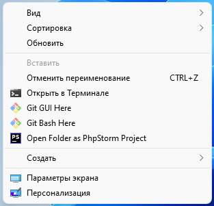

<!-- 
   https://github.com/andreysssr/examples
-->

# Git

## Содержание:

[Установка git](#install)  
[Настройка git - config](#config)  
[Установка настроек](#settihg)  
[Работа с файлом `.gitignore`](#gitignore)  
[Работа с файлом `.gitattrubutes`](#gitattrubutes)  
[Создание репозитория - init, clone](#init)  
[Удалённые репозитории - remote](#remote)  
[Вывести состояние git репозитория](#status)  
[Добавление файлов в индекс - add](#add)  
[Работа с файлами - mv, rm](#mv)  
[Сохранение изменений - commit](#commit)  
[Ветки - branch](#branch)  
[Переключение между ветками и коммитами](#checkout)  
[Метки - tag](#tag)  
["Карман" - stash](#stash)  
[Слияние - merge](#merge)  
[Решение конфликтов](#conflict)  
[Кто написал строку](#blame)  
[Просмотр данных - show, diff](#show)  
[Поиск данных - log](#log)  
[История изменений указателей (веток, HEAD)](#reflog)  

---
<a name="install"><h1>Установка git</h1></a>

## Установка Git на Windows
Перейти на сайт Git [https://git-scm.com/](https://git-scm.com/) и скачать установочный файл. Запусить и установить Git. После установки контекстном меню (правой кнопки мыши) появятся пункты:

- `Git GUI Here` (графическая программа с простым интерфейсом)
- `Git Bash Here` (консоль для работы с Git - которая и понадобится)

<p>
    
</p>

### Установка на macOS
```bash
brew install git
```

### Debian/Ubuntu
```bash
sudo apt-get update
sudo apt-get get install git
```

---
<a name="config"><h1>Настройка git - config</h1></a>

## Уровни конфигурации
```bash
git config --system # общесистемные
git config --global # на уровне пользователя
git config --local (default) # на уровне текущего проекта
```

## Хранение конфигов:
```
--system
    /etc/gitconfig                          # Linux
    C:\Program Files\Git\etc\gitconfig      # Windows
    C:\ProgramData\Git\config

--global
    ~/.gitconfig                            # Linux
    ~/.config/git/config	            # Linux
    C:\Users\<USERNAME>\.gitconfig          # Windows

--local
    <project>/.git/config                   # Linux и Windows
```

## Очерёдность загрузки конфигураций
```
    --system
->
    --glogal
->
    --local

! Если данные повторяются, они перезаписываются
    настройки из -- glogal перезапишут настройки из --system 
    настройки из -- local перезапишут настройки из --glogal 
```

<a name="settihg"><h1>Установка настроек</h1></a>

```bash
# установка имени и email для всех проектов - которым будут подписаны коммиты
git config --global user.name "Your Name"
git config --global user.email "name@example.com"

# установка имени и email для текущего репозитория
git config --local user.name "Your Name"
git config --local user.email "name@example.com"
```

Настройка переноса строк
Windows и Linux используют разные переводы строк
```
Windows - CR LF (0d 0a)
Linux - LF (0a)
```

- `core.autocrlf=false`		/ ни чего не делать
- `core.autocrlf=input`		/ при сохранении заменять все `CR LF` на `LF`
- `core.autocrlf=true`		/ при сохранении заменять все `CR LF` на `LF`, а при чтении заменять все `LF` на `CR LF`

```
core.autocrlf = true

       CRLF --> LF
file                GIT
       CRLF <-- LF
```

```
core.autocrlf = input
       CRLF --> LF
file                GIT
       LF   <-- LF
```

```bash
# настройка изменений перевода строк при сохранении в репозиторий
git config --global core.autocrlf input     # для Linux/Mac
git config --global core.autocrlf true      # для Windows

# Настройка безопасности переноса строк Git
git config --global core.safecrlf true

# Настройка цвета в терминале
git config --global color.ui true

# Настройка текстового редактора для Windows
# Visual Studio Code
git config --global core.editor "code --wait"

# Notepad++ - в качестве редактора для комментариев
git config --global core.editor "'C:/Program Files (x86)/Notepad++/notepad++.exe' -multiInst -notabbar -nosession -noPlugin"

# Sublime Text - в качестве редактора для комментариев
git config --global core.editor "'C:/Program Files (x86)/sublime text 3/subl.exe' -w"

# Настройка текстового редактора для Ubuntu
git config --global core.editor gedit

# Название ветки которая будет создаваться по умолчанию
git config --global init.defaultBranch main

# Для добавления пустых папок
git config core.ignorecase false

# Для игнорирования пустых папок
git config core.ignorecase true

# Установка глобального файла атрибутов .gitattributes
git config --global core.attributesFile ~/.gitattributes

# Указание глобального файла .gitignore
git config --global core.excludesFile ~/.gitignore

# Запретить слияния методом `fast-forward`
git config --global merge.ff false

# Разрешить слияния методом `fast-forward`
git config --global merge.ff true

# Запрет слияния методом `fast-forward` для ветки `main`
git config branch.main.mergeoptions '--no-ff'
```

## Просмотр выбранной конфигураци
```bash
# local
git config --list --local   # cat .git/config

# global
git config --list --global  # cat ~/.gitconfig

# system
git config --list --system  # cat /etc/gitconfig

# Вывести все настройки
git config --list

# Вывести настройки и файлы где они указаны
git config --list --show-origin
```
## Удаление параметров конфигурации

```bash
# Удаление по одному параметру
git config --unset user.name
git config --unset user.email

# Удаление всей секции [user]
git config --remove-section user
```

## Открыть в редакторе глобальный конфиг файл
```bash
git config --global --edit
git config --global -e
```

---
<a name="gitignore"><h1>Работа с файлом `.gitignore`</h1></a>

Установить файл `.gitignore` для всех проектов

```bash
git config --global core.excludesFile ~/.gitignore
git config --global core.excludesFile "C:\Users\<USERNAME>\.gitconfig"
```

Добавить пути/файлы в `.gitignore`

```bash
echo '.idea/' >> ~/.gitignore
echo '/vendor' >> ~/.gitignore
```

Описание настроек в `.gitignore`
```bash
*.[oa]      # Игнорировать любые файлы заканчивающиеся на “.o” или “.a”
~           # Игнорировать все файлы заканчивающиеся на тильду
*.a         # Исключить все файлы с расширение .a
!lib.a      # Но отслеживать файл lib.a даже если он подпадает под исключение выше
/TODO       # Исключить файл TODO в корневой директории, но не файл в subdir/TODO
build/      # Игнорировать все файлы в директории build/
doc/*.txt       # Игнорировать файл doc/notes.txt, но не файл doc/server/arch.txt
doc/**/*.txt    # Игнорировать все .txt файлы в директории doc/
```
Установить файл `.gitignore` для текущего проекта
- создать в корне текущего проекта файл `.gitignore`
- добавить правила игнорирования файлов и директорий

! Файлы `.gitignore` можно добавлять не только в корень проекта, но и в подпапки проекта

## Проверка игнорирования пути / файла

Проверить игнорирование пути "install/sometthing"
```bash
git check-ignore -v "install/sometthing"
```

Проверить игнорирование пути ".idea"
```bash
git check-ignore -v ".idea"
```
---
<a name="gitattrubutes"><h1>Работа с файлом `.gitattrubutes`</h1></a>

! Файл `.gitattrubutes` редактируюется в ручную

Пример содержимого файла `.gitattrubutes`
```gitattrubutes
* text=auto

# force text
*.php text
*.html text
*.js text
*.css text
*.less text
*.saas text

# Windows files (need CRLF)
*.sln text eol=crlf
*.bat eol=crlf

# binary files
*.jpg -text
*.gif -text
*.png -text
*.ico binary	# то же самое что -text -merge -diff

# Задание драйверов для файлов для команды "diff"
*.html diff=html
*.css diff=css
*.php diff=php

*.txt merge=text
*.jpg merge=binary
/NEWS.md merge=union
```
- Для текстовых файлов при слиянии применятся драйвер "text"   
- Для бинарных файлов при слиянии применяется драйвер "binary"

Драйвер "union" используется чтобы все изменения в файле в разных ветках - записывались в итоговый при слиянии.  
Драйвер используется для файлов которые только дополняются данными, и порядок следования данных не имеет значения.

## Значения настроек .gitattributes
```
*               #отсутсвуют
* text          #указан
* text=auto     #указан со значением
* -text         #снят (снят не то же самое что не указан)

# Настройки которые идут ниже могут перекрывать те которые сверху

* text=auto     #git будет сам распознавать текстовый файл или бинарный применяется ко всем файлам по умолчанию - "*"
*.html text     #атрибут стоит без значения, означает что такие файлы всегда текстовые
*.jpg -text     #атрибут в явном виде снят (файлы бинарные)
```

Просмотр возможных аттрибутов
```
git help attributes
```

## Установка глобального файла атрибутов
```
git config --global core.attributesFile ~/.gitattributes
git config --global core.attributesFile "C:\Users\<USERNAME>\.gitconfig"
```

---
<a name="init"><h1>Создание репозитория - init, clone</h1></a>

Клонировать проект в текущую директорию / поддиректорию
``` 
git clone <url>
git clone <url> [dir-name]

git clone ~/old ~/new
git clone git://...
git clone ssh://...
git clone http://...
```

Создание пустого репозитория Git текущей директории
``` 
git init 
git init [dir-name]
```

---
<a name="remote"><h1>Удалённые репозитории - remote</h1></a>

Добавить новый удалённый репозиторий по указанному адресу.
```bash
git remote add origin https://github.com/andreysssr/cheatsheets.git
git remote add upstream git@github.com:andreysssr/cheatsheets.git
```

Варианты подключения удалённого репозитория
```
Локальный репозиторий | Удалённый репозиторий
нет                   | есть
----------------------------------------------
git clone https://github.com/andreysssr/cheatsheets.git
git clone git@github.com:andreysssr/cheatsheets.git
```

```
Локальный репозиторий | Удалённый репозиторий
нет                   | нет
----------------------------------------------
echo "# cheatsheets" >> README.md
git init
git add README.md
git commit -m "first commit"
git branch -M main
git remote add origin git@github.com:andreysssr/cheatsheets.git
git push -u origin main
```
```
Локальный репозиторий | Удалённый репозиторий
есть                  | нет
----------------------------------------------
git remote add origin git@github.com:andreysssr/cheatsheets.git
git branch -M main
git push -u origin main
```

``` bash
# добавить удалённый репозиторий (с сокр. именем origin) с указанным URL
git remote add origin git@github.com:andreysssr/cheatsheets.git

# создать локальную ветку github_branch (данные взять из удалённого репозитория origin, ветка github_branch) и переключиться на неё
git checkout --track origin/github_branch 

git remote -v              # показать список удалённых репозиториев, связанных с локальным    

git remote remove origin   # убрать привязку удалённого репозитория с сокр. именем origin
git remote rm origin       # удалить привязку удалённого репозитория

git remote show origin     # получить данные об удалённом репозитории с сокращенным именем origin

git fetch origin           # скачать все ветки с удаленного репозитория (с сокр. именем origin), но не сливать со своими ветками
git fetch origin master    # то же, но скачивается только указанная ветка

git push -u origin master  # отправить изменения и связать удалённую ветку origin/master с веткой master
git push origin master     # отправить в удалённый репозиторий (с сокр. именем origin) данные своей ветки master
git push --tags            # отправить в удалённый репозиторий со всеми тегами

# если история коммитов в локальном репозитории была измена, 
# она также изменится и в удалённом репозитории
# ! не использовать при командной разработке 
git push -f                # форсировать отправку в удалённый репозиторий 
git push --force           

git pull origin            # влить изменения с удалённого репозитория (все ветки)
git pull origin master     # влить изменения с удалённого репозитория (только указанная ветка)
```
---
<a name="status"><h1>Вывести состояние git репозитория</h1></a>

```
git status      # вывести состояние репозитория
git status -s   # вывести коротко состояние репозитория

git status -sb  # вывести название текущей ветки

git status -u   # вывести неотслеживаемые файлы
git status -su  # вывести коротко неотслеживаемые файлы
```

---
<a name="add"><h1>Добавление файлов в индекс - add</h1></a>

Добавление содержимого файла в индекс
```bash
git add file1 file2     # добавить файлы file1 и file2

git add .               # добавить все файлы в текущей папке
git add *.php           # добавить все файлы в текущей папке с расширением .php
git add "*.php"         # добавить все файлы в проекте с расширением .php
git add someDir/*.php	# добавить все файлы в папке someDir с расширением .php
git add someDir/        # добавить все файлы в папке someDir

git add -f file1        # то же самое что и (git add --force file1) 
git add --force file1   # добавить файл в индекс приндутельно не обращая внимания 
                        # на его игнорирование в файле .gitignore
```

Удаление изменений из индекса

```bash
git reset            # убрать из индекса все добавленные в него изменения (в рабочей директории все изменения сохранятся), антипод git add
git reset readme.txt # убрать из индекса изменения указанного файла (в рабочей директории изменения сохранятся)

git restore --staged readme.txt
```

---
<a name="mv"><h1>Работа с файлами - mv, rm</h1></a>

Перемещение или переименование файла, каталога или символьной ссылки
```bash
git mv text.txt test_new.txt    # переименовать файл «text.txt» в «test_new.txt» и проиндексировать это изменение
git mv readme_new.md folder/    # переместить файл readme_new.md в директорию folder/ (должна существовать) и проиндексировать это изменение
```
Удаление файлов из рабочего каталога и индекса
```bash
git rm text.txt    # удалить отслеживаемый неизменённый файл и проиндексировать это изменение
git rm -f text.txt # удалить отслеживаемый изменённый файл и проиндексировать это изменение
git rm -r log/     # удалить всё содержимое отслеживаемой директории log/ и проиндексировать это изменение
git rm ind*        # удалить все отслеживаемые файлы с именем, начинающимся на «ind» в текущей директории и проиндексировать это изменение

git rm --cached readme.txt  # удалить из отслеживаемых индексированный файл (ФАЙЛ ОСТАНЕТСЯ НА МЕСТЕ) (часто используется для нечаянно добавленных в отслеживаемые файлов)
```

---
<a name="commit"><h1>Сохранение изменений - commit</h1></a>

```bash
git commit -m "Name commit"    # зафиксировать в коммите проиндексированные изменения (закоммитить)
git commit -a -m "Name commit" # проиндексировать ТОЛЬКО отслеживаемые файлы, но НЕ новые файлы)
git commit -am "Name commit"   # то же самое что и выше
```

## Отмена коммитов
Все коммиты, которые уже были отправлены в удалённый репозиторий, должны отменяться новыми коммитами `git revert`, чтобы избежать проблем с историей разработки у других участников проекта.
``` bash
git revert HEAD --no-edit    # создать новый коммит, отменяющий изменения последнего коммита без запуска редактора сообщения
git revert b9533bb --no-edit # то же, но отменяются изменения, внесённые коммитом с указанным хешем (b9533bb)
```
**Все команды, приведённые ниже можно выполнять ТОЛЬКО если коммиты еще не были отправлены в удалённый репозиторий.**

## Забыли добавить файл в коммит или не правильное название коммита  
! меняет хеш последнего коммита
``` bash
git commit --amend -m "Название"  # «перекоммитить» изменения последнего коммита, заменить его новым коммитом с другим сообщением (сдвинуть текущую ветку на один коммит назад, сохранив рабочую директорию и индекс «как есть», создать новый коммит с данными из «отменяемого» коммита, но новым сообщением)
```
Откат в истории коммитов
``` bash
# ВНИМАНИЕ! Опасные команды, можно потерять незакоммиченные изменения

git reset --hard HEAD~      # передвинуть HEAD (и ветку) на предыдущий коммит, рабочую директорию и индекс сделать такими, какими они были в момент предыдущего коммита
git reset --hard 
git reset --hard 75e2d51 # передвинуть HEAD (и ветку) на коммит с указанным хешем, рабочую директорию и индекс сделать такими, какими они были в момент указанного коммита
git reset --soft HEAD~      # передвинуть HEAD (и ветку) на предыдущий коммит, но в рабочей директории и индексе оставить все изменения
git reset --soft HEAD~2     # то же, но передвинуть HEAD (и ветку) на 2 коммита назад
git reset HEAD~             # передвинуть HEAD (и ветку) на предыдущий коммит, рабочую директорию оставить как есть, индекс сделать таким, каким он был в момент предыдущего коммита (удобнее, чем git reset --soft HEAD~, если индекс нужно задать заново)
# Почти как git reset --hard, но безопаснее: не получится потерять изменения в рабочей директории
git reset --keep HEAD~      # передвинуть HEAD (и ветку) на предыдущий коммит, сбросить индекс, но в рабочей директории оставить изменения, если возможно (если файл с изменениями между коммитами менялся, будет выдана ошибка и переключение не произойдёт)
git reset --soft HEAD~2  # переместить указатель на 2 коммита назад
```

## Отмена изменений в файле

``` bash
git checkout text.txt   # ОПАСНО: отменить изменения в файле, вернуть состояние файла, имеющееся в индексе
git checkout 75e2d51 index.html  # восстановить в директории указанный файл на момент указанного коммита
```

## Отчистка директории от не отслеживаемых файлов

``` bash
git clean -n    # показать файлы которые будут удалены
git clean -f    # удалит файлы которые выводил командой (git clean -n)

git clean -n -d     # показать директории и файлы которые будут удалены
git clean -df       # удалить неотслеживаемые файлы и директории
```

---
<a name="branch"><h1>Ветки - branch</h1></a>

```bash
git branch                      # показать список веток
git branch -v                   # показать список веток и последний коммит в каждой
git branch -vv                  # показать список веток и связи локальных с удаленными ветками

git branch -r                   # показать удаленные ветки
git branch -a                   # показать все ветки(локальные и удаленные) 
git branch -av                  # показать все локальные и и удалённые ветки
git branch -avv                 # показать все ветки и связи локальных с удаленными ветками

git branch new_branch           # создать новую ветку с указанным именем на текущем коммите
git branch new_branch 071f3bd   # создать новую ветку с указанным именем на указанном коммите
git branch fix 071f3bd          # восстановить удалённую ветку 

git branch -f dev 071f3bd       # переместить ветку dev на указанный коммит
git branch -f dev dev~2         # переместить ветку dev на 2 коммита назад

git checkout new_branch         # перейти в указанную ветку
git checkout -b new_branch      # создать новую ветку с указанным именем и перейти в неё
git checkout -B master 071f3bd  # переместить ветку с указанным именем на указанный коммит и перейти в неё

git branch -d hotfix            # удалить ветку hotfix (используется, если её изменения уже влиты в главную ветку)

git branch --merged             # показать ветки, уже слитые с активной
git branch --no-merged          # показать ветки, не слитые с активной

git branch -m old_name new_name     # переименовать локально ветку old_name в new_name
git branch -m new_name              # переименовать локально ТЕКУЩУЮ ветку в new_branch_name
git push origin :old_name new_name  # применить переименование в удаленном репозитории

git branch -u origin/main main      # установить ветку как отслеживаемую
```
### «Перенос» ветки

Можно `переместить` ответвление какой-либо ветки от основной на последний коммит. 

Это нужно для того, чтобы в `переносимой` ветке появились какие-либо изменения, внесённые в основной ветке (уже после ответвления переносимой).

! Нельзя `переносить` ветку, если она уже отправлена на удалённый репозиторий.

``` bash
git rebase master       # перенести все коммиты (создать их копии) активной ветки так, будто активная ветка ответвилась от master на нынешней вершине master (часто вызывает конфликты)
git rebase --onto master feature # перенести коммиты активной ветки на master, начиная с того места, в котором активная ветка отделилась от ветки feature
git rebase --abort      # прервать конфликтный rebase, вернуть рабочую директорию и индекс к состоянию до начала rebase
git rebase --continue   # продолжить конфликтный rebase (сработает только после разрешения конфликта и индексации такого разрешения)
```

### Как отменить rebase

``` bash
git reflog feature -2        # смотрим лог перемещений ветки, которой делали rebase (в этом примере — feature), видим последний коммит ПЕРЕД rebase, на него и нужно перенести указатель ветки
git reset --hard feature@{1} # переместить указатель ветки feature на один коммит назад, обновить рабочую директорию и индекс
```
---
<a name="checkout"><h1>Переключение между ветками и коммитами</h1></a>

```bash
git checkout fix      # переключение на другую ветку с текущей ветки
git checkout b9533bb  # переключение на другую коммит с текущей ветки
```

---
<a name="tag"><h1>Метки - tag</h1></a>

``` bash
git tag                 # показать список тегов
git tag v1.0.0          # создать тег с указанным именем на коммите, на который указывает HEAD
git tag -a -m 'Message' v1.0.1 master # создать тег с описанием на том коммите, на который смотрит ветка master

git tag -n              # показать все теги, и по 1 строке сообщения коммитов, на которые они указывают
git tag -n -l 'v1.*'    # показать все теги, которые начинаются с 'v1.*'

git tag -d v1.0.0       # удалить тег с указанным именем(ами)
```

---
<a name="stash"><h1>"Карман" - stash</h1></a>

```bash
git stash                       # положить во временное хранилище все отслеживаемые файлы.
git stash push -m "message"     # положить во временное хранилище с сообщением все изменения.
git stash push -u -m "message"  # положить во временное хранилище сообщением все изменения и не отслеживаемые файлы.

git stash list      # вывести список всех сохраненных изменений во временном хранилище.

git stash pop       # восстановить последние файлы, положенные во временное хранилище и удалить из stash эти данные
git stash pop 3     # восстановить файлы под номером 3 и удалить эти файлы
git stash apply 3   # восстановить файлы под номером 3 и не удалять эти файлы

git stash drop      # удалить элемент под номером (0)
git stash drop 2    # удалить элемент под номером (2), если такого элемента нет - выведет сообщение об ошибке
```
пример
```bash
git stash push -m "text 1" 
git stash push -m "text 2" 
git stash push -m "text 3"

git stash list
# stash@{0}: On main: text 3
# stash@{1}: On main: text 2
# stash@{2}: On main: text 1

git stash pop 1               # возвращает изменения (text 2) находятся под индексом (1)

git stash list
# stash@{0}: On main: text 3
# stash@{1}: On main: text 1  # индексация сохранённых данных в кармане сдвинулась

git stash apply 0

git stash list
# stash@{0}: On main: text 3
# stash@{1}: On main: text 1

git stash pop 1

git stash list
# stash@{0}: On main: text 3
```

---
<a name="merge"><h1>Слияние - merge</h1></a>

```bash
git checkout main # перейти на ту ветку в которую нужно сделать коммит слияния из другой ветки

git merge fix     # делаем слияние в текущую ветку из ветки fix
```

<a name="conflict"><h1>Решение конфликтов</h1></a>

```bash
git merge dev
# Auto-merging README.md
# CONFLICT (content): Merge conflict in README.md
# Automatic merge failed; fix conflicts and then commit the result.

git status
# Unmerged paths:
#   (use "git add <file>..." to mark resolution)
#       both modified:   README.md

# открываем файл README.md
<<<<<<< HEAD
70
=======
20
>>>>>>> dev

в секции HEAD - строка из текущей ветки
в секции dev - строка из сливаемой ветки dev

нужно выбрать нужный вариант или изменить на новый
убрать маркеры
  <<<<<<< HEAD
  =======
  >>>>>>> dev
  
# после этого добавить файл в индекс и продолжить коммит без дополнительных аттрибутов
git add README.md
git commit  
  
git merge --abort # прервать слияние во время конфликта
```
---
<a name="blame"><h1>Кто написал строку</h1></a>

```bash
git blame README.md --date=short -L 5,8 # показать строки 5-8 указанного файла и коммиты, в которых строки были добавлены
```

---
<a name="show"><h1>Просмотр данных - show, diff</h1></a>

```bash
git diff                # сравнить рабочую директорию и индекс (неотслеживаемые файлы ИГНОРИРУЮТСЯ)
git diff --color-words  # сравнить рабочую директорию и индекс, показать отличия в словах (неотслеживаемые файлы ИГНОРИРУЮТСЯ)
git diff index.html     # сравнить файл из рабочей директории и индекс
git diff HEAD           # сравнить рабочую директорию и коммит, на который указывает HEAD (неотслеживаемые файлы ИГНОРИРУЮТСЯ)
git diff --staged       # сравнить индекс и коммит с HEAD
git diff master feature # посмотреть что сделано в ветке feature по сравнению с веткой master
git diff --name-only master feature # посмотреть что сделано в ветке feature по сравнению с веткой master, показать только имена файлов
git diff master...feature # посмотреть что сделано в ветке feature с момента (коммита) расхождения с master
```

```bash
git show 60d6582           # показать изменения из коммита с указанным хешем
git show HEAD~             # показать данные о предыдущем коммите в активной ветке
git show @~                # аналогично предыдущему
git show HEAD~3            # показать данные о коммите, который был 3 коммита назад
git show my_branch~2       # показать данные о коммите, который был 2 коммита назад в указанной ветке
git show @~:index.html     # показать контент указанного файла на момент предыдущего (от HEAD) коммита
git show :/"подвал"        # показать самый новый коммит, в описании которого есть указанное слово (из любой ветки)
```

---
<a name="log"><h1>Поиск данных - log</h1></a>

Выход из длинного лога вывода: клавиша `q`.

```bash
git log master             # показать коммиты в указанной ветке
git log -2                 # показать последние 2 коммита в активной ветке
git log -2 --stat          # показать последние 2 коммита и статистику внесенных ими изменений
git log -p -22             # показать последние 22 коммита и внесенную ими разницу на уровне строк
git log --graph -10        # показать последние 10 коммитов с ASCII-представлением ветвления
git log --since=2.weeks    # показать коммиты за последние 2 недели
git log --after '2018-06-30' # показать коммиты, сделанные после указанной даты
git log index.html         # показать историю изменений файла index.html (только коммиты)
git log -5 index.html      # показать историю изменений файла index.html, последние 5 коммитов (только коммиты)
git log -p index.html      # показать историю изменений файла index.html (коммиты и изменения)
git log -G'myFunction' -p  # показать все коммиты, в которых менялись строки с myFunction (в кавычках регулярное выражение)
git log -L '/<head>/','/<\/head>/':index.html # показать изменения от указанного до указанного регулярных выражений в указанном файле
git log --grep fix         # показать коммиты, в описании которых есть буквосочетание fix (регистрозависимо, только коммиты текущей ветки)
git log --grep fix -i      # показать коммиты, в описании которых есть буквосочетание fix (регистроНЕзависимо, только коммиты текущей ветки)
git log --grep 'fix(ing|me)' -P # показать коммиты, в описании которых есть совпадения для регулярного выражения (только коммиты текущей ветки)
git log --pretty=format:"%h - %an, %ar : %s" -4 # показать последние 4 коммита с форматированием выводимых данных
git log --pretty=format:"%h %ad | %s%d [%an]" --graph --date=short # мой формат вывода, висящий на алиасе оболочки
git log master..branch_99  # показать коммиты из ветки branch_99, которые не влиты в master
git log branch_99..master  # показать коммиты из ветки master, которые не влиты в branch_99
git log master...branch_99 --boundary -- graph # показать коммиты из указанных веток, начиная с их расхождения (коммит расхождения будет показан)
```
---
<a name="reflog"><h1>История изменений указателей (веток, HEAD)</h1></a>

```bash
git reflog -20             # показать последние 20 изменений положения указателя HEAD
git reflog --format='%C(auto)%h %<|(20)%gd %C(blue)%cr%C(reset) %gs (%s)' -20 # то же, но с указанием давности действий
```