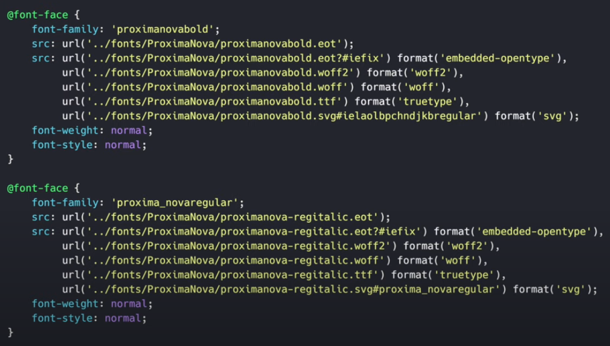
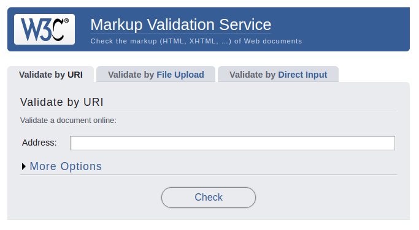
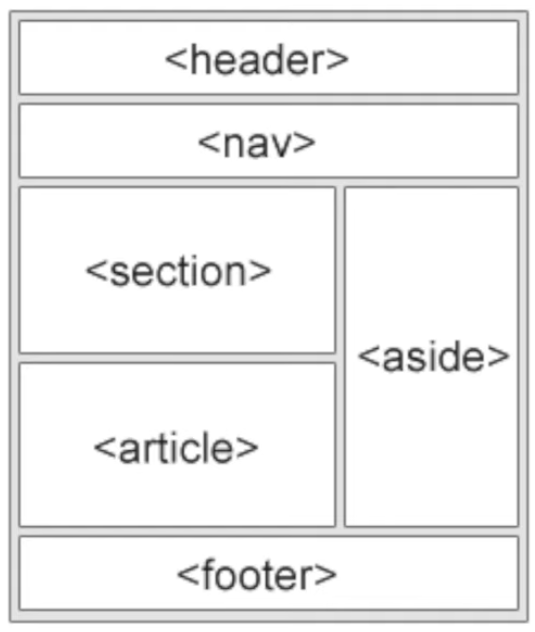

<!-- 
   https://github.com/andreysssr/examples

   webdev
-->

# HTML5 

1 HTML5 #0 Введение (Introduction)  
2 HTML5 #1 Базовая структура HTML документа (Base HTML Document Structure)  
3 HTML5 #2 Мета-данные и внешние импорты (Meta Data & External Imports)  
4 HTML5 #3 Валидация, семантика и доступность (Validation, Semantic, Accessibility)  
5 HTML5 #4 Текст (Text)  
6 HTML5 #5 Списки (Lists)  
7 HTML5 #6 Картинки (Images)  
8 HTML5 #7 Таблица (Table)  
9 HTML5 #8 Ссылки и кнопки (Links & Buttons)  
10 HTML5 #9 Полезные тэги (Useful Tags)  
11 HTML5 #10 Глобальная структура сайта (Global Site Structure)  
12 HTML5 #11 Форма (Form)  
13 HTML5 #12 Типы полей ввода (Input Types. Part I)  
14 HTML5 #13 Типы полей ввода (Input Types. Part II)  
15 HTML5 #14 Видео и аудио файлы (Video & Audio)  
16 HTML5 #15 Общие и полезные атрибуты (Common & Useful Attri

---

2 - HTML5 #1 Базовая структура HTML документа (Base HTML Document Structure)

```html
<!DOCTYPE html>
<html lang="en">
<head>
    <meta charset="UTF-8">
    <title>Title</title>
</head>
<body>

</body>
</html>
```

По написанию - все теги делятся на парные и одиночные
- парный тег: `<body></body>` (занимает всю ширину экрана)  
- одиночный тег: `<meta charset="UTF-8">` (подстраивается под ширину контента)  

По расположению - все теги делятся на:
- блочные - `<div></div>`
- строчные - `<span></span>`

Тег может содержать атрибуты
- атрибут `charset` у тега `meta`
- атрибут `lang` у тега `html`

>Порядок атрибутов внутри тега значения не имеет.  
У каждого тега есть свой набор атрибутов.

Атрибуты помогают расширять возможности тега дополнительной функциональностью.

---
3 - HTML5 #2 Мета-данные и внешние импорты (Meta Data & External Imports)

```html
<!DOCTYPE html>
<html lang="en">
<head>
  <!-- Установка кодировки документа -->  
  <meta charset="UTF-8">

  <!-- Название документа во вкладках браузера -->
  <title>HTML Basics</title>

  <!-- Документ Favicon во вкладках браузера -->
  <link rel="shortcut icon" href="icon.ico" type="image/x-icon">

  <!-- Дополнительный подход к добавлению фавикона -->
  <link rel="apple-touch-icon" href="apple-touch-icon.png">
  <link rel="apple-touch-icon" sizes="72x72" href="apple-touch-icon-72x72.png">
  <link rel="apple-touch-icon" sizes="114x114" href="apple-touch-icon-114x114.png">

  <!-- SEO -->
  <meta name="description" content="Test web page">
  <meta name="keywords" content="html, webdev, Yauhen">
  <meta name="author" content="Yauhen Kavalchuk">

  <!-- Для мобильных устройств responsive design -->
  <meta name="viewport" content="width=device-width, initial-scale=1">

  <!-- Для мобильных устройств и без изменения размера (запрещает zoom на сайте) -->
  <meta name="viewport" content="width=device-width, initial-scale=1 user-scalable=no">

  <!-- Используйте последнюю версию IE edge -->
  <meta http-equiv="X-UA-Compatible" content="IE=edge">

  <!-- Для внешних стилей -->
  <link rel="stylesheet" href="styles.css">

  <!-- Локальные стили -->
  <style>
    div {
      background-color: red;
    }
  </style>

  <!-- Шрифты локальных стилей -->
  <link rel="stylesheet" href="styles-fonts.css">

  <!-- Google шрифты -->
  <link href="https://fonts.googleapis.com/css?family=Roboto&display=swap" rel="stylesheet">

</head>
<body>

  <!-- условные комментарии: можно оборачивать теги и скрипты-->
  
  <!--[if IE]>
      <p>Этот текст вы можете увидеть только в Internet Explorer</p>
  <![endif]-->
  
  <!--[if lt IE 10]>
      <p>Вы увидите этот текст только в IE9 и более поздних версиях.</p>
  <![endif]-->

  <!-- Файлы внешних скриптов -->
  <script src="main.js"></script>

  <!-- Локальные скрипты -->
  <script>
    console.log('Hello world!');
  </script>

</body>
</html>
```

```css
/* styles-fonts.css */

@font-face {
    font-family: 'proximanovavold';
    src: url('../fonts/ProximaNova/proximanovabold.eot');
    src: url('../fonts/ProximaNova/proximanovabold.eot?iefix') format('embedded-opentype'), 
         url('../fonts/ProximaNova/proximanovabold.woff2') format('woff2'),
         url('./fonts/ProximaNova/proximanovabold.woff') format('woff'),
         url('../fonts/ProximaNova/proximanovabold.ttf') format('truetype'),
         url('../fonts/ProximaNova/proximanovabold.svg#ielaocpchg') format('svg');
    font-weight: normal;
    font-style: normal;
}
```



---
4 - HTML5 #3 Валидация, семантика и доступность (Validation, Semantic, Accessibility)

Валидация разметки сайта

[https://validator.w3.org](https://validator.w3.org)



Validation - Валидность страницы

Валидатор позволяет проверить валидность страницы
- по ссылке
- загрузив html файл
- загрузив код страницы


Semantic - семантика тегов

Семантика - это смысл или информационное содержание языка 

Семантичный тег - это тег, который носит смысловое объяснение. Обладает каким-то пояснением своего назначения.
Другими словами каждому элементу на странице соответствует смысловое значение.

```html
<!DOCTYPE html>
<html lang="en">
<head>
  <meta charset="UTF-8">
  <title>HTML Basics</title>
</head>
<body>
  <!-- Блочный элемент -->
  <div>Simple text</div>

  <!-- Строчный элемент -->
  <span>Simple text</span>

  <!-- Примеры семантических тегов -->
  <header></header>
  <nav></nav>
  <article><h1>Заголовок</h1></article>
  <footer></footer>

</body>
</html>
```



Accessibility - доступность ресурса на любом устройстве и доступность для всех людей в том числе с ограниченными возможностями.

--- 

5 - HTML5 #4 Текст (Text)

Теги для текста.
```html
  <!-- Заголовки -->
  <h1>Different Headings</h1>
  <h2>Different Headings</h2>
  <h3>Different Headings</h3>
  <h4>Different Headings</h4>
  <h5>Different Headings</h5>

  <!-- Параграф -->

  <!-- Информация об авторе -->
  <p>Here is my HTML basics course, which was created on 2019.</p>

  <!-- Цитата и автор -->
  <q>Hello, welcome to "webDev" channel</q>

  <!-- Блок цитаты -->
  <blockquote>
    <p>
      Lorem Ipsum is simply dummy text of the printing and typesetting industry.
      Lorem Ipsum has been the industry's standard dummy text ever since the 1500s, when an unknown printer took a galley of type.
      It has survived not only five centuries, but also the leap into electronic typesetting, remaining essentially unchanged.
    </p>
  </blockquote>
    
  <!-- Время или дата -->
  <time>1989-01-26</time>
  <br>

  <!-- Жирный, наклонный, моноширинный, перечёркнутый текст -->
  <b>Bold text</b><br>
  <i>Italic text</i><br>
  <tt>Typing text</tt><br>

  <!-- Пример кода -->
  <code>
    const args = {
      name: "Yauhen",
      age: 30
    };
    const getDate = () => new Date;
  </code>   
    
  <!-- Для подготовленного форматирования -->
  <pre>
    <code>
      const args = {
        name: "Yauhen",
        age: 30
      };
      const getDate = () => new Date;
    </code>
  </pre>    
    
  <!-- Жирный и наклонный с семантическим акцентом -->
  <strong>Bold accent text</strong><br>

  <!-- Маленький текст -->
  <small>Small</small>

  <!-- Большой текст -->
  <big>Big</big>

  <!-- Перечёркнутый текст -->
  <del>Deleted</del>

  <!-- Довабвленный текст -->
  <ins>Inserted</ins>

  <!-- Нижний индекс -->
  <sub>Subscripted</sub>
  <h2>To know HTML <sub>semantic</sub> is important</h2>

  <!-- Верний индекс -->
  <sup>Superscripted</sup>
  <h2>To know HTML <sup>semantic</sup> is important</h2>
```

Назначение тегов:
- `h1` - самый важный заголовок на странице
- `h2` - `h6` - заголовки по мере их важности
- `p` - параграф большие куски текста
- `address` - информация об авторе, может включить не только текст, но и другие теги, `span`, `a` и т.д.
- `q` - цитата небольшого размера
- `blockquote` - для больших цитат, внутри используются ещё теги.
- `time` - время или дата, может быть указано как внутри тега, так и внутри атрибута `datetime` 
- выделение текста - без логического ударения на выделенный текст
  - `b` - жирный текст
  - `i` - курсивный текст
  - `tt` - машинописный 
  - `s` - зачёркнутый
  - `u` - подчёркнутый
  - `mark` - выделение цветом
- выделение текста - с логическим ударением на текст
  - `strong` - выделение жирным текстом, с указанием логического акцента
  - `em` - выделение курсивным текстом, с указанием логического акцента
- `code` - отображение кусков программного кода
- `pre` - отображение предварительно отформатированного текста
- Визуальное уменьшение и увеличение текста по сравнение с остальным (семантический тег) 
  - `small` - логическое выделение менее главного 
  - `big` - логическое выделение более важного
- выделение текста (семантические теги)
  - `del` - зачёркивается как не актуальный или устаревший (не семантический аналог - тег `s`)
  - `ins` - подчёркивается 
- отображение текста в виде верхнего и нижнего индекса (для написания формул)
  - `sup` - верхний индекс
  - `sub` - нижний индекс
- `hr` - линия
- `br` - новая строка

---

HTML5 #5 Списки (Lists)

```html
  <!-- не нумерованный список -->
  <ul>
    <li>Front-end Developer</li>
    <li>Bask-end Developer</li>
    <li>Full-stack Developer</li>
  </ul>

  <!-- нумерованный список -->
  <ol>
    <li>Front-end Developer</li>
    <li>Back-end Developer</li>
    <li>Full-stack Developer</li>
  </ol>

  <!-- нумерованный список, счёт нумерации начнётся с 10 -->
  <ol start="10">
    <li>Front-end Developer</li>
    <li>Back-end Developer</li>
    <li>Full-stack Developer</li>
  </ol>

  <!-- перевёрнутый нумерованный список -->
  <ol reversed>
    <li>Front-end Developer</li>
    <li>Back-end Developer</li>
    <li>Full-stack Developer</li>
  </ol>

  <!-- Вложенный маркированный список -->
  <ul>
    <li>
      Front-end Developer
      <ul>
        <li>Mobile</li>
        <li>UI</li>
        <li>Node.js</li>
      </ul>
    </li>
    <li>Back-end Developer</li>
    <li>Full-stack Developer</li>
  </ul>

  <!-- Вложенный нумерованный список -->
  <ol>
    <li>
      Front-end Developer
      <ol>
        <li>Mobile</li>
        <li>UI</li>
        <li>Node.js</li>
      </ol>
    </li>
    <li>Back-end Developer</li>
    <li>Full-stack Developer</li>
  </ol>

  <!-- Вложенный список - маркированный список содержит нумерованный список, -->
  <!-- Глубина вложенности списков неограничена -->
  <ul>
    <li>
      Front-end Developer
      <ol>
        <li>Mobile</li>
        <li>UI</li>
        <li>Node.js</li>
      </ol>
    </li>
    <li>Back-end Developer</li>
    <li>Full-stack Developer</li>
  </ul>

  <!-- Definitions List - список определений -->
  <dl>
    <dt>Front-end Developer</dt> <!-- термин -->
    <dd>It is a person who works with the visible part of website.</dd> <!-- определение термина -->

    <dt>Back-end Developer</dt>
    <dd>It is a person who works with the hidden part of a website, including databases and environments.</dd>
  </dl>
```

Списки:
- `ul` - маркированный список
- `ol` - нумерованный список

В каждый список вкладывается тег `li` (list item - элемент списка)
Можно делать вложенные списки друг в друга.

Семантический список
- `dl` - список определений 

---
HTML5 #6 Картинки (Images)

```html
  <!-- Простое изображение -->
  

  <!-- Адаптивное изображение -->
  <picture>
    <source media="(min-width: 1024px)" srcset="https://picsum.photos/600/600">
    <source media="(min-width: 768px)" srcset="https://picsum.photos/300/300">
    <source media="(min-width: 360px)" srcset="https://picsum.photos/100/100">
    
  </picture>

  <!-- Изображение с смысловым описанием -->
  <figure>
    
    <figcaption>It is a simple description for a picture above</figcaption>
  </figure>

  <!-- Изображения со смысловым описанием -->
  <figure>
    
    
    
    <figcaption>
      <p>It is a simple description for a couple pictures above.It is a simple description for a couple pictures above.It is a simple description for a couple pictures above</p>
    </figcaption>
  </figure>
```
---

8 - HTML5 #7 Таблица (Table)

```html
  <!-- Минимальная допустимая наценка для таблицы -->
  <table>
    <tr>
      <td>Front-end</td>
    </tr>
  </table>

  <!-- Строка таблицы с данными -->
  <table>
    <tr>
      <td>Front-end</td>
      <td>Back-end</td>
      <td>Full-stack</td>
      <td>QA</td>
    </tr>
  </table>

  <!-- Столбец таблицы с данными -->
  <table>
    <tr>
      <td>Front-end</td>
    </tr>
    <tr>
      <td>Back-end</td>
    </tr>
    <tr>
      <td>Full-stack</td>
    </tr>
    <tr>
      <td>QA</td>
    </tr>
  </table>

  <!-- Простой пример таблицы -->
  <table>
    <tr>
      <td>Front-end</td>
      <td>1 Person</td>
    </tr>
    <tr>
      <td>Back-end</td>
      <td>7 Persons</td>
    </tr>
    <tr>
      <td>Full-stack</td>
      <td>2 Persons</td>
    </tr>
    <tr>
      <td>QA</td>
      <td>5 Persons</td>
    </tr>
  </table>
  <hr>

  <!-- Таблица с подписью -->
  <table>
    <caption>Team members list</caption>
    <tr>
      <td>Front-end</td>
      <td>1 Person</td>
    </tr>
    <tr>
      <td>Back-end</td>
      <td>7 Persons</td>
    </tr>
    <tr>
      <td>Full-stack</td>
      <td>2 Persons</td>
    </tr>
    <tr>
      <td>QA</td>
      <td>5 Persons</td>
    </tr>
  </table>
  <hr>

  <!-- Таблица со смысловыми разделами -->
  <table>

    <caption>Team members list</caption>

    <thead>
      <tr>
        <td>Speciality</td>
        <td>Quantity</td>
      </tr>
    </thead>

    <tbody>
      <tr>
        <td>Front-end</td>
        <td>1 Person</td>
      </tr>
      <tr>
        <td>Back-end</td>
        <td>7 Persons</td>
      </tr>
      <tr>
        <td>Full-stack</td>
        <td>2 Persons</td>
      </tr>
      <tr>
        <td>QA</td>
        <td>5 Persons</td>
      </tr>
    </tbody>

    <tfoot>
      <tr>
        <td></td>
        <td>15</td>
      </tr>
    </tfoot>

  </table>
  <hr>

  <!-- тег th для заголовка таблицы, colspan в tfoot и rowspan в tbody -->
  <table>

    <caption>Team members list</caption>

    <thead>
      <tr>
        <th>Speciality</th>
        <th>Quantity</th>
      </tr>
    </thead>

    <tbody>
      <tr>
        <td>Front-end</td>
        <td>1 Person</td>
      </tr>
      <tr>
        <td>Back-end</td>
        <td>7 Persons</td>
      </tr>
      <tr>
        <td rowspan="2">Full-stack</td>
        <td>2 Persons</td>
      </tr>
      <tr>
        <td>5 Persons</td>
      </tr>
    </tbody>

    <tfoot>
      <tr>
        <td colspan="2">15</td>
      </tr>
    </tfoot>

  </table>
```

---

HTML5 #8 Ссылки и кнопки (Links & Buttons)

```html
  <!-- Простая ссылка -->
  <a href="https://youtube.com/YauhenKavalchuk">Youtube</a>
  <hr>

  <!-- Ссылка для скачивания -->
  <a href="test.txt" download>Download</a>

  <!-- Открыть ссылку в новой вкладке -->
  <a href="https://youtube.com/YauhenKavalchuk" target="_blank">Youtube</a>

  <!-- Открыть ссылку в новой вкладке -->
  <a href="tel:+123-32-23">+123-32-23</a><br>
  <a href="mailto:test@test.com">My e-mail</a><br>
  <a href="skype:test">Skype Call</a><br>

  <!-- Якорная ссылка -->
  <a href="#bottom">Go to Bottom</a>

  <!-- Простые кнопки -->
  <button type="button">Button</button>
  <button type="submit">Button</button>
  <button type="reset">Button</button>

  <!-- Кнопка с автофокусом -->
  <button type="button" autofocus>Button</button>

  <!-- Отключенная кнопка -->
  <button type="button" disabled>Button</button>

  <!-- div с id -->
  <p id="bottom">
    Lorem ipsum dolor sit amet.
  </p>
  <p>
    Lorem ipsum dolor. 
  </p>
```

---

HTML5 #9 Полезные тэги (Useful Tags) 

```html
  <!-- Абревиатура -->
  <abbr title="HyperText Markup Language">HTML</abbr> was created in 1993.

  <!-- Список опций -->
  <input list="list">
  <datalist id="list">
    <option value="Front-end">
    <option value="Back-end">
    <option value="Full-stack">
  </datalist>

  <!-- Meter -->
  <meter value="0" max="100" low="10" high="60">Course Progress</meter><br>
  <meter value="20" max="100" low="40" high="60">Course Progress</meter><br>
  <meter value="80" max="100" low="10" high="60">Course Progress</meter><br>
  <meter value="100" max="100">Course Progress</meter>

  <!-- Progress bar -->
  <progress value="30" max="100"></progress>

  <!-- Нет тега скрипты -->
  <noscript>Please switch on scripts in your browser!</noscript>

  <!-- Выделенный текст -->
  <mark>Marked</mark>
  <h2>To know HTML <mark>semantic</mark> is important</h2>

  <canvas id="example" width="200" height="200"></canvas>

  <script>
    const drawingCanvas = document.getElementById('example');
    if(drawingCanvas && drawingCanvas.getContext) {
      const context = drawingCanvas.getContext('2d');
      context.fillStyle = "#000";
      context.beginPath();
      context.arc(100,100,100,0,Math.PI*2,true);
      context.closePath();
      context.stroke();
      context.fill();
    }
  </script>
```

---
HTML5 #10 Глобальная структура сайта (Global Site Structure)

```html
<body>

  <!-- Header -->
  <header>
  HEADER
    <!-- Main navigation -->
    <nav>NAVIGATION</nav>

  </header>

  <!-- Main part of site -->
  <main>
  MAIN
    <!-- Independent block -->
    <section>
    SECTION
      <!-- Peace of news, article -->
      <article>ARTICLE 1</article>
      <article>ARTICLE 2</article>
      <article>ARTICLE 3</article>

    </section>

    <section>
      SECTION
      <article>ARTICLE 4</article>
    </section>

  </main>

  <!-- Aditional information -->
  <aside>ASIDE</aside>

  <!-- Footer -->
  <footer>FOOTER</footer>

</body>
```
---
12 HTML5 #11 Форма (Form)

```html

  <!-- Простая форма -->
  <form action="formHandler.php" name="simple form" autocomplete="on" method="post" enctype="multipart/form-data">

    <input type="text" /><br>

    <select>
      <option value="Front-end">Front-end</option>
      <option value="Back-end">Back-end</option>
    </select><br>

    <textarea rows="10" cols="45" name="text"></textarea><br>

    <input type="submit"><br>

  </form>
  <hr>

  <!-- Набор полей и метка -->
  <form action="formHandler.php" name="simple form2">

    <fieldset>

    <legend>Simple form legend</legend>

    <input type="text" /><br>

    <select>
      <option value="Front-end">Front-end</option>
      <option value="Back-end">Back-end</option>
    </select><br>

    <textarea rows="10" cols="45" name="text"></textarea><br>

    <input type="submit"><br>

    </fieldset>

  </form>
  <hr>

  <!-- Внутренний набор полей и метка -->
  <form action="formHandler.php" name="simple form3">

    <fieldset>
      <legend>Personal data</legend>
      <input type="text" /><br>
      <select>
        <option value="Front-end">Front-end</option>
        <option value="Back-end">Back-end</option>
      </select><br>
    </fieldset>

    <fieldset>
      <legend>Personal Message</legend>
      <textarea rows="10" cols="45" name="text"></textarea><br>
    </fieldset>

    <input type="submit"><br>

  </form>
  <hr>

  <!-- Метка элемента формы -->
  <label for="username">Username</label>
  <input id="username"><br>

  <label>
    Password
    <input type="password">
  </label>
  <hr>

  <!-- Форма результата -->
  <form action="formHandler.php" name="simple form3">

    <fieldset>
      <legend>Personal data</legend>
      <label for="name">Your name</label>
      <input type="text" id="name" /><br>
      <label for="speciality">Choose your speciality</label>
      <select id="speciality">
        <option value="Front-end">Front-end</option>
        <option value="Back-end">Back-end</option>
      </select><br>
    </fieldset>

    <fieldset>
      <legend>Personal Message</legend>
      <label for="message">Enter your message</label>
      <textarea id="message" rows="10" cols="45" name="text"></textarea><br>
    </fieldset>

    <input type="submit"><br>

  </form>
  <hr>

  <!-- Textarea -->
  <textarea rows="10" cols="45"></textarea><br>
  <textarea rows="5" cols="20" name="test"></textarea><br>
  <textarea rows="5" cols="20" autofocus></textarea><br>
  <textarea rows="5" cols="20" disabled></textarea><br>
  <textarea rows="5" cols="20" readonly>This text you can't change</textarea><br>
  <textarea rows="5" cols="20" placeholder="your message..."></textarea><br>
  <textarea rows="5" cols="20" maxlength="5"></textarea><br>
  <textarea rows="5" cols="20" required></textarea><br>
  <hr>

  <!-- Обязательный атрибут -->
  <form>
    <textarea rows="5" cols="20" required></textarea><br>
    <input type="submit" value="Send">
  </form>
  <hr>

  <!-- Select -->
  <select>
    <option value="Front-end">Front-end</option>
    <option value="Back-end">Back-end</option>
  </select>
  <hr>

  <!-- Select with optgroup -->
  <select>
    <optgroup label="Speciality">
      <option value="Front-end">Front-end</option>
      <option value="Back-end">Back-end</option>
    </optgroup>

    <optgroup label="Direction">
      <option value="Mobile">Mobile development</option>
      <option value="Node">Node.js development</option>
    </optgroup>
  </select>
  <hr>

  <!-- Multiple select -->
  <select multiple>
    <option value="Front-end">Front-end</option>
    <option value="Back-end">Back-end</option>
  </select>
  <hr>

  <!-- Different options -->
  <select>
    <option value="Front-end">Front-end</option>
    <option value="Back-end" label="Back-end">
    <option value="sel" selected>Selected</option>
    <option value="dis" disabled>Disabled</option>
  </select>
  <hr>
```

---

HTML5 #12 Типы полей ввода (Input Types. Part I)  

```html
  <!-- Text -->
  <input type="text">
  <hr>

  <!-- Number -->
  <input type="number"><br>
  <input type="number" min="1" max="10"><br>
  <input type="number" step="5"><br>
  <hr>

  <!-- Password -->
  <input type="password">
  <hr>

  <!-- Range -->
  <input type="range">
  <hr>

  <!-- Date -->
  <input type="date">
  <hr>

  <!-- Color -->
  <input type="color">
  <hr>

  <!-- Submit & reset buttons -->
  <input type="submit"><br>
  <input type="reset"><br>
  <hr>

  <!-- Submit & reset buttons with custom labels -->
  <input type="submit" value="Submit form"><br>
  <input type="reset" value="Reset form"><br>
  <hr>

  <!-- List of options -->
  <input type="text" list="list">
  <datalist id="list">
    <option value="Front-end">
    <option value="Back-end">
    <option value="Full-stack">
  </datalist>
  <hr>

  <!-- E-mail -->
  <input type="email">
  <hr>

  <!-- URL -->
  <input type="url">
  <hr>

  <!-- Input image -->
  <input type="image" src="https://picsum.photos/300/300" alt="Just image">
  <hr>
```
---
HTML5 #13 Типы полей ввода (Input Types. Part II)  

```html

  <!-- Telephone -->
  <input type="tel">
  <hr>

  <!-- Search -->
  <input type="search">
  <hr>

  <!-- Local date & time -->
  <input type="datetime-local">
  <hr>

  <!-- Month -->
  <input type="month">
  <hr>

  <!-- Time -->
  <input type="time">
  <hr>

  <!-- Week -->
  <input type="week">
  <hr>

  <!-- Hidden -->
  <input type="hidden" value="webDev">
  <hr>

  <!-- File -->
  <input type="file"><br>
  <input type="file" multiple><br>
  <hr>

  <!-- Checkbox -->
  <input type="checkbox" value="option1"><br>
  <input type="checkbox" value="option2"><br>
  <input type="checkbox" value="option3"><br>
  <hr>

  <!-- Radio -->
  <input type="radio" name="value" value="option1"><br>
  <input type="radio" name="value" value="option2"><br>
  <input type="radio" name="value" value="option3"><br>
  <hr>

  <!-- Checkbox with checked element -->
  <input type="checkbox" value="option1" checked><br>
  <input type="checkbox" value="option2"><br>
  <input type="checkbox" value="option3"><br>
  <hr>

  <!-- Radio with checked element -->
  <input type="radio" name="value" value="option1"><br>
  <input type="radio" name="value" value="option2" checked><br>
  <input type="radio" name="value" value="option3"><br>
  <hr>

  <!-- Checkbox with label -->
  <label>
    <input type="checkbox" value="option1" checked>
    Front-end dev
  </label><br>
  <label>
    <input type="checkbox" value="option2">
    Back-end dev
  </label><br>
  <label>
    <input type="checkbox" value="option3">
    Full-stack dev
  </label>
  <hr>

  <!-- Radio with label -->
  <label>
    <input type="radio" name="value" value="option1">
    Front-end dev
  </label><br>
  <label>
    <input type="radio" name="value" value="option2" checked>
    Back-end dev
  </label><br>
  <label>
    <input type="radio" name="value" value="option3">
    Back-end dev
  </label>
  <hr>
```
---
HTML5 #14 Видео и аудио файлы (Video & Audio)


```html

  <!-- Audio -->
  <audio src="example.mp3">
    Your browser does not support the audio tag.
  </audio>
  <hr>

  <!-- Video -->
  <video width="320" height="240">
    <source src="example.ogg" type="video/ogg">
    <source src="example.mp4" type="video/mp4">
    Your browser does not support the video tag.
  </video>
  <hr>

  <!-- Audio -->
  <audio controls>
    <source src="example.mp3" type="audio/mpeg">
    Your browser does not support the audio tag.
  </audio>
  <hr>

  <!-- Video -->
  <video controls width="320" height="240">
    <source src="example.mp4" type="video/mp4">
    Your browser does not support the video tag.
  </video>
  <hr>

  <video controls loop width="320" height="240">
    <source src="example.mp4" type="video/mp4">
    Your browser does not support the video tag.
  </video>
  <hr>

  <video controls autoplay width="320" height="240">
    <source src="example.mp4" type="video/mp4">
    Your browser does not support the video tag.
  </video>
  <hr>

  <video controls muted width="320" height="240">
    <source src="example.mp4" type="video/mp4">
    Your browser does not support the video tag.
  </video>
  <hr>

  <video controls poster="preview.png" width="320" height="240">
    <source src="example.mp4" type="video/mp4">
    Your browser does not support the video tag.
  </video>
  <hr>
```

---
HTML5 #15 Общие и полезные атрибуты (Common & Useful Attri

```html

  <!-- ID -->
  <h1 id="heading">Simple text</h1>
  <hr>

  <!-- Class -->
  <p class="text idea">Simple text</p>
  <p class="text">Simple text 2</p>
  <hr>

  <!-- Title -->
  <h2 title="HyperText Markup Language">HTML</h2>
  <hr>

  <!-- Inline styles -->
  <h2 style="color: red;">CSS</h2>
  <hr>

  <!-- Contenteditable -->
  <h2 contenteditable="true">This content you can change</h2>
  <hr>

  <!-- Spellcheck -->
  <textarea spellcheck="true" rows="10" cols="45" name="text">
    This text cantain a cople misstakes
  </textarea>
  <hr>

  <!-- Hidden -->
  <h2 hidden>Hidden content</h2>
  <hr>

  <!-- Without tabindex -->
  <input type="text" placeholder="name"><br>
  <input type="text" placeholder="password"><br>
  <input type="button" value="Submit"><br>
  <hr>

  <!-- With tabindex -->
  <input type="text" placeholder="name" tabindex="1"><br>
  <input type="text" placeholder="password" tabindex="3"><br>
  <input type="button" value="Submit" tabindex="2"><br>
  <hr>

  <!-- Text direction -->
  <h2 dir="rtl">Hello world!</h2>
  <hr>

  <!-- Language -->
  <h2 lang="fr"><q>Hello world!</q></h2>
  <h2 lang="en"><q>Hello world!</q></h2>
  <hr>

```
---
Глобальные атрибуты
```
accesskey
autocapitalize
autofocus
class
contenteditable
contextmenu
Non-standardУстарело
data-*
dir
draggable
enterkeyhint
exportparts
hidden
id
inert
inputmode
is
itemid
itemprop
itemref
itemscope
itemtype
lang
nonce
part
popover
Экспериментальная возможность
slot
spellcheck
style
tabindex
title
translate
virtualkeyboardpolicy
Экспериментальная возможность
```

Aтрибуты
```
accept
autocomplete
capture
crossorigin
disabled
elementtiming
for
max
maxlength
min
minlength
multiple
pattern
readonly
rel
required
size
step
```

Типы < input >
```
<input type="button">
<input type="checkbox">
<input type="color">
<input type="date">
<input type="datetime-local">
<input type="email">
<input type="file">
<input type="hidden">
<input type="image">
<input type="month">
<input type="number">
<input type="password">
<input type="radio">
<input type="range">
<input type="reset">
<input type="search">
<input type="submit">
<input type="tel">
<input type="text">
<input type="time">
<input type="url">
<input type="week">
```

  <h1>Hello</h1>
  <h2>Hello</h2>
  <h3>Hello</h3>
  <h4>Hello</h4>
  <h5>Hello</h5>
  <h6>Hello</h6>


