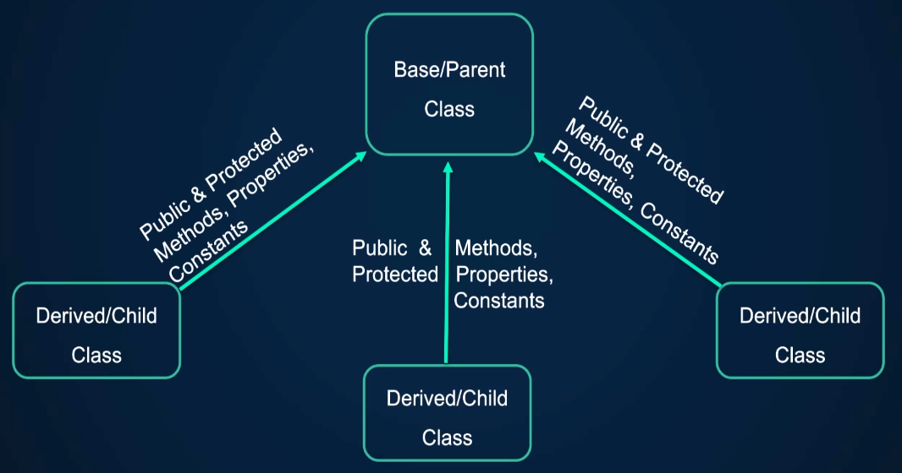
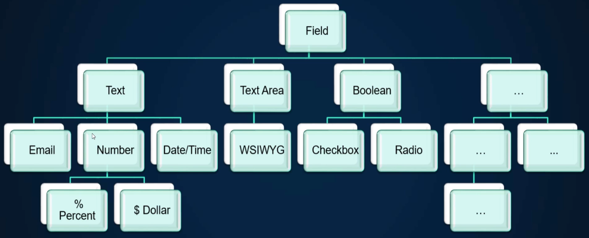
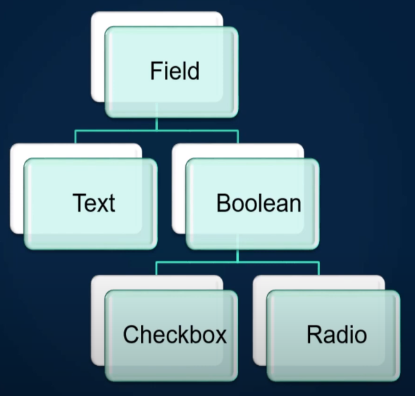
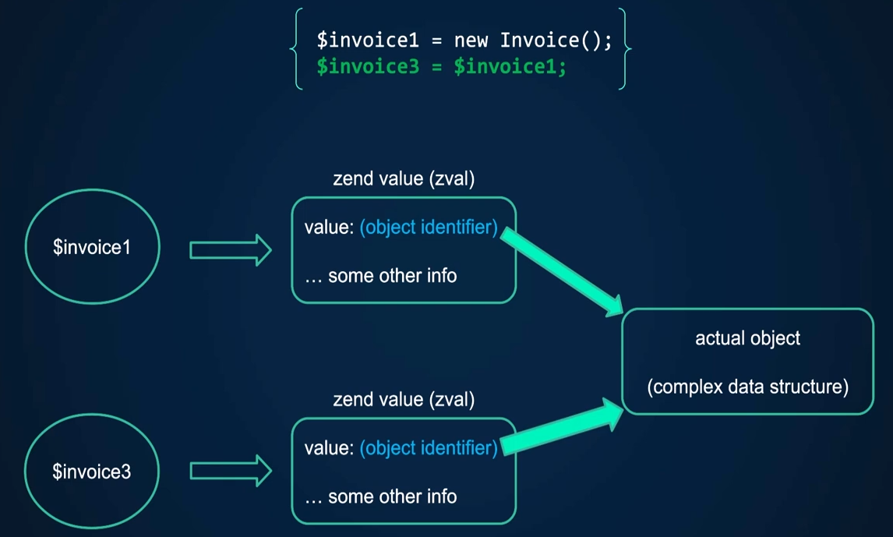

<!-- 
 *   https://github.com/andreysssr/examples

https://www.youtube.com/watch?v=sVbEyFZKgqk&list=PLr3d3QYzkw2xabQRUpcZ_IBk9W50M9pe-&ab_channel=ProgramWithGio
-->

# PHP Полное руководство по PHP 8

1 - Как правильно изучать PHP
2 - Как установить PHP и что такое веб-серверы - Руководство по PHP 8  
3 - Базовый синтаксис PHP - Руководство по PHP 8  
4 - Что такое константы и переменные переменные в PHP  
5 - Типы данных PHP - Обзор приведения типов и как это работает  
6 - Логический тип данных PHP  
7 - Целочисленный тип данных PHP  
8 - PHP с плавающим типом данных  
9 - Строковый тип данных PHP - синтаксис Heredoc и Nowdoc  
10 - Нулевой тип данных PHP  
11 - Тип данных PHP Array - индексированные, ассоциативные и многомерные массивы  
12 - Что такое выражения в PHP и как они вычисляются  
13 - Операторы PHP Часть 1  
14 - Операторы PHP, часть 2  
15 - Приоритет операторов PHP и ассоциативность  
16 - Структуры управления в PHP - Условные операторы - if / else  
17 - Руководство по циклам PHP - Инструкции Break & Continue  
18 - Инструкция переключения PHP - Switch vs if / else statement  
19 - Выражение соответствия PHP - Match vs Switch  
20 - Инструкции PHP Return, Declare и Tickable  
21 - Как включать файлы в PHP - Include and Require  
22 - Как создавать функции в PHP - Руководство по функциям  
23 - Параметры функций PHP - Именованные аргументы - Переменные функции и распаковка  
24 - Области действия переменных PHP - Статические переменные  
25 - Переменные, анонимные, вызываемые функции, функции замыкания и стрелки в PHP  
26 - Как работать с датами и часовыми поясами  
27 - Как работать с массивами в PHP  
28 - Как работать с файлом конфигурации PHPs - PHP.INI  
29 - Обработка ошибок PHP и обработчики ошибок  
30 - Базовая настройка веб-сервера Apache и виртуальных хостов  
31 - Работа с файловой системой на PHP  
32 - Обзор проекта с мини-упражнениями  
33 - Создание небольшой части приложения с помощью процедурного PHP  
34 - Раздел 2 руководства по PHP ООП - Введение в объектно-ориентированное программирование  
35 - Руководство по PHP Docker - Nginx - PHPFPM VS Apache  
36 - Классы и объекты PHP - Типизированные свойства - Конструкторы и деструкторы  
37 - Продвижение свойств конструктора - Оператор Nullsafe  
38 - Руководство по PHP Namespace  
39 - Стандарты кодирования PHP, автозагрузка (PSR-4) и композитор  
40 - Объектно-ориентированный PHP - константы класса  
41 - Статические свойства и методы в объектно-ориентированном PHP  
42 - PHP - Инкапсуляция и абстракция  
43 - PHP - Наследование объяснено - Хорошо ли наследование?  
44 - Абстрактные классы и методы PHP  
45 - Интерфейсы PHP и полиморфизм - Объясненные интерфейсы  
46 - Что такое волшебные методы PHP и как они работают  
47 - Что такое поздняя статическая привязка и как это работает в PHP  
48 - PHP Traits - как они работают и недостатки  
49 - Анонимные классы PHP  
50 - Хранение переменных PHP и сравнение объектов - Zend Value (zval)  
51 - PHP DocBlock - Добавление комментариев к классам и методам  
52 - PHP - Клонирование объектов и магический метод клонирования  
53 - Сериализация объектов PHP и сериализация магических методов  
54 - Обработка ошибок ООП в PHP - Исключения и блоки Try Catch Finally  

---
1 - Как правильно изучать PHP

Основы PHP
- синтаксис и операторы
- переменные и типы данных
- структуры управления и функции
- обработка ошибок
- php.ini конфигурация веб сервера
- работа с массивами
- работа с датами

Промежуточный раздел
- объектно-ориентированное программирование
- классы и методы
- стиль кода и PSR
- Namespaces и Autoloading
- управление зависимостями
- глобальные переменные
- Cookie и Sessions
- базы данных

Продвинутый PHP
- тестирование, PHPunit, TDD, BDD
- введение в MVC и Routing
- контейнеры для внедрения зависимостей
- кеширование и безопасность
- фреймворки 
- программное обеспечение
- хостинг и развёртывание кода
- лучшие практики
  
---
3 - Базовый синтаксис PHP - Руководство по PHP 8

>Код php пишется между тегами `<?php` и `?>` 
>Каждое выражение php должно заканчиваться точной с запятой - `;`
в последней строке перед закрывающим тегом можно не ставить точку с запятой, 
> так как закрывающий тег `?>` автоматически добавляет её в последнюю строку

```php
<?php
echo 'hi'
?>
```

`echo` - языковая конструкция выводит текст, в ней можно использовать скобки как в функциях, 
можно скобки не использовать, а выводимые данные перечислить через запятую.

```php
<?php
echo 'hi', ' ', 'Jon'
?>
```

`print` - языковая конструкция выводит текст, кроме вывода возвращает значение.
в ней можно использовать скобки как в функциях,
можно скобки не использовать,

именование переменных:
имена переменных должны начинаться с буквенных символов, либо со знака нижнего подчёркивания
Допустимые имена, и не должны начинаться с чисел или других символов.
- $hi
- $_123

Присваивание переменных:
по умолчанию переменные присваиваются по значению
```php
$x = 1;
$y = $x; // присвоение по значению
$x = 3;
echo $y; // 1
```
если нужно чтобы значение переменной $y менялось, нужно присвоить его по ссылке
```php
$x = 1;
$y = &$x; // присвоение по ссылке
$x = 3;
echo $y; // 3
```
---
Использование ковычек
в php используются разные ковычки в зависимости от задачи
- `' '` одинарные ковычки интерпретируются как простой текст,
- `" "` двойные ковычки, переменные будут заменены значениями
- `` ` ` `` обратные ковычки - выполнение консольного кода

```php
$text = "Jon";

echo '$text';      // $text
echo "$text";      // Jon
echo "Hi {$text}"; // Hi Jon
echo 'Hi' . $text; // Hi Jon
echo `ls`;         // index.php - выведет содержимое директории
echo `ls ../../`;
```

встравивание php кода в html
```html
<!doctype html>
<html lang="en">
<head>
    <meta charset="UTF-8">
    <title>Document</title>
</head>
<body>
    <?php 
        $x = 10;
        $y = 5;
        echo $x . ', ' . $y;
    ?>

    <!-- вывод текста -->
    <?php echo "Hello world" ?>
    
    <!-- короткая запись echo -->
    <?= "Hello world" ?>
</body>
</html>
```

---
Комментарии
```php
// Однострочный комментарий

# Однострочный комментарий

/*
 многострочный
 комментарий 
 */
```
---
Константы
4 - Что такое константы и переменные переменные в PHP


Существуют 2 спосба создания констант:
- define
- const

```php
//---------------------------------------
// Первый способ определения константы  |
//---------------------------------------
// статический способ создания константы
define('STATUS_PAID', 'paid');
defined('STATUS_PAID'); // проверить была ли определена константа STATUS_PAID, вернёт (true/false)
echo STATUS_PAID;

// динамический способ создания константы
$statusNew = 'NEW';
define('STATUS_' . $statusNew, 'new');
echo STATUS_NEW; // new

//---------------------------------------
// Второй способ определения константы  |
//---------------------------------------
const FOO = 'bar';
```

константы созданные при помощи `const` не могут быть созданы в циклах и структурах
управления.

константы созданные при помощи `define` могут быть созданы в циклах и структурах управления.

В php есть встроенные магические константы:
- `__CLASS__`
- `__DIR__`
- `__FILE__`
- `__FUNCTION__`
- `__LINE__`
- `__METHOD__`
- `__NAMESPACE__`
- `__TRAIT__`

---
Переменная переменная 

Переменная переменная - создание переменной с именем из значения другой переменной
создаётся используя два символа переменной
```php
$foo = 'bar';
$$foo = 'baz';

echo $bar; // baz
echo $$foo; // baz
echo "$foo {$$foo}"; // bar baz
echo "${foo} ${$foo}"; // bar baz
```
---
5 - Типы данных PHP - Обзор приведения типов и как это работает

>PHP - язык с динамической типизацией. Проверка типа происходит во время выполнения.

В PHP поддерживается 8 основных и 2 дополнительных типов данных:
- Скалярные типы данных (4 шт.)
  - bool - логическое значение - true/false
  - int - целое число без десятичных знаков - 1, 2, 3, 0, -5
  - float - число с плавающей точкой - 1.5, 0.1, 0.005, -15.8
  - string - строка - 'hello'
- Составные типы данных (4 шт.) 
  - array - массив
  - object - объект
  - callable
  - iterable  
- Специальные типы данных (2 шт.)
  - resource - ресурс
  - null - отсутствие значения  

>Для получения типа переменной существует функция `gettype()`, 
> можно воспользоваться функцией `var_dump()` 

>Для печати массивом используется функция `print_r()`

```php
// Скалярные типы данных

// bool - логическое значение - true/false
$completed = true;

// int - целое число без десятичных знаков - 1, 2, 3, 0, -5
$scope = 75;

// float - число с плавающей точкой - 1.5, 0.1, 0.005, -15.8
$price = 0.99;

// string - строка - 'hello'
$greeting = 'Hello Gio';
```
```php
// Cоставные типы данных (4 шт.) 


// array - массив
$arr = [1, 2, 3, 0.5, -9.2, 'A', 'b', true];

// object - объект


// callable


// iterable


```

Приведения типов

>В PHP 7 добавили директиву `declare(strict_types=1);`
> , которая как раз и включает строгий режим. 
> В строгом режиме будет принята только переменная точного, 
> заданного типа, или будет выброшен TypeError.
```php
<?php
declare(strict_types = 1);

function getAge(string $age) {
 var_dump($age);
}

$age = 33;
getAge($age);

//Fatal error: Uncaught TypeError: Argument 1 passed to getAge() must be of the type string, integer given..
```

Включить строгий тип
```php
// включение строгой типизации
declare(strict_types=1);
```

преобразование строки в целочисленное значение
```php
$x = (int) '5';

var_dump($x);
```

Приведение данных к нужному типу 

- `(int), (integer)` — приведение к integer.
- `(bool), (boolean)` — приведение к boolean.
- `(float), (double), (real)` — приведение к float.
- `(string)` — приведение к string.
- `(array)` — приведение к array.
- `(object)` — приведение к object.
- `(unset)` — приведение к NULL.

---

[Таблица сравнения типов в PHP](https://www.php.net/manual/ru/types.comparisons.php)
[https://www.php.net/manual/ru/types.comparisons.php](https://www.php.net/manual/ru/types.comparisons.php)

---
6 - Логический тип данных PHP

Сравнение типов `$x` и результатов функций PHP, связанных с типами

| Выражение	| gettype()	| empty()	| is_null()	| isset()	| bool : if($x) |
|---|---|---|---|---|---|
| $x = "";	| string	| true	| false	| true	| false|
| $x = null;	| NULL	| true	| true	| false	| false|
| var $x;	| NULL	| true	| true	| false	| false |
| $x не определена	| NULL	| true	| true	| false |	false |
| $x = [];	| array	| true	| false	| true	| false |
| $x = ['a', 'b'];	| array	| false	| false	| true |	true |
| $x = false;	| bool	| true	| false	| true	| false |
| $x = true;	| bool	| false	| false	| true	| true |
| $x = 1;	| int	| false	| false	| true	| true| 
| $x = 42;	| int	| false	| false	| true	| true| 
| $x = 0;	| int	| true	| false	| true	| false| 
| $x = -1;	| int	| false	| false	| true	| true| 
| $x = "1";	| string	| false	| false	| true	| true| 
| $x = "0";	| string	| true	| false	| true	| false| 
| $x = "-1";	| string	| false	| false	| true	| true |
| $x = "php";	| string	| false	| false	| true	| true |
| $x = "true";	| string	| false	| false	| true	| true |
| $x = "false";	| string	| false	| false	| true	| true |

```
BOOLEANS - bool : if($x)
------------------------
0 -0            = false
0.0 -0.0        = false
''              = false
'0'             = false
[]              = false
null            = false
------------------------
1               = true
-1              = true
'1'             = true
'false'         = true
'text'          = true
[1, 2]          = true
5.7             = true
------------------------
```

---

Гибкое сравнение с помощью `==`

|	| true| 	false |	1	| 0	| -1	| "1"	| "0"	| "-1"	| null	| []	| "php"	|"" |
|---|---|---|---|---|---|---|---|---|---|---|---|---|
| true	| true	| false	| true	| false	| true	| true	| false	| true	| false	| false	| true	| false |
| false	| false	| true	| false	| true	| false	| false	| true	| false	| true	| true	| false	| true |
| 1	| true	| false	| true	| false	| false	| true	| false	| false	| false	| false |	false	| false |
| 0	| false	| true	| false	| true	| false	| false	| true	| false	| true	| false |	`false*`	| `false*` |
| -1	| true	| false	| false	| false	| true	| false	| false	| true	| false	| false	| false	| false |
| "1"	| true	| false	| true	| false	| false	| true	| false	| false	| false	| false	| false	| false |
| "0"	| false	| true	| false	| true	| false	| false	| true	| false	| false	| false	| false	| false |
| "-1"	| true	| false	| false	| false	| true	| false	| false	| true	| false	| false	| false	| false |
| null	| false	| true	| false	| true	| false	| false	| false	| false	| true	| true	| false	| true |
| []	| false	| true	| false	| false	| false	| false	| false	| false	| true	| true	| false	| false |
| "php"	| true	| false	| false	| false*	| false	| false	| false	| false	| false	| false	| true	| false |
| ""	| false	| true	| false	| false*	| false	| false	| false	| false	| true	| false	| false	| true |

>`*` true до PHP 8.0.0.

---

Жёсткое сравнение с помощью `===`

|	| true	| false	| 1	| 0	| -1	| "1"	| "0"	| "-1"	| null	| [] | "php"| 	"" |
|---|---|---|---|---|---|---|---|---|---|---|---|---|
| true	| true	| false	| false	| false	| false	| false	| false	| false	| false	| false	| false	| false |
| false	| false	| true	| false	| false	| false	| false	| false	| false	| false	| false	| false	| false |
|1	| false	| false	| true	| false	| false	| false	| false	| false	| false	| false	| false	| false |
|0	| false	| false	| false	| true	| false	| false	| false	| false	| false	| false	| false	| false |
|-1	| false	| false	| false	| false	| true	| false	| false	| false	| false	| false	| false	| false |
|"1"	| false	| false	| false	| false	| false	| true	| false	| false	| false	| false	| false	| false |
|"0"	| false	| false	| false	| false	| false	| false	| true	| false	| false	| false	| false	| false |
|"-1"	| false	| false	| false	| false	| false	| false	| false	| true	| false	| false	| false	| false |
|null	| false	| false	| false	| false	| false	| false	| false	| false	| true	| false	| false	| false |
|[]	| false	| false	| false	| false	| false	| false	| false	| false	| false	| true	| false	| false |
|"php"	| false	| false	| false	| false	| false	| false	| false	| false	| false	| false	| true	| false |
|""	| false	| false	| false	| false	| false	| false	| false	| false	| false	| false	| false	| true |

---
7 - Целочисленный тип данных PHP

INTEGERS

```php
// размер максимального и минимального числа для 32 битных систем.
echo PHP_INT_MIN . PHP_EOL; // -2000000000
echo PHP_INT_MAX . PHP_EOL; // 2000000000

// размер максимального и минимального числа для 64 битных систем.

echo PHP_INT_MIN . PHP_EOL; // -9223372036854775808
echo PHP_INT_MAX . PHP_EOL; // 9223372036854775807
```

```php
$x = 5;    // 5  десятичная система исчисления 
$x = 12;   // 12 десятичная система исчисления

$x = 0x2A; // 42 шестнадцатиричная система исчисления - имеет префикс 0x

$x = 05;   // 5  восмеричная система исчисления - имеет префикс 0
$x = 055;  // 45 восмеричная система исчисления - имеет префикс 0

$x = 0b1;  // 1 двоичная система исчисления - имеет префикс 0b
$x = 0b10; // 2 двоичная система исчисления - имеет префикс 0b
$x = 0b11; // 3 двоичная система исчисления - имеет префикс 0b
$x = 0b110; // 6 двоичная система исчисления - имеет префикс 0b
```

Переполнение целого числа

При переполнении целого числа тип `integer` меняется на тип числа с плавающей точкой `double`

```php
var_dump(PHP_INT_MAX);     // int(9223372036854775807)
var_dump(PHP_INT_MAX + 1); // double(9.2233720368548E+18)
```

Преобразование в целое число
```
INTEGER
------------------------
(int) true        = 1
(int) false       = 0
(int) 5.98;       = 5
(int) '5.9'       = 5
(int) '77'        = 77
(int) '33текст'   = 33
(int) '42 text'   = 42
(int) 'text'      = 0
(int) null        = 0

(int) 340_650     = 340650
(int) '2_340_650' = 2
------------------------
intval(5.5)       = int(5)
------------------------
```
Для проверки переменной является ли она числом - используется функция `is_int()`

>Начиная с версии 7.4 в написании чисел можно использовать нижнее подчёркивание.   
> `200_000` - это число, его удобнее различать с числом `200000`.  
> Удобно использовать для длинных чисел.  
> Символы нижнего подчёркивания в числе игнорируются и удаляются.
 
>`200_000 == 200000`, `'200_000' = 200`

```php
$x = 200_000;
var_dump($x); // int(200000)

$x = 340_650;
var_dump($x); // int(340650)

$x = 50_750_340;
var_dump($x); // int(50750340

$x = 5_0_75_03_40;
var_dump($x); // int(50750340
```
---
8 - PHP с плавающим типом данных

FLOATS / DOUBLE 

```php
$x = 13.5; 
$x = 13.5e3;  //13500 (eN) - увеличивает число на N порядков (умножает на [N * 10])
$x = 13.5e-3; //0.0135 (e-N) - уменьшает число на N порядков (делит на [N * 10])

var_dump(PHP_FLOAT_MAX); // double(1.7976931348623E+308)
var_dump(PHP_FLOAT_MIN); // double(2.2250738585072E-308)

// не точность математических операций с числами с плавающей точкой
// округление в меньшую сторону
echo floor((0.1 + 0.7) * 10); // 7 вместо ожидаемых 8
// 7.99999999999991118

// округление в большую сторону
echo ceil((0.1 + 0.2) * 10); //  4 вместо ожидаемых 3
// 0.30000000000000004 * 10 = 3.0000000000000004
```

>! Не сравнивать числа с плавающей точкой напрямую

```php
$x = 0.23;
$y = 1 - 0.77;
var_dump($x, $y);   // double(0.23) double(0.23)
var_dump($x == $y); // bool(false)
```
```php
echo NAN; // не числовое значение
echo INF; // значение безконечности будет получено когда выйдем за пределы double
echo PHP_FLOAT_MAX * 2;    // INF - бесконечное число

$x = PHP_FLOAT_MAX * 2;
var_dump($x);              // double(INF)
var_dump(is_infinite($x)); // bool(true) - является ли число бесконечным
var_dump(is_finite($x));   // bool(false) - является ли число не бесконечным
var_dump(is_finite(5));    // bool(true) - является ли число не бесконечным
```

Преобразование в число с плавающей точкой
```php
$x = 5;
var_dump($x); // int(5)

$x = (float) 5;
var_dump($x); // double(5)

$x = 5;
var_dump((float) $x); // double(5)

$x = floatval(5);
var_dump($x); // double(5)

//----------------------------
$x = 5;
var_dump((float) $x);  // double(5) 
var_dump((double) $x); // double(5)
```

```
FLOAD / DOUBLE
---------------------------
(float) 'asdfadf'    = 0
(float) '15.5asadf'  = 15.5
```
---
9 - Строковый тип данных PHP - синтаксис Heredoc и Nowdoc

STRINGS

Для педставления строковых значений используются следующие методы:
- `' '` заключение строки в одинарные ковычки
- `" "` заключение строки в двойные ковычки
- `Heredoc` - трактует строку так, как если бы она была заключена в двойные кавычки 
- `Nowdoc`- трактует строку так, как если бы она была заключена в одинарные кавычки

>Внутри одинарных кавычек нельзя использовать переменные.

```php
$firstName = 'Will';
$lastName = '$firstName Smith'; // $firstName Smith
$lastName = "$firstName Smith"; // Will Smith
$lastName = "${firstName} Smith"; // заключить переменную в фигурные скобки для лучшей читабельности 
$lastName = "{$firstName} Smith"; // заключить переменную в фигурные скобки для лучшей читабельности 

echo $firstName; // Will
echo $lastName;  // Will Smith
```

Доступ к определённому символу в строке  
- доступ по индексу вся строка рассматривается как массив из букв
```php
$firstName = 'Will';
$lastName = "Smith";

$name = $firstName . ' ' . $lastName;

echo $name; // Will Smith

// вывести букву i из слова Will
echo $name[1]; // i - вторая буква с начала
echo $name[-2]; // t - вторая буква с конца

// в слове Will заменить букву i на I
$name[1] = 'I';
echo $name; // WIll Smith

var_dump($name); // string(10) "Will Smith"
$name[15] = 'z'; // позиции с 10-14 заполняются пустыми символами
var_dump($name); // string(16) "Will Smith     z"
```

```php
// Heredoc
$x = 1;
$y = 2;

$text = <<<TEXT
Line $x ' "
Line $y ' "
Line 3
TEXT;

echo nl2br($text); // функция nl2br() заменяет перевод строки на <br> для вывода в браузере
```

```php
// Nowdoc - синтаксис как и у Heredoc, только маркер берётся в одинарные кавычки
$x = 1;
$y = 2;

$text = <<<'TEXT'
Line $x ' "
Line $y ' "
Line 3
TEXT;

echo nl2br($text); // функция nl2br() заменяет перевод строки на <br> для вывода в браузере
```

>`Heredoc` и `Nowdoc` используется для многострочных строк со сложными выражениями. 
> В них можно использовать одинарные и двойные кавычки без необходимости экранирования.
> В основном используется для динамического генерирования кода.

Преобразование данных к строковому типу
```
STRING 
------------------------
(string) null       = ''
strval( 7);         = '7'
```

---
10 - Нулевой тип данных PHP

NULL - специальный тип данных, который представляет переменную с нулевым значением.

Переменная может содержать NULL:
- если ей присвоено значение NULL через null - константу
- переменная ещё не определена
- переменная была удалена

```php
// переменной присвоено значение null
// null - constant
$x = NULL;
$x = null;

var_dump($x);          // NULL
var_dump(is_null($x)); // bool(true)
var_dump($x === null); // bool(true)
var_dump($x === NULL); // bool(true)
```
```php
// переменная ещё не определена
var_dump($x); // вызовет ошибку, но переменная имеет значение NULL
// PHP Warning:  Undefined variable $x in /home/user/workspace-edu/2023/php/project/php/app/public/index.php on line 89
// PHP Stack trace:
// PHP   1. {main}() /home/user/workspace-edu/2023/php/project/php/app/public/index.php:0
// /home/user/workspace-edu/2023/php/project/php/app/public/index.php:89:
// NULL
```
```php
// переменная была удалена
$x = 123;
unset($x);
var_dump($x); // вызовет ошибку, но переменная имеет значение NULL
// PHP Warning:  Undefined variable $x in /home/user/workspace-edu/2023/php/project/php/app/public/index.php on line 89
// PHP Stack trace:
// PHP   1. {main}() /home/user/workspace-edu/2023/php/project/php/app/public/index.php:0
// /home/user/workspace-edu/2023/php/project/php/app/public/index.php:89:
// NULL
```

Приведение значения NULL к разным типам данных
```
NULL
------------------------
var_dump((int) null);
------------------------
(string) null  = string(0) ""
(int) null     = int(0)
(bool) null    = bool(false)
(array) null   = array(0) {}
```
---
11 - Тип данных PHP Array - индексированные, ассоциативные и многомерные массивы

ARRAYS массив - список значений, в котором эти значения могут относиться к разным типам данных.

>Порядок исчисления в массивах начинается с `0`.
>В отличии от строк в массивах нельзя получить значение конца массива используя отрицательный индекс.
>Индексы в массивах должны быть либо строковыми, либо целыми числами

```php
// индексный массив
$arr = ['PHP', 'Java', 'Python'];
isset($arr[3]); // false - проверить существование значения с индексом 3
print_r($arr);  // распечатать содержимое массива
count($arr);    // 3 вернёт количество элементов в массиве - размер массива 
$arr[] = 'C++';  // добавление нового элемента в массив
array_push($arr, 'C', 'Go'); // добавление нескольких элементов в массив
```
```php
// именованный массив
$arr = [
    'php' => '8.0', 
    'python' => '3.9'
];
print_r($arr); 
```
```php
// вложенный массив
$arr = [
  'php' => [
      'creator' => 'Rasmus Lerdorf',
      'website' => 'www.php.net',
      'versions' => [
        ['version' => 8, 'releaseDate' => 'Nov 26, 2020'],  
        ['version' => 7.4, 'releaseDate' => 'Nov 28, 2019'],  
      ]
  ],
  'python' => [
      'creator' => 'Guido Van Rossum',
      'website' => 'www.python.org',
      'versions' => [
        ['version' => 3.9, 'releaseDate' => 'Oct 5, 2020'],  
        ['version' => 3.8, 'releaseDate' => 'Oct 14, 2019'],  
      ]
  ], 
];
echo '<pre>';
print_r($arr); 
echo '</pre>';

// при обращении к несущевтующему элементу массива мы получаем предупрежедние
echo $arr['php']['versions'][3]; // PHP Warning:  Undefined array key 3 in 

// 
echo $arr['php']['versions'][3]['releaseDate']; 
// PHP Warning:  Undefined array key 3 in 
// PHP Warning:  Trying to access array offset on value of type null in 
```

При использовании одинаковых ключей - предыдущие значения перезапишутся
```php
$arr = [0 => 'foo', 1 => 'bar', '1' => 'baz'];
print_r($arr); // Array ( [0] => foo [1] => baz )
```

```php
$arr = [true => 'a', 1 => 'b', '1' => 'c', 1.8 => 'd', null => 'e'];
print_r($arr); // Array ( [1] => d )

// true преобразуется в число 1 - индекс со значением 'a'
// индекс 1 перезаписывается на 'b'
// '1' преобразуется в число 1 - перезаписывается на 'c'
// 1.8 преобразуется в число 1 - перезаписывается на 'd'
// null преобразуется в пустую строку - индекс пустая строка со значением 'e'

echo $arr['']; // выведет 'e'
echo $arr[null]; // выведет 'e'
```

> При добавлении значения в массив, можно не указывать индекс, php автоматически 
> создаст ключ прибавляя `1` к последнему целочисленному ключу. Если целочисленного ключа 
> не было, индексация начнётся с `0`.

```php
$arr = ['a', 'b', 50 => 'c', 'd', 'foo' => 'f'];
print_r($arr); // Array ( [0] => a [1] => b [50] => c [51] => d [52] => f )
```

Удаление элементов массивов

Существует несколько способов удаления элементов массивов
- `array_pop($arr)` - вернёт последний элемент и удалит его из массива
- `array_shift($arr)` - вернёт первый элемент и удалит его из массива, затем массив будет переиндексирован на числовые индексы, строковые индексы останутся без имзменения.
- `unset($arr[2])` - удаляет элемент с индексом 2
- `unset($arr[2], $arr[50])` - удаляет элемент с индексом 2 и 50
- `unset($arr)` - удаляет весь массив

```php
// после удаления элеменов массива, нумерация целочисленных индексов сохраняется
$arr = [1, 2, 3];
unset($arr[0],$arr[1],$arr[2]);
$arr[] = 1;
print_r($arr); // Array ( [3] => 1 )
```

Преобразование типов в массив
```
$x = 5;
var_dump((array) $x); 
print_r((array) $x); // Array ( [0] => 5 ) 

(array) 5      = Array ( [0] => 5 )
(array) 'foo'  = Array ( [0] => foo )
(array) null   = Array ()
```

Проверить существование ключа в массиве
```php
$arr = ['a' => 1, 'b' => null];

var_dump(array_key_exists('a', $arr)); // bool(true) - проверка существования ключа
var_dump(isset($arr['a']));            // bool(true) - проверка существования значения

var_dump(array_key_exists('b', $arr)); // bool(true)
var_dump(isset($arr['b']));            // bool(false)
```
---
12 - Что такое выражения в PHP и как они вычисляются

```php
$x = 5;
$y = $x;

$z = $x == $y; // выражение логического сравнения
$c = sum($x, $y); // выражение

if ($x < 5){
    echo 'Hello';
}
```
---
13 - Операторы PHP Часть 1

OPERATORS

>Оператором называется нечто, принимающее одно или более значений и вычисляющее новое значение.

>Оператор принимающий одно значение называется `унарный оператор`.  
>
>Если оператор принимает 2 значения, он называется `бинарный оператор`.  
>
>Если оператор требует 3 значения, он называется `тернарный оператор`.  

Арифметические операторы ()
Операторы присваивания ()
Строковые операторы ()
Операторы сравнения ()
Операторы контроля ошибок ()
Операторы увеличения/уменьшения ()
Логические операторы ()
Побитовые операторы ()
Операторы массива ()
Операторы выполнения ()
Операторы типа ()
Операторы Nullsafe ()

Ссылки на документацию `php.net`
[Арифметические операторы]()
[Оператор присваивания]()
[Побитовые операторы]()
[Операторы сравнения]()
[Оператор управления ошибками]()
[Операторы исполнения]()
[Операторы инкремента и декремента]()
[Логические операторы]()
[Строковые операторы]()
[Операторы, работающие с массивами]()
[Оператор проверки типа]()

Операторы:

Арифметические операторы позволяют производить математические операции: 
 - `+` - оператор сложения
 - `-` - оператор вычитания
 - `*` - оператор умножения
 - `/` - оператор деления
 - `%` - оператор деления по модулю
 - `**` - оператор возведения в степень

Арифметические операции

|Пример	| Название	| Результат |
|---|---|---|
|+$a	| Идентичность	| Конвертация $a в int или float, что более подходит. |
|-$a	| Отрицание	| Смена знака $a. |
|$a + $b	| Сложение	| Сумма $a и $b. |
|$a - $b	| Вычитание	| Разность $a и $b. |
|$a * $b	| Умножение	| Произведение $a и $b. |
|$a / $b	| Деление	| Частное от деления $a на $b. |
|$a % $b	| Деление по модулю	| Целочисленный остаток от деления $a на $b. |
|$a ** $b	| Возведение в степень	| Возведение $a в степень $b. |

Арифметические операторы можно использовать как префикс к переменной, и этот оператор
преобразует это значение в число, либо в число с плавающей точкой.

Тип результата деления всегда будет float если оба операнда не являются целыми числами и не делятся без остатка
```php
$x = '10';
$y = 2;

var_dump($x);  // string(2) "10"
var_dump(+$x); // int(10)
var_dump(-$x); // int(-10)
```
```php
var_dump(+'10'); // int(10)
var_dump(-'10'); // int(-10)
var_dump(10 / 2); // int(5)

//Тип результата деления всегда будет float если оба операнда не являются целыми числами и не делятся без остатка
var_dump(10 / 3); // double(3.3333333333333)
var_dump(10 / 2.0); // double(5)

// деление на 0
var_dump(10 / 0); // PHP Fatal error:  Uncaught DivisionByZeroError: Division by zero

// функция fdiv() для деления - первый аргумент делится на второй, возвращает float
// фукнкция поможет избежать фатальной ошибки, если вдруг второй аргумент является нулём.
var_dump(fdiv(10, 2)); // double(5)
var_dump(fdiv(10, 0)); // double(INF)

// результат деления по модулю преобразуется в целочисленное значение
// знак результата берётся из числа - которое мы делим (первое число)
var_dump(10 % 2);      // int(0)
var_dump(5 % 3);       // int(2)
var_dump(5 % -3);      // int(2)
var_dump(-5 % 3);      // int(-2)
var_dump(-5 % -3);     // int(-2)
var_dump (10.5 % 2.9); // int(0) - для деления по модулю числа приводятся к целым - 10 % 2

// для деления по модулю для чисел с плавающей точкой есть функция 
var_dump (fmod(10.5, 2.9)); // double(1.8)
```

Операторы присваивания

>Базовый оператор присваивания обозначается как "=".

Оператор присваивания 
```php
$x = 3;

// 10 присваивается переменной $y, затем значение переменной $y присваивается переменной $x
$x = $y = 10; // переменные $x и $y равны 10

$x = ($y = 10) + 5;// $y = 10, $x = 15

$a = ($b = 4) + 5; // $a теперь равно 9, а $b было присвоено 4.

```

Операторы арифметического присваивания (комбинированные операторы)

| Пример	| Эквивалент	| Операция |
|---|---|---|
| $a += $b	| $a = $a + $b	| Сложение |
| $a -= $b	| $a = $a - $b	| Вычитание |
| $a *= $b	| $a = $a * $b	| Умножение |
| $a /= $b	| $a = $a / $b	| Деление |
| $a %= $b	| $a = $a % $b	| Модуль |
| $a **= $b	| $a = $a ** $b	| Возведение в степень |

Строковые операторы
- `.` - оператор конкатенации
- `.=` - комбинированный оператор конкатенации

```php
$x = 'Hello';
$x = $x . ' World';
echo $x; // Hello World

$y = 'Hello';
$y .= ' World';
echo $y; // Hello World
```

Операторы сравнения - позволяют сравнивать два операнда друг с другом
- `==` - Равно
- `===` - Тождественно равно
- `!=` - Не равно
- `<>` - Не равно
- ` !== ` - Тождественно не равно
- `<` - Меньше
- `>` - Больше
- `<=` - Меньше или равно
- `>=` - Больше или равно
- `<=>` - Космический корабль

| Пример	| Название	| Результат |
|---|---|---|
| $a == $b	| Равно	| `true` если $a равно $b после преобразования типов. |
| $a === $b	| Тождественно равно	| `true` если $a равно $b и имеет тот же тип. |
| $a != $b	| Не равно	| `true` если $a не равно $b после преобразования типов. |
| $a <> $b	| Не равно	| `true` если $a не равно $b после преобразования типов. |
| $a !== $b	| Тождественно не равно	| `true` если $a не равно $b, или они разных типов. |
| $a < $b	| Меньше	| `true` если $a строго меньше $b. |
| $a > $b	| Больше	| `true` если $a строго больше $b. |
| $a <= $b	| Меньше или равно	| `true` если $a меньше или равно $b. |
| $a >= $b	| Больше или равно	| `true` если $a больше или равно $b. |
| $a <=> $b	| Космический корабль (spaceship)	| Число типа int меньше, больше или равное нулю, когда $a соответственно меньше, больше или равно $b. |

```php
// работа оператора сравнения -    <=>
// шкала на цифровой прямой   -   -101
// Целые числа
echo 1 <=> 1; // 0
echo 1 <=> 2; // -1
echo 2 <=> 1; // 1

// Числа с плавающей точкой
echo 1.5 <=> 1.5; // 0
echo 1.5 <=> 2.5; // -1
echo 2.5 <=> 1.5; // 1

// Строки
echo "a" <=> "a"; // 0
echo "a" <=> "b"; // -1
echo "b" <=> "a"; // 1

echo "a" <=> "aa"; // -1
echo "zz" <=> "aa"; // 1
```

> До 8 версии php для сравнения числа и строки - строки конвертировались в число и сравнивались,
> В 8 версии php для сравнения числа и строки - числа конвертируются в строку и сравниваются.

```
// до 8 версии php
(0 == 'hello') // возвращало true - строка приводилась к числу, 
получался 0, (0 == 0)

// в 8 версии php 
(0 == 'hello') // возвращает false - число приводится к строке, 
получается '0', ('0' == 'hello')
```

Условные операторы - тернарные операторы
- `?:` - тернарный оператор
- `??` - нулевой оператор

| Пример	| Эквивалент	|
|---|---|
| $a ??= $b	| $a = $a ?? $b	|

```php
function test($text = null){
    echo $text ??= 'default';
}
```

```php
// тернарный оператор
$result = ($y === false) ? 'Not Found' : 'Found';

// Пример использования тернарного оператора
$action = (empty($_POST['action'])) ? 'default' : $_POST['action'];
```
```php
$x = null;
$y = $x ?? 'hello';
var_dump($y); // string(5) "hello"
```
```php
$x = 'hi';
$y = $x ?? 'hello';
var_dump($y); // string(5) "hi"
```
```php
$y = $x ?? 'hello'; // переменная x не определена, но ошибки не будет
var_dump($y); // string(5) "hello"

// Пример использования оператора
$action = $_POST['action'] ?? 'default';
```
```php
// Вызывает предупреждение о том, что $name не определено.
print 'Mr. ' . $name ?? 'Anonymous';

// Выведет "Mr. Anonymous"
print 'Mr. ' . ($name ?? 'Anonymous');
```

Оператор контроля ошибок `@`

Работа оператора контроля ошибок заключается в том что если вы добавите его в выражение,
он подавит все возникающие ошибки в этом выражении.
```php
$x = @file('text.txt');
```

>Не рекомендуется пользоваться этим оператором. Он просто подавляет ошибку, которую труднее 
> будет обнаружить.

Оператор инкремента/декремента (++, --)

- оператор инкремента используется для увеличения значения переменной на 1,
- оператор декремента используется для уменьшения значения переменной на 1

>PHP поддерживает префиксные и постфиксные операторы инкремента и декремента

>Замечание: Операторы инкремента/декремента влияют только на числа и строки. Массивы, объекты, булевы значения и ресурсы не будут изменены. Декремент null также не даст никакого эффекта, однако инкремент даст значение 1.

Операторы инкремента и декремента

| Пример	| Название	| Действие |
|---|---|---|
| ++$a	| Префиксный инкремент	| Увеличивает $a на единицу, затем возвращает значение $a. |
| $a++	| Постфиксный инкремент	| Возвращает значение $a, затем увеличивает $a на единицу. |
| --$a	| Префиксный декремент	| Уменьшает $a на единицу, затем возвращает значение $a. |
| $a--	| Постфиксный декремент	| Возвращает значение $a, затем уменьшает $a на единицу. |

```php
$x = null;
var_dump(--$x); // NULL
var_dump(++$x); // int(1)

$y = 'abc';
var_dump(--$y); // string(3) "abc"
var_dump(++$y); // string(3) "abd"
```

Логические операторы

|Пример	| Название	| Результат |
|---|---|---|
|$a and $b	| И	| `true`, если и $a, и $b `true`. |
|$a or $b	| Или	| `true`, если или $a, или $b `true`. |
|$a xor $b	| Исключающее или	| `true`, если $a, или $b `true`, но не оба. |
|! $a	| Отрицание	| `true`, если $a не `true`. |
|$a && $b	| И	| `true`, если и $a, и $b `true`. |
|$a II $b	| Или	| `true`, если или $a, или $b `true`. |

>Смысл двух разных вариантов для операторов "and" и "or" в том, что они работают с различными приоритетами 

```php
// foo() никогда не будет вызвана,
// т.к. эти операторы являются шунтирующими (short-circuit)

$a = (false && foo());
$b = (true  || foo());
$c = (false and foo());
$d = (true  or  foo());
```

Побитовые операторы - используются для побитовых операций

Думайте о битах как о переключателях включения-выключения

|Пример	| Название	| Результат |
|---|---|---|
|$a & $b	| И	| Устанавливаются только те биты, которые установлены и в $a, и в $b. |
|$a I $b	| Или	| Устанавливаются те биты, которые установлены в $a или в $b. |
|$a ^ $b	| Исключающее или	| Устанавливаются только те биты, которые установлены либо только в $a, либо только в $b, но не в обоих одновременно. |
|~ $a	| Отрицание	| Устанавливаются те биты, которые не установлены в $a, и наоборот. |
|$a << $b	| Сдвиг влево	| Все биты переменной $a сдвигаются на $b позиций влево (каждая позиция подразумевает "умножение на 2") |
|$a >> $b	| Сдвиг вправо	| Все биты переменной $a сдвигаются на $b позиций вправо (каждая позиция подразумевает "деление на 2") |

```php
$x = 6;
$y = 3;

var_dump($x & $y); // int(2)

// число 6 это 110 в двоичной системе исчисления 
// 6 - 110
//     &  
// 3 - 011
// --------
//     010 = 2 (в 10 системе исчисления) 

// 6 - 110
//     |  
// 3 - 011
// --------
//     111 = 7

// 6 - 110
//     ^  
// 3 - 011
// --------
//     101 = 5

var_dump(~$x & $y); // int(2)
// 6 - 110
//     ~
//     001   
//     &  
// 3 - 011
// --------
//     001 = 1 

$x = 6;
$y = 3;
var_dump($x << $y);
// 6 - 110
//     <<
//     110000 = 48 

var_dump($x >> $y);
// 6 - 110
//     >>
//     0 = 0

$x = 6;
$y = 1;
var_dump($x >> $y);
// 6 - 110
//     <<
//     11 = 3
```

Операторы массивов

Операторы, работающие с массивами

| Пример	| Название	 | Результат |
|---|---|---|
| $a + $b	| Объединение	| Объединение массива $a и массива $b. |
| $a == $b	| Равно	| `true` в случае, если $a и $b содержат одни и те же пары ключ/значение. |
| $a === $b	| Тождественно равно	| `true` в случае, если $a и $b содержат одни и те же пары ключ/значение в том же самом порядке и того же типа. |
| $a != $b	| Не равно	| `true`, если массив $a не равен массиву $b. |
| $a <> $b	| Не равно	| `true`, если массив $a не равен массиву $b. |
| $a !== $b	| Тождественно не равно	| `true`, если массив $a не равен тождественно массиву $b. |

```php
$x = ['a', 'b', 'c'];
$y = ['d', 'e', 'f', 'g', 'h'];
print_r($x + $y); // Array ( [0] => a [1] => b [2] => c [3] => g [4] => h )

$a = array("a" => "apple", "b" => "banana");
$b = array("a" => "pear", "b" => "strawberry", "c" => "cherry");
print_r($a + $b); // Array ( [a] => apple [b] => banana [c] => cherry )
```
---
15 - Приоритет операторов PHP и ассоциативность
https://www.youtube.com/watch?v=pmX_-x3LX-k&list=PLr3d3QYzkw2xabQRUpcZ_IBk9W50M9pe-&index=15

Порядок выполнения операторов

| Ассоциативность	| Оператор	| Дополнительная информация |
|---|---|---|
| (н/а) |	clone new	| clone и new |
| правая |	**	арифметические операторы |
| (н/а) |	+ - ++ -- ~ (int) (float) (string) (array) (object) (bool) @	| арифметические операторы (унарные + и -), инкремент/декремент, побитовые операторы, приведение типов и оператор управления ошибками |
| левая |	instanceof	| типы |
| (н/а) |	!	| логические операторы |
| левая |	* / %	| арифметические операторы |
| левая |	+ - .	| арифметические операторы (бинарные + и -), операторы, работающие с массивами и строковые операторы (. до PHP 8.0.0) |
| левая |	<< >>	| побитовые операторы |
| левая |	.	| строковые операторы (начиная с PHP 8.0.0) |
| неассоциативна |	< <= > >=	| операторы сравнения |
| неассоциативна |	== != === !== <> <=>	| операторы сравнения |
| левая |	&	| побитовые операторы и ссылки |
| левая |	^	| побитовые операторы |
| левая |	|	| побитовые операторы |
| левая |	&&	| логические операторы |
| левая |	||	| логические операторы |
| правая |	??	| операторы сравнения с null |
| неассоциативна |	? :	| тернарный оператор (лево-ассоциативный до PHP 8.0.0) |
| правая |	= += -= *= **= /= .= %= &= |= ^= <<= >>= ??=	| операторы присваивания |
| (н/а) |	yield from	| yield from |
| (н/а) |	yield	| yield |
| (н/а) |	print	| print |
| левая |	and	| логические операторы |
| левая |	xor	| логические операторы |
| левая |	or	| логические операторы |

Асоциативность - начало выполнение выражения - слева, справа.

```php
// and, or - имеют самый низкий приоритет
$z = true and false; // выполняется присваивание и false отбрасывается
$y = (true and false);

var_dump($z); // true
var_dump($y); // false
``` 

---
16 - Структуры управления в PHP - Условные операторы - if / else 

> (if / else / elseif/ else if)

```php
$scope = 90;
if($scope >= 85){
    echo 'A';
}

// для выражения из 1 строки можно не использовать скобки
if($scope >= 85)
    echo 'A';

if($scope >= 90){
    echo 'A';
}elseif ($scope >= 80){
    echo 'B';
}elseif ($scope >= 70){
    echo 'C';
}elseif ($scope >= 60){
    echo 'D';
}else{
    echo 'F';
}
```

Альтернативный синтаксис - открывающие скобки заменяются на двоеточие.
```php
<?php $scope = 90; ?>

<?php if($scope >= 90) : ?>
    <strong>A</strong>
<?php elseif($scope >= 80) : ?>
    <strong>B</strong>
<?php elseif($scope >= 70) : ?>
    <strong>C</strong>
<?php elseif($scope >= 60) : ?>
    <strong>D</strong>
<?php else: ?>
    <strong>F</strong>
<?php endif ?>
```
---
17 - Руководство по циклам PHP - Инструкции Break & Continue

Управление циклами
- break - останавливает цикл текущего - 1 уровня, break 2 - останавливает родительский цикл
- continue - остановка текущей итерации и переход к следующей, continue 2 - остановка родитеськой итерации

Цикл `while`
```php
$i = 0;
while ($i <= 15){
    echo ++$i;
}
```

Бесконечный цикл
```php
$i = 0;
while (true){
    if($i >= 15){
        break; // останавливает цикл - по умолчанию первый уровень, 
               // можно передавать уровень цикла для остановки - для вложенных циклов
    }
    echo $i++;
}
```
```php
$i = 0;
while (true){
    while($i >= 15){
        break 2; // останавливает цикл - по умолчанию первый уровень, 
               // можно передавать уровень цикла для остановки - для вложенных циклов
    }
    echo $i++;
}
```

Альтернативный синтаксис для встраивания кода в html:
```php
$i = 0;
while ($i < 15):
// html 
// код php
// html 
endwhile;
```

Цикл `do while` - гарантирует что код будет выполнен минимум 1 раз
```php
$i = 0;
do{
    echo $i++;
}while($i <= 15);
```

Циклы `for`
```php
for ($i = 0; $i < 10; $i++ ){
    echo $i;
}

for ($i = 0; $i < 10; print $i, $i++ ){}
for ($i = 0; print $i, $i < 10; $i++ ){}
```
```php
// все параметры не обязательны
// по сути будет запущен бесконечный цикл
for ( ; ; ){ 
    echo $i;
}
```

```php
$text = ['a', 'b', 'c', 'd'];
for ($i = 0, $length = count($text); $i < $length; $i++ ){
    echo $text[$i] . '<br>';
}

$text = ['a', 'b', 'c', 'd'];
$length = count($text)
for ($i = 0; $i < $length; $i++ ){
    echo $text[$i] . '<br>';
}
```

```php
$programming = ['php', 'java', 'go', 'rust'];

foreach ($programming as $item) {
    echo $item . '<br>';
}

foreach ($programming as $key => $item) {
    echo  $key. ': ' . $item . '<br>';   
}

echo $item;
// Переменная $item доступна (с последним значением) после окончания цикла  
```

```php
$user = [
    'name' => 'Gio',
    'email' => 'gio@email.com',
    'skills' => ['php', 'graphql', 'react'],
];

foreach ($user as $key => $value) {
//    echo $key . ': ' . ($value); // вызовет ошибку вывода массива как строки
    echo $key . ': ' . json_encode($value); // переводит массив в строку
}
```
Альтернативный синтаксис
```php
<?php foreach ($user as $key => $value) : ?>
    // ...
<?php endforeach; ?>
```

---
18 - Инструкция переключения PHP - Switch vs if / else statement  

>Оператор `switch` выполняется построчно, но начинает выполняться после того
как находится совпадение. Если после совпадения не стоит оператор `break` - все нижестоящие
инструкции будут выполнены не зависимо от того совпадает значение в `case` или нет.

```php
$paymentStatus = 'paid';

switch ($paymentStatus){
    case 'paid': // выполняет слабое значение: (1 и '1'), (1 и true) будут равны
        echo 'Paid '; // на экран выведется - 'Paid Pending Payment'
    
    case 'pending':
        echo 'Pending Payment ';
        break;
    
    case 'declined': // используется один блок для разных значений
    case 'rejected': // блок отработает при значениях 'declined' либо 'rejected'
        echo 'Payment Declined';
        break; 

    default: // блок отработает при любых значениях
        echo 'Unknown Payment Status';
}
```
Если `switch` находится в цикле, можно прерывать цикл указав `break 2`.
Оператор `continue` для `switch` - эквивалентен оператору `break`, и при использовании
выдаст предупреждение об этом. 
Если оператор `switch` находится в цикле и нужно пропустить итерацию - нужно 
использовать `continue 2` - тогда предупреждение не будет выдано, а текущая итерация будет пропущена при совпадении значения `case`

```php
$paymentStatuses = [1, 3, 0];

foreach ($paymentStatuses as $paymentStatus) {
    switch ($paymentStatus){
        case 1:
            echo 'Paid';
            continue 2;
            
        case 2:
        case 2:
    }
}
```
>Отличие оператора `switch` от `if` в том что операции в `switch` выполняются один раз, а
> операции в `if` - повторно.

---
19 - Выражение соответствия PHP - `Match` vs `Switch`

```php
$paymentStatus = 1;

switch ($paymentStatus){
    case 1:
        echo 'Paid';
        break;
  
    case 2:
    case 3:
        echo 'Payment Declined';
        break; 
    
    case 0:
        echo 'Pending Payment';
        break;

    default:
        echo 'Unknown Payment Status';
}

echo '<br>';

match($paymentStatus){
    1 => 'Paid',
    1 > 2 => function(){} // могут использоваться сложные выражения
    2, 3 => 'Payment Declined', // сработает для значения 2 или 3
    0 => echo 'Pending Payment',
    default => 'Unknown Payment Status', // значение по умолчанию
};
```

>Конструкция `switch` использует лёгкое сравнение `(switch ==)`.  
> 
>Конструкция `match` использует строгое сравнение `(match ===)`

>В конструкции `switch` ожно использовать несколько операторов подряд - расположенных ниже (echo, print, ...),   
в конструкции `match` можно использовать только 1 оператор, либо для этой цели использовать функцию.

---
20 - Инструкции PHP Return, Declare и Tickable 

Операторы
- return 
- declare
  - ticks - директива о галочках (после каждого или нескольких тиках кода)
  - encoding - директива о кодировании для разных сценариев
  - strict_types - директива включения проверки строгих типах 

Выполнение команды `return` внутри функции завершает её выполнение и возвращает значение 
Использование команды `return` в скрипте остановит его выполнение.

```php
// Оператор return
function sum($x, $y){
    return $x + $y;
}
```

```php
// Оператор declare
// директива ticks
function onTick(){
    echo 'Tick' . PHP_EOL;
}
register_tick_function('onTick');
declare(ticks=3);
$i = 0;
$length = 10;

while ($i < $length){
    echo $i++ . PHP_EOL;
}
```

>Инструкция `declare(strict_types=1);` должна быть первой в скрипте (в самом начале)   
>  
>Инструкция действует только на файл в котором она объявлена, на подключаемый файл она не действует.

```php
declare(strict_types=1); 
function sum(int $x, int $y){
    return $x + $y;
}

echo sum('5', 10);
```

---
21 - Как включать файлы в PHP - Include and Require

Подключение файлов в php:
- `require` - подключить файл, при отсутствии файла выдаст фатальную ошибку
- `require_once` - подключить файл если он ещё не подключен, при отсутствии файла выдаст фатальную ошибку
- `include` - подключить файл, при отсутствии файла продолжит выполнять скрипт
- `include_once` - подключить файл если он ещё не подключен, при отсутствии файла продолжит выполнять скрипт

```php
require 'file.php';
require_once 'file.php';
include 'file.php';
include_once 'file.php';
```

```php
// file.php
// <?php $x = 5;

// =========================

require_once 'file.php';
$x++;

echo $x . PHP_EOL; // 6

require 'file.php'; // подключит файл, $x = 5
echo $x . PHP_EOL;  // 5
```

```php
ob_start();
include './partitials/nav.php';

$nav = ob_get_clean();
$nav = str_replace('About', 'About Us', $nav);

echo nav;
```

---
22 - Как создавать функции в PHP - Руководство по функциям 

```php
function foo(){
    return 'Hello World';
}

function test(){}

var_dump(foo());  // string(11) "Hello World"
var_dump(test()); // NULL
```

Можно определить функцию после её вызова, если определение идёт в том же файле.
```php
var_dump(foo());  // string(11) "Hello World"

function foo(){
    return 'Hello World';
}
```

Типы возвращаемых данных
- int
```php
function foo1(): int
{
    return '1';
}

function foo2()
{
    return '1';
}

var_dump(foo1()); // int(1)
var_dump(foo2()); // string(1) "1"

var_dump((function(){return 5;})()); //int(5)
```

```php
declare(strict_types=1);

function foo1(){} // по умолчанию функция возвращает null
function foo2(): void // функция ни чего не должна возвращать
{
    return null; // вызовет ошибку, т.к. возвращает null, но ни чего не должна возвращать
} 

var_dump(foo1());
var_dump(foo2()); // PHP Fatal error:  A void function must not return a value (did you mean "return;" instead of "return null;"?)
```
```php
function foo1(): ?int // функция может возвращать число либо null
{
    return null; // вызовет ошибку, т.к. возвращает null, но ни чего не должна возвращать
} 

function foo2(): ?int // функция может возвращать число либо null
{
    return 1; // вызовет ошибку, т.к. возвращает null, но ни чего не должна возвращать
} 

var_dump(foo1()); // NULL
var_dump(foo2()); // int(1)
```

Возврат разных типов данных
```php
function foo(): int|float|array
{ 
//    return 1; 
//    return 1.5; 
    return [1];
} 
```
Вместо перечисления нескольких типов данных можно использовать `mixed`
```php
function foo(): mixed
{
    return 1; 
} 
```
---
23 - Параметры функций PHP - Именованные аргументы - Переменные функции и распаковка  

```php
function foo($x, $y) // $x и $y - параметры функции
{
    return $x + $y; 
} 

echo foo(5, 10); // 5 и 10 - аргументы функции, данные которые ей переданы
```

```php
function foo(int|float $x, int|float $y): int|float  // int|float - установка типов принимаемых параметров
{
    return $x * $y; 
} 

echo foo(5.0, '10');
```

Добавление не обязательного параметра
```php
function foo(int|float $x, int|float $y = 10): int|float
{
    return $x * $y; 
} 

echo foo(5.0);
```

Добавление аргументов по ссылке
по умолчанию аргументы добавляются по значению (значения копируются в функцию)
```php
function foo(int|float &$x, int|float $y): int|float // добавление параметра $x по ссылке
{
    if ($x % 2 == 0){
        $x /= 2;
    }
    return $x * $y; 
} 
$a = 10;
$b = 3;

echo foo($a, $b); // 15

var_dump($a, $b); // int(5), int(3)
```

Вариационные функции принимают неограниченное число аргументов
```php
function sum(...$numbers): int|float
{
//    $sum = 0;
//    foreach ($numbers as $number) {
//        $sum += $number;
//    }
//    return $sum;
    
    return array_sum($numbers);
}

var_dump(sum(2, 3, 4)); // int(9)
```

Оператор многоточие, оператор распаковки
```php
function sum(int|float $x, int|float $y, int|float ...$numbers): int|float
{
    return $x + $y + array_sum($numbers);
}

var_dump(sum(1, 2, 3, 4, 5)); // int(15)
```

>Оператор многоточие можно использовать в массивах для распаковки других массивов.

Именованные аргументы - передают аргументы на основе имени параметра, это значит что
они не обязательно должны находится в том же порядке что и в функции
```php
function foo(int $x, int $y): int 
{
    return $x - $y;
}

$x = 5;
$y = 3;

echo foo(y: $y, x: $x); // 2
```
```php
setcookie(name: 'foo', value: 'bar', httponly: true);
```

```php
function foo(int $x, int $y): int
{
    var_dump($x, $y);
    return $x + $y;
}
//$arr = [1, 2];
$arr = ['y' => 2, 'x' => 1];

echo foo(...$arr); // int(1) int(2)
```

---
24 - Области действия переменных PHP - Статические переменные 

По умолчанию доступ к переменным за пределами функции закрыт,
доступ к переменным возможен через аргументы функции, либо через
объявление глобальных переменных.

```php
$x = 5;
function foo(){
    global $x; // инициализируется глобальная переменная 
    $x = 10; // меняется переменная
    // echo $GLOBALS['x']; 
    echo $x;
}
foo();
echo $x;
```

Статическая переменная - не уничтожается и сохраняет своё ззначение
```php
function getParams(){
    sleep(2);
    echo 'Processing' . PHP_EOL;
    return 10;
}

function getValue(){
    static $value = null;
    return $value ??= getParams(); 
}

echo getValue() . PHP_EOL;
echo getValue() . PHP_EOL;
echo getValue() . PHP_EOL;
```

---
25 - Переменные, анонимные, вызываемые функции, функции замыкания и стрелки в PHP  

Функции с переменных

Когда php обнаруживает круглые скобки рядом с переменной, он будет искать ту же
функцию что и значение у переменной

```php
function sum(int|float ...$nambers): int|float
{
    return array_sum($nambers);
}
$x = 'sum';
echo $x(1, 2, 3, 4); // 10
```
```php
function sub(int|float ...$nambers): int|float
{
    return array_sum($nambers);
}

$x = 'sum';

if(is_callable($x)){
    echo $x(1, 2, 3, 4); 
}else{
    echo 'Not Callable';
}
```

Анонимные функции, также известные как лямбда функции - это функции у которых
нет имени. Анонимные функции должны заканчиваться точкой с запятой.
```php
function (int|float ...$nambers): int|float
{
    return array_sum($nambers);
}; // анонимные функции должны заканчиваться точкой с запятой.
```
```php
$x = function (int|float ...$nambers): int|float
{
    return array_sum($nambers);
}; 

echo $x(1, 2, 3, 4, 5); // 15
```

Анонимные фукции можно возвращать как аргумент другой функции, передавать их из
функций.

В анонимных функциях можно получить доступ к внешним переменным через конструкцию `use()`
```php
$x = 1;
$sum = function (int|float ...$nambers) use($x): int|float
{
    echo $x . PHP_EOL;
    return array_sum($nambers);
}; 

echo $sum(1, 2, 3, 4, 5);
```

Этот тип анонимных функций, в которой вы можете получить доступ к переменной за
локальной областью видимости так же называют - замыканимем.

>В конструкцию `use($x)` по умолчанию переменные передаются по значению (копируются), а не по ссылке.  
> 
>Переменную можно передать по ссылке `use(&$x)` тогда эту переменную можно будет изменить
внутри функции.

>Когда функция передаётся другой функции в качестве аргумента, а затем вызыввается
внутри этой функции - она называется `функцией обратного вызова`.

В php есть множество встроенных функций, которые в качестве аргумента ожидают функцию обратного вызова.

```php
$arr = [1, 2, 3, 4,];
$arr2 = array_map(function ($element){
    return $element * 2;
}, $arr);

print_r($arr);
print_r($arr2);
```
Второй вариант передачи функции обратного вызова - это назначить функцию переменной
```php
$arr = [1, 2, 3, 4,];
$x = function ($element){
    return $element * 2;
};

$arr2 = array_map($x, $arr);

print_r($arr);
print_r($arr2);
```

```php
$arr = [1, 2, 3, 4,];
function foo($element){
    return $element * 2;
}

$arr2 = array_map('foo', $arr);

print_r($arr);
print_r($arr2);
```

```php
$sum = function (callable $callback, int|float ... $numbers): int|float
{
    return $callback(array_sum($numbers));
};

echo $sum('foo', 1, 2, 3, 4);

function foo($element){
    return $element * 2;
}
```

php автоматически преобразует функции в экземпляры замыкания,  
В основном анонимные функции это экземпляры замыкания.

Функции со стрелкой в php были введены в версии 7.4 и представляют более чистый 
синтаксис анонимных функций с несколькими отличиями.

Функция со стрелкой полезна для передачи её в качестве аргумента функциям.

>Функции со стрелкой имеют доступ к родительской области видимости без необходимости объявлять конструкцию `use`
> Переменная из родительской области передаётся по значению, мы не можем изменить её в стрелочной функции
```php
$arr = [1, 2, 3, 4,];

$result = array_map(function ($number){
    return $number * $number;
}, $arr);

$y = 5;
$result2 = array_map(fn($number) => $number * $number * $y, $arr);

print_r($result);
print_r($result2);
```
---

26 - Как работать с датами и часовыми поясами  

```php
echo time(); // 1691336765 - метка линукс текущее количество секунд прошедших с 1 января 1970 года

echo time() - 60;// время в прошлом на 1 минуту назад
echo time() + 60;// время в будущем на 1 минуту вперёд
```
```php
$currentTime = time();
echo $currentTime;
echo $currentTime + (5 * 24 * 60 * 60); // будущее время на 5 дней вперёд 
```
```php
$currentTime = time();
echo date('d/m/Y g:ia') . PHP_EOL; // без второго параметра будет использоваться текущее время
echo date('d/m/Y g:ia', $currentTime + 5 * 24 * 60 * 60) . PHP_EOL; 
echo date('d/m/Y g:ia', $currentTime - 24 * 60 * 60) . PHP_EOL; 
```

По умолчанию все функции даты и времени используют часовой пояс установленный в файле
конфигурации php, но его можно перезаписать - используя одну из встроенных функций во время выполнения.

```php
date_default_timezone_set('UTC');
$currentTime = time();
echo date('d/m/Y g:ia') . PHP_EOL;
echo date('d/m/Y g:ia', $currentTime + 5 * 24 * 60 * 60) . PHP_EOL;
echo date('d/m/Y g:ia', $currentTime - 24 * 60 * 60) . PHP_EOL;
echo date_default_timezone_get() . PHP_EOL;
date_default_timezone_set('Europe/Moscow');
echo date('d/m/Y g:ia') . PHP_EOL;
echo date('d/m/Y g:ia', $currentTime + 5 * 24 * 60 * 60) . PHP_EOL;
echo date('d/m/Y g:ia', $currentTime - 24 * 60 * 60) . PHP_EOL;
echo date_default_timezone_get() . PHP_EOL;
```
```php
echo date('d/m/Y g:ia', strtotime('tomorrow')); // завтрашний день полночь
echo date('d/m/Y g:ia', strtotime('first day of february')); // первый день февраля
echo date('d/m/Y g:ia', strtotime('last day of february')); // последний день февраля
echo date('d/m/Y g:ia', strtotime('last day of february 2020')); // последний день февраля 2020 года

$date = date('d/m/Y g:ia', strtotime('last day of february 2020'));
print_r(date_parse($date));
print_r(date_parse_from_format('d/m/Y g:ia', $date));
```
---
27 - Как работать с массивами в PHP

Разбить массив на части
```php
$arr = ['a' => 1, 'b' => 2, 'c' => 3, 'd' => 4, 'e' => 5];
print_r(array_chunk($arr, 2)); // дробит массив по 2 элемента в подмассиве без сохранения ключей
print_r(array_chunk($arr, 2, true)); // дробит массив с сохранением ключей
```
Объединение массивов
```php
$arr = ['a', 'b', 'c']; // в новом массиве будут ключами
$arr2 = [5, 10, 15];    // в новом массиве будут значениями
print_r(array_combine($arr, $arr2)); // количество ключей и количество значений должно быть одиноковое, иначе фатальная ошибка
```
Фильтр массивов данных
```php
// чётных и не чётных чисел
$arr = [1, 2, 3, 4, 5, 6, 7, 8, 9, 10];
$even = array_filter($arr, fn($number) => $number & 1);
sort($even);
print_r($even);
```

Уменьшение массива до 1 значения
```php
// позиция счёт-фактуры
$items = [
    ['price' => 9.99,  'qty' => 3, 'desc' => 1],
    ['price' => 29.99, 'qty' => 1, 'desc' => 2],
    ['price' => 149,   'qty' => 1, 'desc' => 3],
    ['price' => 14.99, 'qty' => 2, 'desc' => 4],
    ['price' => 4.99,  'qty' => 4, 'desc' => 5],
];

// в callback передаётся значение предыдущей итерации 
$total1 = array_reduce(
    $items, 
    fn($sum, $item) => $sum + ($item['price'] * $item['qty']) 
);

$total2 = array_reduce(
    $items, 
    fn($sum, $item) => $sum + ($item['price'] * $item['qty']),
    500 
);

echo $total1 . PHP_EOL; // 258.9
echo $total2 . PHP_EOL; // 758.9
```

Поиск по массиву

```php
$arr = ['a', 'b', 'c', 'D', 'E', 'ab', 'bc', 'cd', 'b', 'd'];
$key = array_search('D', $arr);

var_dump($key); // int(3) - индекс где найдено значение
```

Сортировка массива пользовательской функцией
```php
$arr = [4,5,1,3,2];
usort($arr, fn($a, $b) => $a <=> $b);
print_r($arr);
```

Построение структур массивов
```php
$arr = [1, 2, 3, 4];
list($a, $b, $c, $d]) = $arr;
```

---
28 - Как работать с файлом конфигурации PHPs - PHP.INI

https://www.php.net/manual/ru/ini.list.php

Есть директивы которые задаются при загрузке, некоторые можно изменить во 
время выполнения скрипта.

```
PHP_INI_SYSTEM - нельзя изменить из скрипта
PHP_INI_PERDIR - нельзя изменить из скрипта
```

`;` - комментарий

функции для измненения директив php.ini
```php
ini_get(); // 
ini_set(); //
```

```php
var_dump(ini_get('error_reporting'));
var_dump(E_ALL);
```

```php
ini_set('error_reporting', E_ALL); // показывать все ошибки
ini_set('error_reporting', E_ALL & ~E_WARNING); // показывать все ошибки и не выводить предупрежения

ini_set('display_errors', 0); // не показывать ошибки, записывать запись в журнал ошибок

//memory_limit	"128M" 
//upload_max_filesize	"2M"
```

---
29 - Обработка ошибок PHP и обработчики ошибок 

https://www.php.net/manual/ru/errorfunc.constants

```php
// управление уровнями ошибок
error_reporting(E_ALL); // показывать все ошибки
error_reporting(E_ALL & ~E_WARNING); // показывать все ошибки, не показывать предупреждения
```

Пользовательский обработчик ошибки
```php
function errorHandler(
    int $type, 
    string $msg, 
    ?string $file = null, 
    ?int $line = null
){
    echo $type . ': ' . $msg . ' in ' . $file . ' on line ' . $line;

    exit;
}
error_reporting(E_ALL & ~E_WARNING);
set_error_handler('errorHandler', E_ALL); // регистрация пользовательской функции для обработки ошибок

echo $x;
```
---
30 - Базовая настройка веб-сервера Apache и виртуальных хостов 

---
31 - Работа с файловой системой на PHP 

```php
$dir = scandir(__DIR__);
var_dump($dir);
is_file($dir[2]); // является ли это файлом
is_dir($dir[1]);  // является ли это каталогом
```
```php
mkdir('foo'); // создать каталог
mkdir('foo/bar', recursive: true); // создать каталог

rmdir('foo');
```

```php
//mkdir('foo.txt', recursive: true);
if(file_exists('foo.txt')){
    echo filesize('foo.txt');
    
    file_put_contents('foo.txt', 'Hello world');
    
    clearstatcache();
    echo filesize('foo.txt');
}else{
    echo 'File not found';
}
```

Открытие файла и чтение его построчно.

```php
if(! file_exists('foo.txt')){
    echo 'File not found';
    
    return;
}

$file = fopen('foo.txt', 'r'); // возвращает ресурс 

var_dump($file);
```


```
fopen(filename, mode); 
```
Список возможных режимов для fopen(), используя mode 

| mode	| Описание |
|---|---|
| 'r'	| Открывает файл только для чтения; помещает указатель в начало файла.|
| 'r+'	| Открывает файл для чтения и записи; помещает указатель в начало файла.|
| 'w'	| Открывает файл только для записи; в противном случае ведёт себя так же, как и 'w+'.|
| 'w+'	| Открывает файл для чтения и записи; помещает указатель в начало файла и обрезает файл до нулевой длины. Если файл не существует - пытается его создать.|
| 'a'	| Открывает файл только для записи; помещает указатель в конец файла. Если файл не существует - пытается его создать. В данном режиме функция fseek() не применима, записи всегда добавляются в конец.|
| 'a+'	| Открывает файл для чтения и записи; помещает указатель в конец файла. Если файл не существует - пытается его создать. В данном режиме функция fseek() влияет только на позицию чтения, записи всегда добавляются в конец.|
| 'x'	| Создаёт и открывает только для записи; помещает указатель в начало файла. Если файл уже существует, вызов fopen() закончится неудачей, вернёт false и выдаст ошибку уровня E_WARNING. Если файл не существует, попытается его создать. Это эквивалентно указанию флагов O_EXCL|O_CREAT для внутреннего системного вызова open(2).|
| 'x+'	| Создаёт и открывает для чтения и записи; в остальном имеет то же поведение, что и'x'.|
| 'c'	| Открывает файл только для записи. Если файл не существует, то он создаётся. Если же файл существует, то он не обрезается (в отличие от 'w'), и вызов к этой функции не вызывает ошибку (также как и в случае с 'x'). Указатель на файл будет установлен на начало файла. Это может быть полезно при желании заблокировать файл (смотрите flock()) перед изменением, так как использование 'w' может обрезать файл ещё до того как была получена блокировка (если вы желаете обрезать файл, можно использовать функцию ftruncate() после запроса на блокировку).|
| 'c+'	| Открывает файл для чтения и записи; в остальном имеет то же поведение, что и 'c'.|
| 'e'	| Установить флаг close-on-exec (закрыть при запуске) на открытый файловый дескриптор. Доступно только в PHP скомпилированном на системах поддерживающих POSIX.1-2008.|

```php
// построчное чтение файла
$file = fopen('foo.txt', 'r');
while (($line = fgets($file)) !== false){
    echo $line . PHP_EOL;
}
fclose($file);
```

Чтение файла CSV
```php
$file = fopen('foo.csv', 'r');
while (($line = fgetcsv($file)) !== false){
    print_r($line) . PHP_EOL;
}
fclose($file);
```

Чтение содержимого файла
```php
$content = file_get_contents('foo.txt');
echo $content;
```

Запись содержимого в файл
```php
file_put_contents('bar.txt', 'hello'); // обновить содержимое файла, если файла нет - он будет создан
file_put_contents('bar.txt', 'world', FILE_APPEND); // добавить содержимое в файл
```

Удаление файла
```php
unlink('bar.txt');
```

Копирование файла
```php
copy('foo.txt', 'bar.txt');
```

Переименование
```php
rename('foo.txt', 'bar.txt');
```

---
32 - Обзор проекта с мини-упражнениями 

---
33 - Создание небольшой части приложения с помощью процедурного PHP  

---
34 - Раздел 2 руководства по PHP ООП - Введение в объектно-ориентированное программирование  

---
35 - Руководство по PHP Docker - Nginx - PHPFPM VS Apache  

```Dockerfile

```

```yml
version: '3.9'

services:
  app:
    build:
      context: ./
      dockerfile: Dockerfile
    container_name: programwithgio-app
    restart: always
    working_dir: /app
    volumes:
      - ../src:/app
  
  nginx:
    image: library/nginx:1.9.15-alpine
    container_name: programwithgio-nginx
    restart: always
    ports:
      - "8000:80"
    volumes:
    - ../src:/app
    - ./nginx:/etc/nginx/conf.d
```
```nginx.conf
server {
    listen 80;
    index index.php;

    error_log  /var/log/nginx/error.log;
    access_log /var/log/nginx/access.log;
    
    error_page 404 /index.php;
    
    root /app/public;

    location / {
        try_files $uri $uri/ /index.php?$query_string;
    }

    location ~ \.php$ {
        try_files $uri =404;
        fastcgi_pass app:9000;
        fastcgi_index index.php;
        include fastcgi_params;
        fastcgi_param SCRIPT_FILENAME $document_root$fastcgi_script_name;
    }
}
```

---
36 - Классы и объекты PHP - Типизированные свойства - Конструкторы и деструкторы  

типы данных - https://www.php.net/manual/ru/language.types.intro.php

```
null
bool
int
float 
string
array
object
callable
resource
```

Модификаторы доступа:
- public - открытый (доступен для всех)
- private - закрытый (доступен только внутри объекта)
- protected - защищённый (доступен внутри объекта и для потомков объекта)

```php
declare(strict_types=1);

class Transaction
{
    public float $amount;
    public $description;
}
$transaction = new Transaction();
var_dump($transaction); 
// class Transaction#1 (2) {
//   public float $amount =>
//   *uninitialized*
//   public $description =>
//   NULL
// }
```

```php
declare(strict_types=1);

class Transaction
{
    private float $amount;
    private string $description;

    public function __construct(float $amount, string $description){
        $this->amount = $amount;
        $this->description = $description;
    }

    public function addTax(float $rate): Transaction
    {
        $this->amount += $this->amount * $rate / 100;
        return $this;
    }
    
    public function applyDiscount(float $rate): Transaction
    {
        $this->amount -= $this->amount * $rate / 100;
        return $this;
    }
    
    public  function getAmount(): float{
        return $this->amount;
    }
}

$transaction1 = (new Transaction(100, 'transaction'))
    ->addTax(8)
    ->applyDiscount(10);
var_dump($transaction1->getAmount());    
    
$class = 'Transaction';
$transaction2 = (new $class(200, 'transaction'))
    ->addTax(8)
    ->applyDiscount(15)
    ->getAmount();
    
var_dump($transaction1, $transaction2);
```

Магические методы
- `__construct()` - конструктор класса, вызывается при создании объекта класса
- `__destruct()` - деструктор класса, вызывается когда на объект больше нет ссылок, или объект уничтожен
- `` - 
- `` - 
- `` - 
- `` - 
- `` - 
- `` - 
- `` - 
- `` - 

>Деструктор можно использовать для выполнения какой-либо отчистки, 
> снятия блокировок, закрытия ресурсов или соединения с базой данных.
> Деструктор будет выполнен даже если в скрипте используется `exit`.


```php
class MagicMethods
{
    public function __construct() {} // Конструктор класса
    public function __destruct() {}  // 
    
}
```

```php
$str = '{"a":1,"b":2,"c":3}';
$arr1 = json_decode($str, true);
$arr2 = json_decode($str);
var_dump($arr1); // array(3)
var_dump($arr2); // class stdClass#1 (3), ключи массива станут свойствами объекта
var_dump($arr2->a); // int(1)
```

```php
$obj = new \stdClass();
$obj->a = 1;
$obj->b = 2;
var_dump($obj);
```

Преобразование массива в объект
```php
$arr = [1, 2, 3];
var_dump((object) $arr); // ключи становятся свойствами, а значения массива - значениями свойств
// class stdClass#1 (3) {
//   public $0 =>
//   int(1)
//   public $1 =>
//   int(2)
//   public $2 =>
//   int(3)
// }
```
```php
$arr = [1, 2, 3];
$obj = (object) $arr;
var_dump($obj->{1});
```
```php
$obj = (object) 1;
var_dump($obj);
var_dump($obj->scalar);
// class stdClass#1 (1) {
//   public $scalar =>
//   int(1)
// }
```
```php
$obj = (object) true;
var_dump($obj);
// class stdClass#1 (1) {
//   public $scalar =>
//   bool(true)
// }
```
```php
$obj = (object) null;
var_dump($obj);
// class stdClass#1 (0) {
// }
```

---
37 - Продвижение свойств конструктора - Оператор Nullsafe 

Продвижение свойств конструктора - эта функция была добавлени в PHP8,
она позволяет избавиться от шаблонного кода, в котором вы определяете свойства,
а затем присваиваете в них аргументы передаваемые в конструкторе.

Когда php видит модификаторы доступа в конструкторе, 
он интерпретирует его как свойство и аргумент конструктора, 
и присваивает значения, которые передаются этому свойству

https://wiki.php.net/rfc/constructor_promotion

```php
// до версии php8
class Transaction
{
    private float $amount;
    private string $description;

    public function __construct(
        float $amount, 
        string $description
    ){
        $this->amount = $amount;
        $this->description = $description;
    }
}
```

```php
// в версии php8
class Transaction
{
    public function __construct(
        private float $amount, 
        private string $description
    ){
    }
}
```

```php
class Transaction
{
    private float $amount;
    
    public function __construct(
        float $amount, 
        private string $description = 'hello' // установка значения по умолчанию
    ){
        $this->amount = $amount;
    }
}
```

```php
class Transaction
{
    private float $amount;
    
    public function __construct(
        float $amount, 
        private ?string $description = null // для значения по умолчанию (null) нужно сделать обнуляемый тип (?string)
    ){
        $this->amount = $amount;
    }
}
```

```php
class Transaction
{
    public function __construct(
        private float $amount, 
        private string $description
    ){
        echo $this->amount; // доступ к свойству
        echo $description;  // доступ к параметру
    }
}
$transaction = new Transaction(5, 'transaction_1');
```

Оператор нулевой безопасности
https://wiki.php.net/rfc/nullsafe_operator
>Поераторо нулевой безопасности позволяет связывать в цепочку свойств и методов, даже если один из них 
возвращает значение `null`
```php
class PaymentProfile
{
    private int $id;
    public function __construct() 
    {
        $this->id = rand();        
    }
}

class Customer
{
    private ?PaymentProfile $paymentProfile = null;
}

class Transaction 
{
    private ?Customer $customer = null;
    public function __construct(
        private float $amount,
        private string $description
    ){
    }
    
    public function getCustomer()
    {
        return $this->customer;
    }
}
$transaction = new Transaction(5, 'Test');
echo $transaction->customer->paymentProfile->id; 
// PHP Warning:  Attempt to read property "paymentProfile" on null
// PHP Warning:  Attempt to read property "id" on null

$transaction1 = new Transaction(7, 'Test1');
$transaction1->customer = new Customer();
echo $transaction1->customer?->paymentProfile?->id; 

// =============================================================
// ОТЛИЧИЯ ОПЕРАТОРА НУЛЕВОЙ БЕЗОПАСНОСТИ ОТ НУЛЕВОГО ОПЕРАТОРА
// =============================================================

// 
echo $transaction1->customer->paymentProfile->id ?? 'foo'; 
// foo

echo $transaction1->getCustomer()->getPaymentProfile()->id ?? 'foo';
// PHP Fatal error:  Uncaught Error: Call to a member function getPaymentProfile() on null

echo $transaction1->getCustomer()?->getPaymentProfile()?->id;
// foo

// без оператора - nullsafe
$profileId = null;
if($customer = $transaction1->getCustomer()){
    if ($paymentProfile = $customer->getPaymentProfile()){
        $profileId = $paymentProfile->id;
    }
}
echo $profileId;
```

Как работает оператор нулевой безопасности
```php
echo $transaction1->getCustomer()?->getPaymentProfile()?->id;
// если $transaction1->getCustomer() вернёт null, то всё что справой стороны
// будет отброшено
```

```php
echo $transaction1->getCustomer()?->getPaymentProfile(сreate_profile())?->id;
```

>Когда левая часть оператора принимает значение null, выполнение всей цепочки останавливается и присваивается значение null. 
> Когда это не так, `nullsafe` он будет вести себя точно так же, как обычный -> оператор.

---
38 - Руководство по PHP Namespace 


```php
declare(strict_types = 1);

namespace Gio;

class Transaction
{
    
}

var_dump(new Transaction()); // class Gio\Transaction#1 (0) {}
```

```php
use Payment\Strike\Transaction;
use function Payment\Strike\TransactionFunction;
use const Payment\Strike\TransactionConst;
```

```php
declare(strict_types = 1);

namespace Payment\Strike;

class Transaction
{
    public function __construct() 
    {
        var_dump(new Costumer()); // php будет искать Class "Payment\Strike\Costumer"
    }
}
```

```php
declare(strict_types = 1);

namespace Payment\Strike;

use Location\Next\Costumer;

class Transaction
{
    public function __construct() 
    {
        var_dump(new Costumer()); // php будет искать Class "Location\Next\Costumer"
    }
}
```

```php
declare(strict_types = 1);

namespace Payment\Strike;

use Location\Next\Break as Costumer;

class Transaction
{
    public function __construct() 
    {
        var_dump(new Costumer()); // php будет искать Class "Location\Next\Break"
    }
}
```

```php
declare(strict_types = 1);

namespace Payment\Strike;

use Location\Next\Break as Costumer;
use DateTime;

class Transaction
{
    public function __construct() 
    {
        var_dump(new \Costumer()); // php будет искать Class "Costumer" - из глобального пространства имёт
        var_dump(new DateTime());
        var_dump(new \DateTimeImmutable());
    }
}
```

```php
declare(strict_types = 1);

namespace Payment\Strike;
class Transaction
{
    public function __construct()
    {
        var_dump(new Role\Costumer());  // будет искать  Class "Payment\Strike\Role\Costumer"
        var_dump(new \Role\Costumer()); // будет искать  Class "Role\Costumer"
    }
}
```

Разрешение конфликтов имён классов - использование псевдонимов
```php
use Payment\Paddle\Transaction;
use Payment\Stripe\Transaction as StripeTransaction; // устанавливаем псевдоним StripeTransaction 
// для класса Payment\Stripe\Transaction

$paddleTransaction = new Transaction();
$stripeTransaction = new StripeTransaction();

var_dump($paddleTransaction, $stripeTransaction);
```

>Псевдонимы используются для конфликтующих имён классов, псевдонимы можно использовать 
> для длинных имён классов.

Группировка нескольких классов из общего пространства имён

```php
use Payments\Strike\Transaction;
use Payments\Strike\CustomerProfile;

$transaction = new Transaction();
$customerProfile = new CustomerProfile();
```

Можно заменить на следующий код

```php
use Payments\Strike\{Transaction, CustomerProfile};

$transaction = new Transaction();
$customerProfile = new CustomerProfile();
```
Можно переносить по строчно
```php
use Payments\Strike\{
    Transaction, 
    CustomerProfile
};

$transaction = new Transaction();
$customerProfile = new CustomerProfile();
```

>Импортирование классов `use` работает только для текущуего файл, для подключаемых файлов
> нужно заново указывать импортированные классы.

Пространства имён
https://www.php.net/manual/en/language.namespaces.php

Правила разрешения имён
https://www.php.net/manual/ru/language.namespaces.rules.php

Часто задаваемые вопросы
https://www.php.net/manual/ru/language.namespaces.faq.php

---
39 - Стандарты кодирования PHP, автозагрузка (PSR-4) и композитор  

https://www.php-fig.org/

```php
spl_autoload_register(function ($class){
    var_dump($class);
});
```

Composer

Пакеты для установки через Composer - https://packagist.org
```bash
composer require ramsey/uuid
composer remove ramsey/uuid
composer require laravel/laravel:^5

composer dump-autoload # после ручной правки файла (composer.json)
composer dump-autoload -o # создание оптимизированной карты классов composer для ускорения подключения классов
# следует использовать для (production)
```

---
40 - Объектно-ориентированный PHP - константы класса

Получение значений констант класса

```php
class Transaction
{
    public const STATUS_PAID = 'paid'; 
    public const STATUS_PENDING = 'pending'; 
    public const STATUS_DECLINED = 'declined'; 
    
    public function __construct()
    {
    }
}

$transaction = new Transaction();

echo $transaction::class . PHP_EOL;

echo $transaction::STATUS_PAID . PHP_EOL;
echo Transaction::STATUS_PAID . PHP_EOL;
```


```php
class Transaction
{
    public const STATUS_PAID = 'paid'; 
    public const STATUS_PENDING = 'pending'; 
    public const STATUS_DECLINED = 'declined'; 
    
    private $status;
    
    public const ALL_STATUSES = [
        self::STATUS_PAID => 'Paid',
        self::STATUS_PENDING => 'Pending',
        self::STATUS_DECLINED => 'Declined',
    ]; 
    
    public function __construct()
    {
        $this->setStatus(self::STATUS_PENDING);
    }
    
    public function setStatus(string $status): self
    {
        if (!isset(self::ALL_STATUSES[$status])){
            throw new \InvalidArgumentException('Invalid status')
        }
        
        $this->status = $status;
        
        return $this;
    }
}

$transaction = new Transaction();

$transaction->setStatus(Transaction::STATUS_PAID);
var_dump($transaction);
```

```php
class Status
{
  public const PAID = 'paid'; 
  public const PENDING = 'pending'; 
  public const DECLINED = 'declined'; 
  
  public const ALL_STATUSES = [
    self::PAID => 'Paid',
    self::PENDING => 'Pending',
    self::DECLINED => 'Declined',
  ]; 
}

class Transaction
{
    private $status;
    
    public function __construct()
    {
        $this->setStatus(Status::PENDING);
    }
    
    public function setStatus(string $status): self
    {
        if (!isset(self::ALL_STATUSES[$status])){
            throw new \InvalidArgumentException('Invalid status')
        }
        
        $this->status = $status;
        
        return $this;
    }
}

$transaction = new Transaction();
$transaction->setStatus(Status::PAID);
var_dump($transaction);
```

---
41 - Статические свойства и методы в объектно-ориентированном PHP  

```php
class Transaction
{
    public static int $count = 0;

    public function __construct(
        public float $amount,
        public string $description
    ){
        self::$count++;
    }
    
    public function process()
    {
        echo 'Processing paddle transaction...';
    }
}

$transaction = new Transaction(25, 'Transaction 1');
$transaction = new Transaction(25, 'Transaction 1');
$transaction = new Transaction(25, 'Transaction 1');

var_dump($transaction::$count);
var_dump(Transaction::$count);
```
Использование статических свойств и методов

```php
class DB
{
    // $instance - может иметь тип null или тип DB
    public static ?DB $instance = null; 
    
    public function __construct(public array $config) 
    {
        echo 'Instance Crated' . PHP_EOL;
    }
    
    public static function getInstance(array $config): DB
    {
        if (self::$instance === null){
            self::$instance = new DB($config);
        }
        
        return self::$instance;
    }
}

$db = DB::getInstance([]);
$db = DB::getInstance([]);
$db = DB::getInstance([]);
$db = DB::getInstance([]);
$db = DB::getInstance([]);

$db = new DB([]);
$db = new DB([]);
$db = new DB([]);
$db = new DB([]);
$db = new DB([]);
```

---
42 - PHP - Инкапсуляция и абстракция  

Инкапсуляция - скрывает внутреннее состояние объекта, защищиает целостность
этого объекта. Инкапсуляция гарантирует что объект сам управляет своим состоянием.


```php
class Transaction
{
    private float $amount;
    
    public function __construct(float $amount) 
    {
        $this->amount = $amount;
    }
    
    public function process(){
        echo 'Processing $' . $this->amount . ' transaction';
    }
    
//    public  function getAmount(): float{
//        return $this->amount;
//    }
    
//    public  function setAmount(float $amount):void {
//        $this->amount = $amount;
//    } 
}

$trabsaction = new Transaction(25);
$trabsaction->process();
```

Абстрация - описание действий без деталей.

---

43 - PHP - Наследование объяснено - Хорошо ли наследование? 



```php
class Toaster
{
    public array $slices = [];
    public int $size = 2;
    public function addSlice(string $slice): void
    {
        var_dump($this); // ссылается на вызывающий объект
        
        if (count($this->slices) < $this->size){
            $this->slices[] = $slice;
        }
    }
    public function toast(){
        foreach ($this->slices as $i => $slice) {
            echo ($i + 1) . ': Toasting ' . $slice . PHP_EOL;
        }
    }
}

class ToastingPro extends Toaster
{
    public int $size = 4;
    public function toastBagel()
    {
        foreach ($this->slices as $i => $slice) {
            echo ($i + 1) . ': Toasting ' . $slice . ' with bagels option' . PHP_EOL;
        }
    }
}

$toaster = new Toaster();
$toaster->addSlice('bread');
$toaster->addSlice('bread');
$toaster->addSlice('bread');
$toaster->addSlice('bread');
$toaster->addSlice('bread');
$toaster->toast();
$toaster->toastBagel();
```

>Переменная `$this` ссылается на вызывающий объект.

>В классах наследниках нельзя уменьшать область видимости. Например 
> родительское свойство `public` в наследниках нельзя переопределить  на `protected` или `private`

>В классах наследниках можно увеличивать область видимости. Например
> родительское свойство `protected` в наследниках можно переопределить на `public`

```php
class Toaster
{
    protected array $slices;
    protected int $size;
    public function __construct() 
    {
        $this->slices = [];
        $this->size = 2;
    }
    
    public function addSlice(string $slice): void
    {
        if (count($this->slices) < $this->size){
            $this->slices[] = $slice;
        }
    }
}

class ToasterPro extends Toaster
{
    public function __construct() 
    {
        $this->size = 2;
    }
}

$toaster = new ToasterPro();
$toaster->addSlice('bread');
```

Сигнатуры методов наследников должны совпадать с сигнатурами родительских классов
(количество и типы принимаемых аргументов, типы возвращаемых значений). Конструкторы классов наследников и конструкторы классов родителей
могут иметь разные сигнатуры.

Конструктор вызывается при создании объекта, когда создаётся класс наследник - 
родительский класс не создаётся, и его конструктор не вызывается. Если конструктор
родителя используется для установки каких-то параметров, его можно вызывать в конструкторе
 класса наследника - передав ему нужные параметры `parent::__construct(.., .., ..)`

Можно определить класс как окончательный - чтобы запретить наследование класса
`final class ClassName`.

Можно указывать методы как финальные чтобы их нельзя было переопределить в классах наследниках
`final public function functionName`

>Ключевое слово `final` используется для предотвращения наследования класса и перезаписи методов.


>В классах PHP запрещено множественное наследование.

В PHP разрешено многоуровневое наследование


Композиция - в целом указывается на использование в классе другого класса
Композиция - в точном определение - создание класса в другом классе
Агрегация - в точном определение - передача класса аргументом в другой класс 

```php
class FancyOven
{
    public function __construct(private ToasterPro $toaster){
    }
    
    public function fty(){
        // fry stuff
    }
    
    public function toast(){
        $this->toaster->toast();
    }  
     
    public function toastBagel(){
        $this->toaster->toastBagel();
    }   
    
}
```

---
44 - Абстрактные классы и методы PHP  

Абстрактный класс - это шаблон или базовый класс из которого может быть расширен
дочерний элемент или дочерний класс.

Экземпляр абстрактного класса не может быть создан, его можно только расширить.
Абстрактный класс может содержать методы которые содержат сигнатуру без фактической реализации.
Абстрактный класс `знает что`, но `не знает как`.
Реализация абстрактных методов лежит на дочерних классах.



Использование наследования
```php
class Field
{
    public function __construct(protected string $name) 
    {
    
    }
    
    public function render(): string
    {
        return '';    
    }
}

class Text extends Field
{
    public function render(): string
    {
        return <<<HTML
<input type="text" name="{$this->name}" />
HTML;   
    }
}

class Boolean extends Field 
{

}

class Checkbox extends Field 
{
    public function render(): string
    {
        return <<<HTML
<input type="type" name="{$this->name}" />
HTML;   
    }
}

class Radio extends Field 
{
    public function render(): string
    {
        return <<<HTML
<input type="radio" name="{$this->name}" />
HTML;   
    }
}

$fields = [
    new Field('baseField'), 
    new Text('textField'), 
    new Boolean('booleanField'), 
    new Checkbox('checkboxField'), 
    new Radio('radioField'), 
];

foreach ($fields as $field) {
    echo $field->render() . PHP_EOL;
}
```

Использование абстрактных классов
```php
abstract class Field
{
    public function __construct(protected string $name) 
    {
    
    }
    
    abstract public function render(): string;
}

class Text extends Field
{
    public function render(): string
    {
        return <<<HTML
<input type="text" name="{$this->name}" />
HTML;   
    }
}

abstract class Boolean extends Field 
{

}

class Checkbox extends Field 
{
    public function render(): string
    {
        return <<<HTML
<input type="type" name="{$this->name}" />
HTML;   
    }
}

class Radio extends Field 
{
    public function render(): string
    {
        return <<<HTML
<input type="radio" name="{$this->name}" />
HTML;   
    }
}

$fields = [
    new Text('textField'), 
    new Boolean('booleanField'), 
    new Checkbox('checkboxField'), 
    new Radio('radioField'), 
];

foreach ($fields as $field) {
    echo $field->render() . PHP_EOL;
}
```

>Если в классе есть хотя бы 1 абстрактный метод, то весь класс должен быть 
> помечен как абстрактный класс.

>Методы которые переопределяют абстрактные методы могут иметь дополнительные
> аргументы со значениями по умолчанию.

Видимость абстрактных методов может быть либо `public` либо `protected`.
Нельзя установить видимость `private` для абстрактного метода.

Когда использовать абстрактный класс - его можно использовать когда нужно
заставить дочерние классы реализовывать методы, предоставляя какую-то 
базовую функциональность.  

---

45 - Интерфейсы PHP и полиморфизм - Объясненные интерфейсы 

Интерфейс это контракт - который определяет все необходимые действия или методы, 
которыми должен обладать объект.

```php
interface DebtCollector
{
    public function collect(float $owedAmount): float;
}

class CollectionAgency implements DebtCollect
{
    public function collect(float $owedAmount): float
    {
        // TODO: Implement collect() method.
    }
}
```

>Все методы объявленные в интерфейсе должны быть реализованны в конкретных классах
реализующих этот интерфейс.

Все методы объявленные в интерфейсе должны быть общедоступными `public`, не может
быть закрытых или защищённых методов.

К реализованным методам применяются правила одинаковых сигнатур.

Класс может реализовывать несколько интерфейсов

```php
interface DefaultConstruct
{
    public function __construct();
}

interface DebtCollector
{
    public function collect(float $owedAmount): float;
}

class CollectionAgency implements DebtCollector, DefaultConstruct
{
    public function __construct(int $num)
    {
    }

    public function collect(float $owedAmount): float
    {
        // TODO: Implement collect() method.
    }
}
```

>Ключевое слово `extends` используется для расширения классов и для расширения
интерфейсов.
> В интерфейсе не может быть свойств, но могут быть константы.
> Константы определённые в интерфейсе - нельзя переопределять.
> Константы определённые в родительском классе, либо в абстрактном классе - можно
> переопределять

Расширение интерфейсов
```php
interface DefaultConstruct
{
    public const MY_CONSTANT = 1;
    public function __construct();
}

interface DebtCollector extends DefaultConstruct
{
    public function collect(float $owedAmount): float;
}

class CollectionAgency implements DebtCollector
{
    public function __construct()
    {
    }

    public function collect(float $owedAmount): float
    {
        // TODO: Implement collect() method.
    }
}
```

Полиморфизм - множество форм.
```php
interface DebtCollector
{
    public function collect($amount);
}

class Rocky implements DebtCollector
{
    public function collect($amount)
    {
        return $amount * 0.65;
    }
}

class CollectionAgency implements DebtCollector
{
    public function collect($amount)
    {
        return mt_rand($amount * 0.65, $amount);
    }
}

class DebtCollectorService
{
   public function collectDebt(DebtCollector $collector)
   {
        var_dump($collector instanceof DebtCollector);
        $owedAmount = mt_rand(100, 1000);
        $collectAmount = $collector->collect($owedAmount);
        echo 'Collected $' . $collectAmount . ' out of $' . $owedAmount .PHP_EOL;
   }    
}

$service = new DebtCollectorService();

$service->collectDebt(new Rocky());
$service->collectDebt(new CollectionAgency());
```

Различие абстрактных классов и интерфейсов:
- Абстрактные классы:
  - абстрактные классы могут содержать обычные методы с реализацией
  - абстрактные классы могут иметь свойства
  - могут иметь закрытые `private` и защищённые методы `protected`
  - может расширять только 1 класс
- Интерфейсы:
  - интерфейсы могут содержать только объявление метода без реализации
  - не могут иметь ни каких свойств
  - могут иметь только общедоступные методы `public`
  - может расширять несколько интерфейсов

>В абстрактном классе не обязательно реализовывать методы указанные 

>При имплементации абстрактным классом интерфейса, в абстрактном классе
> можно не реализовывать методы интерфейса.

```php
interface Base
{
    public function defaultMethod();
}

abstract class Template implements Base
{

}

class Real extends Template
{
    public function defaultMethod()
    {
        echo __METHOD__;
    }
}

$real = new Real();
$real->defaultMethod();
```

---

https://www.youtube.com/watch?v=nCxnzj83poQ&list=PLr3d3QYzkw2xabQRUpcZ_IBk9W50M9pe-&index=46&ab_channel=ProgramWithGio

46 - Что такое волшебные методы PHP и как они работают  

>Магические методы - это специальные методы, которые переопределяют действие PHP по умолчанию, когда над объектом выполняются определённые действия.

Следующие названия методов считаются магическими:
- `__construct()` - вызывается при создании объекта
- `__destruct()` - будет вызван при освобождении всех ссылок на определённый объект или при завершении скрипта
- `__set()` - будет выполнен при записи данных в недоступные (защищённые или приватные) или несуществующие свойства.
- `__get()` - будет выполнен при чтении данных из недоступных (защищённых или приватных) или несуществующих свойств.
- `__isset()` - будет выполнен при использовании `isset()` или `empty()` на недоступных (защищённых или приватных) или несуществующих свойствах.
- `__unset()` - будет выполнен при вызове `unset()` на недоступном (защищённом или приватном) или несуществующем свойстве. 
- `__call()` - запускается при вызове недоступных методов в контексте объект.
- `__callStatic()` - запускается при вызове недоступных методов в статическом контексте.
- `__sleep()` - 
- `__wakeup()` - 
- `__serialize()` - 
- `__unserialize()` - 
- `__toString()` - позволяет классу решать, как он должен реагировать при преобразовании в строку. Например, что вывести при выполнении `echo $obj;`
- `__invoke()` - вызывается, когда скрипт пытается выполнить объект как функцию.
- `__set_state()` - 
- `__clone()` - 
- `__debugInfo()` - Этот метод вызывается функцией `var_dump()`, когда необходимо вывести список свойств объекта. Если этот метод не определён, тогда будут выведены все свойства объекта c модификаторами `public`, `protected` и `private`.


`__construct()` - Классы, в которых объявлен метод-конструктор, будут вызывать этот метод при каждом создании нового объекта,

>Замечание: Конструкторы, определённые в классах-родителях, не вызываются автоматически, 
> если дочерний класс определяет собственный конструктор. 
> 
> Чтобы вызвать конструктор, объявленный в родительском классе, 
> требуется вызвать `parent::__construct()` внутри конструктора дочернего класса. 
> 
> Если в дочернем классе не определён конструктор, то он может быть унаследован от родительского класса как обычный метод (если он не был определён как приватный).

>В отличие от других методов, `__construct()` освобождается от обычных правил совместимости сигнатуры при наследовании.

```php
class ProcessInvoice
{
    public function __invoke()
    {
        var_dump('invoked');    
    }
}
```

```php
class Invoice
{
    private float $amount;
    private int $id = 1;
    private string $accountNumber = '0123456789';
    
    public function __debugInfo() : ?array
    {
        return [
          'id' => $this->id,
          'accountNumber' => '****' . substr($this->accountNumber, -4),
        ];
    }
}

$invoice = new Invoice();
var_dump($invoice);
```

>Все магические методы, за исключением __construct(), __destruct() и __clone(), ДОЛЖНЫ быть объявлены как public, в противном случае будет вызвана ошибка уровня E_WARNING. До PHP 8.0.0 для магических методов __sleep(), __wakeup(), __serialize(), __unserialize() и __set_state() не выполнялась проверка.

>Если объявления типа используются в определении магического метода, они должны быть идентичны сигнатуре, описанной в этом документе. В противном случае выдаётся фатальная ошибка. До PHP 8.0.0 диагностические сообщения не отправлялись. Однако __construct() и __destruct() не должны объявлять возвращаемый тип; в противном случае выдаётся фатальная ошибка.

```php
class Invoice
{
    public function __call(string $name,array $arguments){
 // TODO: Implement __call() method.
}

    public function __clone() : void{
 // TODO: Implement __clone() method.
}

public function __construct() {}

public function __destruct(){
 // TODO: Implement __destruct() method.
}

public function __debugInfo() : ?array{
 // TODO: Implement __debugInfo() method.
}

public function __get(string $name){
 // TODO: Implement __get() method.
}

public function __invoke(){
 // TODO: Implement __invoke() method.
}

public function __isset(string $name) : bool{
 // TODO: Implement __isset() method.
}

public function __serialize() : array{
 // TODO: Implement __serialize() method.
}

public function __set(string $name,$value) : void{
 // TODO: Implement __set() method.
}

public function __sleep() : array{
 // TODO: Implement __sleep() method.
}

public function __toString() : string{
 // TODO: Implement __toString() method.
}

public function __unserialize(array $data) : void{
 // TODO: Implement __unserialize() method.
}

public function __unset(string $name) : void{
 // TODO: Implement __unset() method.
}

public function __wakeup() : void{
 // TODO: Implement __wakeup() method.
}

public static function __callStatic(string $name,array $arguments){
 // TODO: Implement __callStatic() method.
}

public static function __set_state(array $an_array) : object{
 // TODO: Implement __set_state() method.
}
}
```


---

47 - Что такое поздняя статическая привязка и как это работает в PHP

```php
class A
{
    protected string $name = 'A';
    public function getName(): string
    {
        var_dump(get_class($this));
        return $this->name;
    }
}

class B extends A
{
    protected string $name = 'B';
}

echo (new A())->getName() . PHP_EOL;
echo (new B())->getName() . PHP_EOL;
```

```php
class A
{
    protected static string $name = 'A';

    public static function getNameSelf(): string
    {
        var_dump(get_called_class());
        return self::$name;
    }
    
    public static function getNameStatic(): string
    {
        var_dump(get_called_class());
        return static::$name;
    }
}

class B extends A
{
    protected static string $name = 'B';
}

echo A::getNameSelf() . PHP_EOL;
echo B::getNameSelf() . PHP_EOL;

echo A::getNameStatic() . PHP_EOL;
echo B::getNameStatic() . PHP_EOL;
```

```php
class A
{
    public static function makeSelf(): self
    {
        return new self();
    }
    
    public static function makeStatic(): static
    {
        return new static();
    }
}

class B extends A
{
    
}

var_dump(B::makeSelf());
var_dump(B::makeStatic());

```

---

48 - PHP Traits - как они работают и недостатки

```php
trait LatteTrait
{
    public function make()
    {
        echo static::class . ": is making {$this->nameMaker}" . PHP_EOL ;
    }
}

class LatteMaker
{
    use LatteTrait;
    private string $nameMaker = 'latteMaker';
}

class CappuccinoMaker
{
    use LatteTrait;
    private string $nameMaker = 'cappuccinoMaker';
}

echo (new LatteMaker())->make();
echo (new CappuccinoMaker())->make();
```


Приоритет выполнения одинаковых методов в текущем классе, трейте и родителськом классе
```
1 метод текущего класса (переопределяет трейт и родительский)
2 метод из трейта (переопределяет родительский)
3 метод из родительского класса (если метода нет ни в дочернем классе, ни в трейте)
```

```php
trait LatteTrait
{
    public function makeCoffee()
    {
        echo static::class . ": is making {$this->nameMaker}" . PHP_EOL ;
    }
}

class LatteMaker
{
    use LatteTrait;
    private string $nameMaker = 'latteMaker';

    public function makeCoffee()
    {
        echo static::class . ": (UPDATED) {$this->nameMaker}" . PHP_EOL ;
    }
}

class CappuccinoMaker
{
    use LatteTrait;
    private string $nameMaker = 'cappuccinoMaker';
}

echo (new LatteMaker())->makeCoffee();
echo (new CappuccinoMaker())->makeCoffee();
```

Решение конфликтов методов в трейтах

```php
// исключение методов других трейтов
trait LatteTrait
{
    public function makeCoffee()
    {
        return static::class . ": LatteTrait" . PHP_EOL ;
    }
}

trait CappuccinoTrait
{
    public function makeCoffee()
    {
        return static::class . ": CappuccinoTrait" . PHP_EOL ;
    }
}

class CoffeeMaker
{
    use LatteTrait {
        LatteTrait::makeCoffee insteadof CappuccinoTrait;
    }
    use CappuccinoTrait {
        CappuccinoTrait
    };
}

echo (new CoffeeMaker())->makeCoffee();
```

Поменять область видимости метода трейта
```php
trait LatteTrait
{
    private function make()
    {
        return static::class . ": LatteTrait" . PHP_EOL ;
    }
}

class CoffeeMaker
{
    use LatteTrait {
        LatteTrait::make as public;
    }
}

echo (new CoffeeMaker())->make();
```

Трейты можно вкладывать в другие трейты

```php
trait LatteTrait
{
    use trait CappuccinoTrait;
    
    public function makeCoffee()
    {
        echo static::class . ": is making {$this->nameMaker}" . PHP_EOL ;
    }
}
```

Использование абстрактных методов внутри трейтов
```php
trait LatteTrait
{
    public function makeCoffee()
    {
        return static::class . ": is making latte with " . $this->getMilkType() . PHP_EOL;
    }

    abstract public function getMilkType(): string;
}

class CoffeeMaker
{
    use LatteTrait;

    public function getMilkType(): string
    {
        return 'default Milk';
    }
}

echo (new CoffeeMaker())->makeCoffee();
```

```php
trait LatteTrait
{
    public static int $x = 1;

    public static function makeCoffee()
    {
        return static::class . ": is making latte with " . PHP_EOL;
    }
}

echo LatteTrait::makeCoffee();
echo LatteTrait::$x;
```

Хороший пример использования трейтов
```php
class Customer
{
    use Mail;

    public function updateProfile()
    {
        echo 'Profile UpdateProfile' . PHP_EOL;

        // send email
        $this->sendEmail();
    }
}

class Invoice
{
    use Mail;
    public function process()
    {
        echo 'Profile invoice' . PHP_EOL;

        // send email
        $this->sendEmail();
    }
}

trait Mail
{
    public function sendEmail()
    {
        echo 'Sending Email' . PHP_EOL;
    }
}
```


---

49 - Анонимные классы PHP

```php
$obj = new class(1, 2, 3)
{
    public function __construct(
        public int $x,
        public int $y,
        public int $z)
    {
    }
};

var_dump($obj); 
```

Наследование анонимным класом
```php
class ClassA
{
    public function __construct(public int $x, public int $y)
    {    
    }

    public function foo(): string
    {
        echo get_called_class() . PHP_EOL;
        return 'foo';
    }

    public function bar(): object
    {
        return new class($this->x, $this->y) extends ClassA
        {
            public function __construct(public int $x, public int $y)
            {
                parent::__construct($this->x, $this->y);

                echo $this->foo() . PHP_EOL;
            }
        };
    }
}

$obj = new ClassA(1, 2);

var_dump($obj->bar());
```

Основной вариант использования анонимных классов - тестирование.
Он позволяет создать один из объектов на основе анонимного класса.

---

50 - Хранение переменных PHP и сравнение объектов - Zend Value (zval)

```php
$invoice1 = new Invoice(25, 'My Invouce 1');
$invoice2 = new Invoice(100, 'My Invouce 2');

echo 'invoice1 == invoice2' . PHP_EOL;
var_dump($invoice1 == $invoice2);  // bool(false)

echo 'invoice1 === invoice2' . PHP_EOL;
var_dump($invoice1 === $invoice2); // bool(false)
```

```php
$invoice1 = new Invoice(1, 'My Invouce');
$invoice2 = new Invoice(true, 'My Invouce');

echo 'invoice1 == invoice2' . PHP_EOL;
var_dump($invoice1 == $invoice2);  // bool(true)

echo 'invoice1 === invoice2' . PHP_EOL;
var_dump($invoice1 === $invoice2); // bool(false)
```

```php
$invoice1 = new Invoice(25, 'My Invouce');
$invoice2 = new Invoice(25, 'My Invouce');

$invoice3 = $invoice1;

echo 'invoice1 == invoice2' . PHP_EOL;
var_dump($invoice1 == $invoice2);  // bool(true)

echo 'invoice1 === invoice2' . PHP_EOL;
var_dump($invoice1 === $invoice2); // bool(false)

echo 'invoice1 === invoice3' . PHP_EOL;
var_dump($invoice1 === $invoice3); // bool(true)
```



```php
class Invoice
{
    public function __construct(public int $x, public string $y)
    {
    }
}

class CustomInvoice extends Invoice
{
}

$invoice1 = new Invoice(25, 'My Invouce');
$invoice2 = new CustomInvoice(25, 'My Invoice');

echo 'invoice1 == invoice2' . PHP_EOL;
var_dump($invoice1 == $invoice2);   // bool(false)

echo 'invoice1 === invoice2' . PHP_EOL;
var_dump($invoice1 === $invoice2);  // bool(false)

var_dump($invoice1, $invoice2); // class Invoice#1{} class CustomInvoice#2{} 


var_dump();
```

---
51 - PHP DocBlock - Добавление комментариев к классам и методам

```php
/** 
* @property-read int $x
* @property-write float $y
* @property float $z
*/
class Transaction
{
    /** @var Customer */ // подсказка для IDE - PHPStorm
    private Customer $customer; // начиная с версии 7.4 
    
    /** @var float */
    private float $amount; // начиная с версии 7.4 
    
    /** @var Customer[] $arr */ подсказка для IDE для - массив объектов Customer
    public function foo(array $arr)
    {
        /** @var Customer $obj */ // подсказка для IDE для - заполнения свойствами и методами обьекта Customer
        foreach($arr as $obj){
            $obj->myMethod();
        }    
    }
    
    /*
    * Docblock
    * 
    * @param - документирование типа параметра
    * @return - документирование типа возвращаемого значения
    */
    /**
     * 
     * @param Customer $customer
     * @param float|int $amount
     *
     * @throws \RuntimeException 
     * @throws \InvalidArgumentException
     * 
     * 
     * 
     * @return bool
    */
    public function process($customer, $amount): bool
    {
        // process transaction
        
        // if failed, return false
        
        // otherwise return true
        return true;
    }
}
```

```php
/**
* @method int foo(string $x) - подсказка для IDE - автоподсказка доступного метода объекта
* @method static int foo2(string $x) - подсказка для IDE - автоподсказка доступного метода объекта
*/
class Transaction
{
    public function __call(string $name,array $arguments){
        // TODO: Implement __call() method.
    }
    
    public static function __callStatic(string $name,array $arguments){
        // TODO: Implement __callStatic() method.
    }
}

$transaction = new Transaction();
//$transaction->        // редактор покажет доступные методы
```

---

52 - PHP - Клонирование объектов и магический метод клонирования

```php
class Invoice
{
    private string $id;
    
    public function __construct() 
    {
        $this->id = uniqid('invoice_');
    }
    
    public static function create(){
        return new self();
    }
    
    public function __clone() : void
    {
        $this->id = uniqid('invoice_');    
    }
}

$invoice = new Invoice();
$invoice2 = $invoice;

var_dump($invoice, $invoice2, Invoice::create());
//   index.php:1806:
//   class Invoice#1 (1) {
//     private string $id =>
//     string(21) "invoice_64fda681a8208"
//   }
//   index.php:1806:
//   class Invoice#1 (1) {
//     private string $id =>
//     string(21) "invoice_64fda681a8208"
//   }
//   index.php:1806:
//   class Invoice#2 (1) {
//     private string $id =>
//     string(21) "invoice_64fda681a8212"
//   }
```

```php
class Invoice
{
    private string $id;
    
    public function __construct() 
    {
        $this->id = uniqid('invoice_');
    }
    
    public static function create(){
        return new self();
    }
    
    public function __clone() : void
    {
        $this->id = uniqid('invoice_');    
    }
}

$invoice = new Invoice();
$invoice2 = clone $invoice; // конструктор не вызывается при клонировании

var_dump($invoice, $invoice2, Invoice::create());
//    index.php:1806:
//    class Invoice#1 (1) {
//      private string $id =>
//      string(21) "invoice_64fda9270b4bc"
//    }
//    index.php:1806:
//    class Invoice#2 (1) {
//      private string $id =>
//      string(21) "invoice_64fda9270b4c6"
//    }
//    index.php:1806:
//    class Invoice#3 (1) {
//      private string $id =>
//      string(21) "invoice_64fda9270b4c9"
//    }

```

53 - Сериализация объектов PHP и сериализация магических методов

>Сериализация - процесс преобразования объекта в строковую форму

Сериализация данных
```php
echo serialize(true) . PHP_EOL;                 // b:1;
echo serialize(1) . PHP_EOL;                    // i:1;
echo serialize(2.5) . PHP_EOL;                  // d:2.5;
echo serialize('hello world') . PHP_EOL;        // s:11:"hello world";
echo serialize([1, 2, 3]) . PHP_EOL;            // a:3:{i:0;i:1;i:1;i:2;i:2;i:3;}
echo serialize(['a' => 1, 'b' => 2]) . PHP_EOL; // a:2:{s:1:"a";i:1;s:1:"b";i:2;}
echo serialize(['a' => 'Hello', 'b' => 'world']) . PHP_EOL; //a:2:{s:1:"a";s:5:"Hello";s:1:"b";s:5:"world";}
``` 

Ансериализация данных
```php
var_dump(unserialize('a:2:{s:1:"a";i:1;s:1:"b";i:2;}'));
//    array(2) {
//      'a' =>
//      int(1)
//      'b' =>
//      int(2)
//    }
```

```php
class Invoice
{
    private string $id;
    
    public function __construct() 
    {
        $this->id = uniqid('invoice_');
    }
}

$invoice = new Invoice();
echo serialize($invoice);
```

Сериализцаия объектов
```php
class Invoice
{
    protected string $id;
    
    public function __construct(
        public float $amount,
        public string $description,
        public string $creditCardNumber,
    ) 
    {
        $this->id = uniqid('invoice_');
    }
    
    public function __sleep() : array // вызывается до начала сериализации
    { 
        return ['id', 'amount']; // перечисляются имена свойств которые нужно сериализовать
    }

    public function __wakeup() : void // вызывается после сериализации
    {
        
    }
    
    public function __serialize() : array // вызывается до начала сериализации (как и __sleep)
    {
        return [
            'id' => $this->id,
            'amount' => $this->amount,
            'description' => $this->description,
            'creditCardNumber' => base64_encode($this->creditCardNumber),
            'foo' => 'bar',
        ];
    }
    
    public function __unserialize(array $data) : void
    {
        // вызывается после того как объект был дессериализован
        $this->id = $data['id'];
        $this->amount = $data['amount'];
        $this->description = $data['description'];
        $this->creditCardNumber = base64_decode($data['creditCardNumber']);
        var_dump($data);
    }
}

$invoice = new Invoice(amount: 45, description: 'Invoice 1', creditCardNumber: '123456789');
echo serialize($invoice);
```

>При наличии методов `__sleep()` и `__serialize()` метод `__serialize()` во время сериализации 
> будет выполнен только метод `__serialize()`, метод `__sleep()` будет проигнорирован
>
> Метод `__serialize()` имеет более высокий приоритет чем метод `__sleep()`.

>При наличии методов `__wakeup()` и `__unserialize()` метод `__unserialize()` во время ансериализации
> будет выполнен только метод `__unserialize()`, метод `__wakeup()` будет проигнорирован
>
> Метод `__unserialize()` имеет более высокий приоритет чем метод `__wakeup()`.

---

54 - Обработка ошибок ООП в PHP - Исключения и блоки Try Catch Finally

```php
class Customer
{
    public function __construct(private array $billingInfo = [])
    {
    }

    public function getBillingInfo(): array
    {
        return $this->billingInfo;
    }
}

class MissingBillingInfoException extends Exception
{
    protected $message = 'Missing billing information';
}

class Invoice
{
    public function __construct(public Customer $customer)
    {
    }

    public function process(float $amount): void
    {
        if($amount<= 0){
            throw new InvalidArgumentException('Invalid invoice amount');
        }

        if(empty($this->customer->getBillingInfo())){
            throw new MissingBillingInfoException();
        }

        echo 'Processing $' . $amount . ' invoice - ';
        sleep(1);
        echo 'OK' . PHP_EOL;
    }
}

$invoice = new Invoice(new Customer([25]));

try {
    $invoice->process(25);
} catch (MissingBillingInfoException $e) {
    echo $e->getMessage();
}
```

