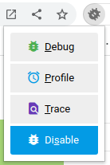

<!-- 
 *   https://github.com/andreysssr/examples
-->

# Активация и триггеры

[Настройки параметров `xdebug.mode`](#params_mode)  
[Настройки параметров `xdebug.start_with_request`](#params_start_with_request)  
[Режим `debug.mode=profile` - Профилировщик xdebug](#mode_profile)  
[Режим `debug.mode=trace` - Трассировка xdebug](#mode_trace)  
[Режим `debug.mode=debug` - Пошаговый отладчик](#mode_debug)  
[Рекомендация](#recomend)  
[Расширения для браузеров](#browsers_extension)  
[Просмотр информации о режимах и настройках](#show_info)  

---
Xdebug имеет несколько разных настроек, которые имеют разные значения.
Важным является параметр конфигурации запроса `xdebug.start_with_request` для которого по умолчанию 
установлено значение `default`

Если мы запустим `xdebug` без каких-либо настроек конфигурации, у него будет включён только режим разработки.  

Настройки по умолчанию имеют значения:
```ini
xdebug.mode=develop
xdebug.start_with_request=default
```

---
<a name="params_mode"><h2>Настройки параметров `xdebug.mode`</h2></a>

```ini
# значения: off, develop, coverage, debug, gcstats, profile, trace
xdebug.mode=develop,debug
```

Список значений параметра `xdebug.mode`
- `off` - Ничего не включено. Xdebug не работает, кроме как проверяет, включена ли функциональность. Используйте этот параметр, если вы хотите, чтобы накладные расходы были близки к нулю.
- `develop` - Включает помощники по разработке, включая перегруженный `var_dump()`.
- `coverage` - Позволяет Анализу покрытия кода генерировать отчеты о покрытии кода, в основном в сочетании с `PHPUnit` .
- `debug` - Включает пошаговую отладку. Это можно использовать для пошагового выполнения кода во время его выполнения и анализа значений переменных.
- `gcstats` - Включает статистику сборки мусора для сбора статистики о механизме сборки мусора PHP.
- `profile` - Включает профилирование, с помощью которого можно анализировать узкие места производительности с помощью таких инструментов, как `KCacheGrind`.
- `trace` - Включает функцию трассировки функций, которая позволяет записывать каждый вызов функции, включая аргументы, присвоение переменных и возвращаемое значение, сделанное во время запроса к файлу.

>Вы можете включить несколько режимов одновременно, разделяя их идентификаторы 
> запятыми в качестве значения `xdebug.mode` : `xdebug.mode=develop,trace`.

>Вы также можете установить режим Xdebug, установив `XDEBUG_MODE` переменную среды в командной строке; 
> это будет иметь приоритет над параметром `xdebug.mode`, но не изменит значение параметра `xdebug.mode`
--- 
<a name="params_start_with_request"><h2>Настройки параметров `xdebug.start_with_request`</h2></a>

```ini
# значения: yes, no, trigger, default
xdebug.start_with_request=default
```

Список значений параметра `xdebug.start_with_request`
- `yes` (выбранные режимы запускаются при запуске запроса PHP и до запуска любого кода PHP):
  - Например, `xdebug.mode = trace` и `xdebug.start_with_request = yes` автоматичестки запускает установленный режим без использования триггеров.
  - `xdebug.mode = trace,profile` и `xdebug.start_with_request = yes` автоматичестки запускает все установленные режимы без использования триггеров.
- `no` (функциональность не активируется при запуске запроса)
  - Вы по-прежнему можете запустить трассировку функций с помощью `xdebug_start_trace()`, 
    пошаговую отладку с помощью `xdebug_break()` или статистику сбора мусора с помощью `xdebug_start_gcstats()`
- `trigger` (функциональность активируется только при наличии определенного триггера при запуске запроса)
    - Имя триггера — `XDEBUG_TRIGGER`, и Xdebug проверяет его наличие либо в:
      - `$_ENV` (переменная среды), либо в ->
      - `$_GET` в переменной, либо в ->
      - `$_POST` в переменной, либо в ->
      - `$_COOKIE` (имя файла cookie HTTP).
    - Существует устаревший резервный вариант имени триггера для конкретной функциональности: 
      - `XDEBUG_PROFILE` (для профилирования), 
      - `XDEBUG_TRACE` (для трассировки функции), 
      - `XDEBUG_SESSION` (для пошаговой отладки).
    - Управление сеансом для пошаговой отладки также доступно через `XDEBUG_SESSION_START`
    - С помощью `xdebug.trigger_value` вы можете контролировать, какое конкретное значение триггера будет активировать триггер. 
      Если для `xdebug.trigger_value` задана пустая строка, будет принято любое значение.
- `default` (значение `default` зависит от `xdebug.mode`:)
    - `debug`: `trigger`
    - `gcstats`: `no`
    - `profile`: `yes`
    - `trace`: `trigger`

---
<a name="mode_profile"><h2>Режим `debug.mode=profile` - Профилировщик xdebug</h2></a>

Профилировщик xdebug может запускаться только при запуске запроса PHP, он не может быть запущен во время запроса.

```ini
debug.mode=profile
xdebug.output_dir=/tmp                        # директория сохранения
xdebug.profiler_output_name=cachegrind.out.%R # название файла
xdebug.use_compression=true                   # сжимать или нет
```

>Значение `default` для `xdebug.start_with_request` запускает профилировщик немедленно.

Если включение профилировщика требуется не всегда, его можно включать по триггеру.
```shell
# настройка запуска профилировщика по триггеру
php -n -zend_extension=xdebug -xdebug.start_with_request=trigger -xdebug.mode=profile -S localhost:8123
```

Теперь нужно использовать триггер для активации функции профилировщика.
- для запуска в браузере:
  - использовать расширение для браузера (включить режим `Profile`)
- для запуска в командной строке:
  - нужно **экспортировать** переменную среды (для профилировщика):
    - `XDEBUG_TRIGGER=yes` (новый параметр)
    - `XDEBUG_PROFILE=yes` (устаревший параметр)
  - запустить локальный сервер 
    
```shell
# экспорт переменной среды 
export XDEBUG_PROFILE=yes

# запуск профилировщика по триггеру
php -n -zend_extension=xdebug -xdebug.start_with_request=trigger -xdebug.mode=profile -S localhost:8123

# удаление переменной среды из командной строки (для отключения триггера)
unset XDEBUG_PROFILE
```

Все расширения устанавливают `cookie`, в этом случае установит файл cookie `XDEBUG_PROFILE=yes`

---
<a name="mode_trace"><h2>Режим `debug.mode=trace` - Трассировка xdebug</h2></a>

Трассировка xdebug. Для запуска трассировки по умолчанию требуется включение триггера 

После включения триггера, при каждом запросе создаётся файл трассировки.

```ini
debug.mode=trace
xdebug.output_dir=/tmp            # директория сохранения
xdebug.trace_output_name=trace.%R # название файла
xdebug.use_compression=true       # сжимать или нет
```

Теперь нужно использовать триггер для активации функции трассировки.
- для запуска в браузере:
    - использовать расширение для браузера (включить режим `Trace`)
- для запуска в командной строке:
    - нужно **экспортировать** переменную среды (для функции трассировки):
      - `XDEBUG_TRIGGER=yes` (новый параметр)
      - `XDEBUG_TRACE=yes` (устаревший параметр)
    - запустить локальный сервер

```shell
# экспорт переменной среды 
export XDEBUG_TRACE=yes

# запуск профилировщика по триггеру
php -n -zend_extension=xdebug -xdebug.start_with_request=trigger -xdebug.mode=trace -S localhost:8123

# удаление переменной среды из командной строки (для отключения триггера)
unset XDEBUG_TRACE
```

Если нужно всегда использовать включённый режим трассировки, 
тогда устанавливаем значение `yes` для параметра `debug.start_with_request`  
```ini
debug.start_with_request=yes
```

Если нужно отключить трассировщик, тогда устанавливаем значение `no` для параметра
`debug.start_with_request`, его теперь можно запустить вручную, вызвав функцию `xdebug_start_rtace()`

---
<a name="mode_debug"><h2>Режим `debug.mode=debug` - Пошаговый отладчик</h2></a>

Пошаговый отладчик - по умолчанию не создаёт сеанс отладки, только при наличии триггера.

Можно настроить xdebug так, чтобы он всегда инициировал сеанс отладки, даже если триггер отсутствует.

Для этого устанавливаем значение `yes` для параметра `debug.start_with_request`
```ini
debug.start_with_request=yes
```

```ini
debug.mode=debug
```

Теперь нужно использовать триггер для активации функции трассировки.
- для запуска в браузере:
    - использовать расширение для браузера (включить режим `Debug`)
- для запуска в командной строке:
    - нужно **экспортировать** переменную среды (для функции пошаговый отладчик):
      - `XDEBUG_TRIGGER=yes` (новый параметр)
      - `XDEBUG_SESSION_START=yes` (новый параметр)
      - `XDEBUG_SESSION=yes` (устаревший параметр)
    - запустить локальный сервер

>Значение для `XDEBUG_TRIGGER`, `XDEBUG_SESSION_START`, `XDEBUG_SESSION` можно присваивать любые, например `yes` или `1`.
> Для запуска функции проверяется само наличие переменной окружения.

```shell
# экспорт переменной среды 
export XDEBUG_SESSION=1

# запуск профилировщика по триггеру
php -n -zend_extension=xdebug -xdebug.start_with_request=trigger -xdebug.mode=debug -S localhost:8123

# удаление переменной среды из командной строки (для отключения триггера)
unset XDEBUG_SESSION
```

>Для `debug.mode=debug` равнозначное значение имеют следующие параметры:
>- xdebug.start_with_request=trigger
>- xdebug.start_with_request=default
>- отсутствие настройки `xdebug.start_with_request` в конфигурации `xdebug.ini`

Данный код будет иметь одинаковое значение:
```shell
# запуск пошаговой отладки
php -n -zend_extension=xdebug -xdebug.start_with_request=trigger -xdebug.mode=debug -S localhost:8123
php -n -zend_extension=xdebug -xdebug.start_with_request=default -xdebug.mode=debug -S localhost:8123
php -n -zend_extension=xdebug -xdebug.mode=debug -S localhost:8123
```
Просмотреть в командной строке включенные режимы
```shell
XDEBUG_SESSION=1 XDEBUG_MODE=debug php  -r 'xdebug_info();' | head -n 22 | tail -n 10

php -n -dzend_extension=xdebug -dxdebug.mode=debug -S localhost:8123
```

>Для режима `xdebug.mode=debug`, значение `default` для параметра `xdebug.start_with_request` устанавливает значение `trigger`

>Для режима `xdebug.mode=debug`, при отсутствии настройки для параметра `xdebug.start_with_request` по умолчанию присваивается значение `default` 

! Некоторые IDE требуют специального значения для `XDEBUG_SESSION`
Netbeans требует значение `netbeans-xdebug` чтобы отладчик работал, 
нужно в расширении для `XDEBUG_SESSION` установить требуемое значение.

---
<a name="recomend"><h2>Рекомендация</h2></a>

! Не рекомендуется проводить отладку на рабочих серверах, но если это требутся то можно настроить:
- установить секретный ключ активации для триггера в параметре `xdebug.trigger_value`
  ```shell
  php -n -dzend_extension=xdebug -dxdebug.trigger_value=secret-key -xdebug.mode=debug -S localhost:8123
  ```
- в настройках расширения браузера указать секретный ключ
- включить режим пошаговой отладки в расширении браузера
---
<a name="browsers_extension"><h2>Расширения для браузеров</h2></a>

Расширения для браузеров:
- [Xdebug Helper для Firefox](https://addons.mozilla.org/en-GB/firefox/addon/xdebug-helper-for-firefox/) ([источник](https://github.com/BrianGilbert/xdebug-helper-for-firefox))
- [Xdebug Helper для Chrome](https://chrome.google.com/extensions/detail/eadndfjplgieldjbigjakmdgkmoaaaoc) ([источник](https://github.com/mac-cain13/xdebug-helper-for-chrome))
- [XDebugToggle для Safari](https://apps.apple.com/app/safari-xdebug-toggle/id1437227804?mt=12) ([источник](https://github.com/kampfq/SafariXDebugToggle))

Расширение браузера позволяет выбрать режим `xdebug.mode` для включения  

  

Например при такой конфигурации:
```ini
xdebug.mode=develop,debug,profile,trace
xdebug.start_with_request=trigger
```
В браузере без расширения можно использовать разные переменные окружения для включения отдельных функций:
- `debug` - `http://localhost:8123/?XDEBUG_SESSION_START=yes`
- `debug` - `http://localhost:8123/?XDEBUG_SESSION=yes`
- `trace` - `http://localhost:8123/?XDEBUG_TRACE=yes`
- `profile` - `http://localhost:8123/?XDEBUG_PROFILE=yes`

Для включения сразу всех функций `debug,profile,trace` можно использовать следующее:
- `http://localhost:8123/?XDEBUG_TRIGGER=yes`

>Не рекомендуется использовать сразу несколько режимов Xebug
---
<a name="show_info"><h2>Просмотр информации о режимах и настройках</h2></a>

Просмотр информации о режимах и настройках:
  - для просмотра в браузере
    ```php
    <?php
    
    xdebug_info();
    ```
  - для просмотра в консоли
    ```shell
    php -r 'xdebug_info();' | head -n 22 | tail -n 10
    XDEBUG_MODE=profile php -r 'xdebug_info();' | head -n 22 | tail -n 10
    ```
<br>

Для команды `php -r 'xdebug_info();' | head -n 22 | tail -n 10` 
может быть такой вывод:
```
             Enabled Features (through 'xdebug.mode' setting)             
Feature => Enabled/Disabled
Development Helpers => ✔ enabled
Coverage => ✘ disabled
GC Stats => ✘ disabled
Profiler => ✘ disabled
Step Debugger => ✔ enabled
Tracing => ✘ disabled
```
<br>

Для команды `XDEBUG_MODE=profile php -r 'xdebug_info();' | head -n 22 | tail -n 10` может быть такой вывод:
```
          Enabled Features (through 'XDEBUG_MODE' env variable)          
Feature => Enabled/Disabled
Development Helpers => ✘ disabled
Coverage => ✘ disabled
GC Stats => ✘ disabled
Profiler => ✔ enabled
Step Debugger => ✘ disabled
Tracing => ✘ disabled
```

>В строке `Enabled Features` указывается место где была определена настройка.
>- (through 'xdebug.mode' setting) - используется настройка из файла `xdebug.ini`
>- (through 'XDEBUG_MODE' env variable) - используется настройка из переменной окружения `XDEBUG_MODE`


