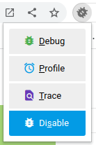
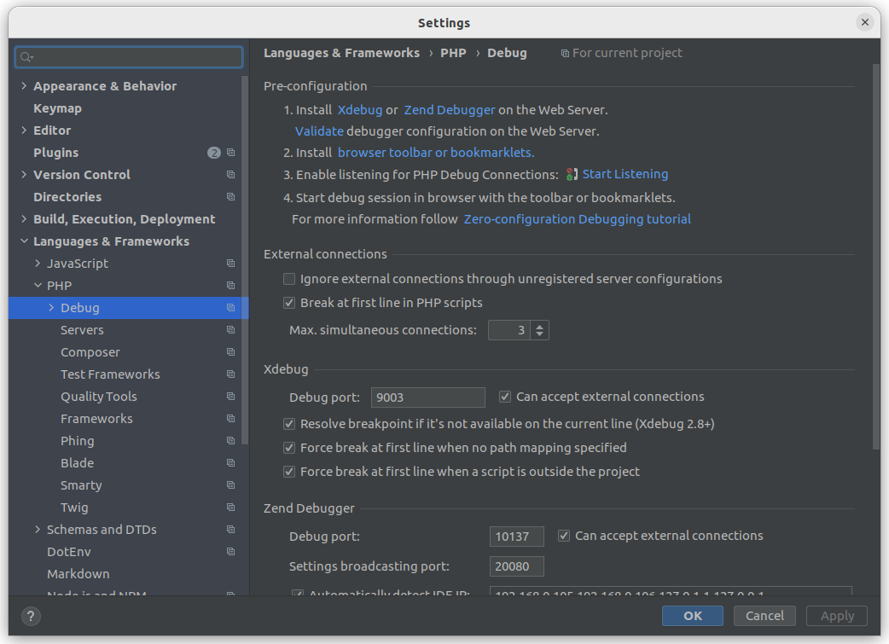
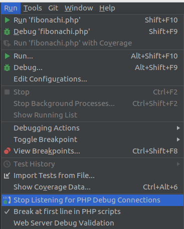
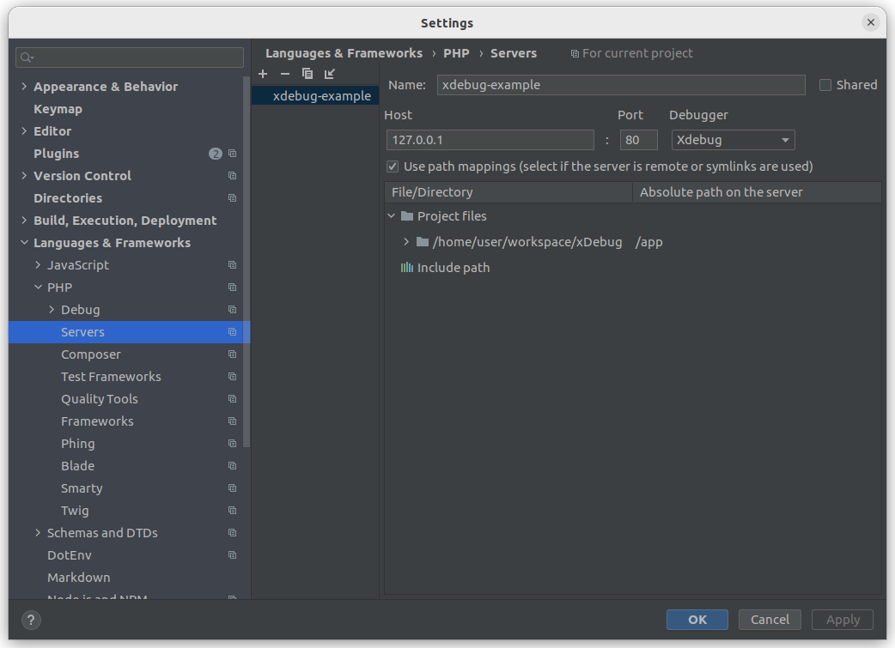

<!-- 
 *   https://github.com/andreysssr/examples
-->


# Установка и Настройка Xdebug в PHPStorm

---
- Установка xdebug на сервер
    - Установка на Docker
        - Установка расширения
        - Настройка конфигурации Xdebug
        - Настройки в Docker
- Установка расширения в браузере
- Настройка xdebug в PHPStorm
    - Настройки для запуска в Docker
    - Настройка порта
    - Настройка путей серверов
    - Добавление исключений
    - Включение xdebug
---

Установка расширения

```Dockerfile
# Dockerfile

RUN pecl install xdebug
COPY docker/90-xdebug.ini "${PHP_INI_DIR}/conf.d"
```

Настройка конфигурации Xdebug
```ini
# 90-xdebug.ini

zend_extension=xdebug.so
xdebug.mode=develop,debug
xdebug.start_with_request=yes
xdebug.discover_client_host=0
xdebug.client_host=host.docker.internal
```

Настройки в Docker
```yml
# docker-compose.yml

version: '3.9'
services:
  php:
    container_name: php
    extra_hosts:
      - "host.docker.internal:host-gateway"
    build:
      context: .
      dockerfile: Dockerfile
```

Сборка образа  
Запуск контейнеров
```
docker-compose build
docker-compose up
```
---

Установка расширения в браузере

Расширения для браузеров:
- [Xdebug Helper для Firefox](https://addons.mozilla.org/en-GB/firefox/addon/xdebug-helper-for-firefox/) ([источник](https://github.com/BrianGilbert/xdebug-helper-for-firefox))
- [Xdebug Helper для Chrome](https://chrome.google.com/extensions/detail/eadndfjplgieldjbigjakmdgkmoaaaoc) ([источник](https://github.com/mac-cain13/xdebug-helper-for-chrome))
- [XDebugToggle для Safari](https://apps.apple.com/app/safari-xdebug-toggle/id1437227804?mt=12) ([источник](https://github.com/kampfq/SafariXDebugToggle))

Расширение браузера позволяет выбрать режим `xdebug.mode` для включения



---
Настраиваем нашу IDE

Файл -> Настройки -> Debug

- Оставляем порт `9003`



- Включаем прослушивание входящих отладочных соединений
- Включаем остановку на первой строке `PHP скрипта`



- Сопоставить путь к файлу на сервере с путём к файлу в проекте

 
